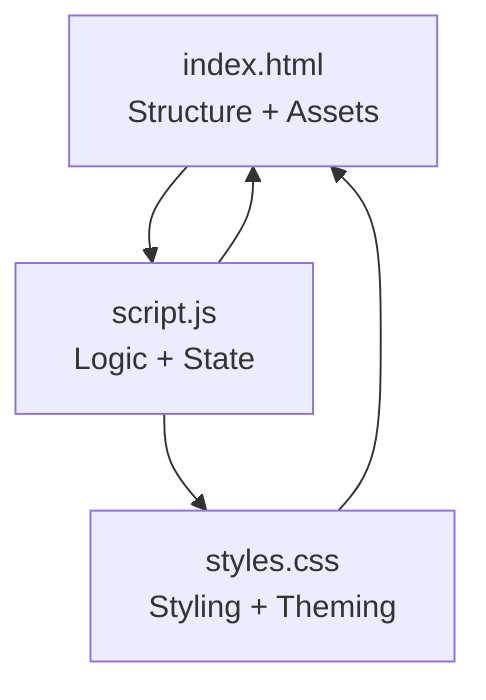
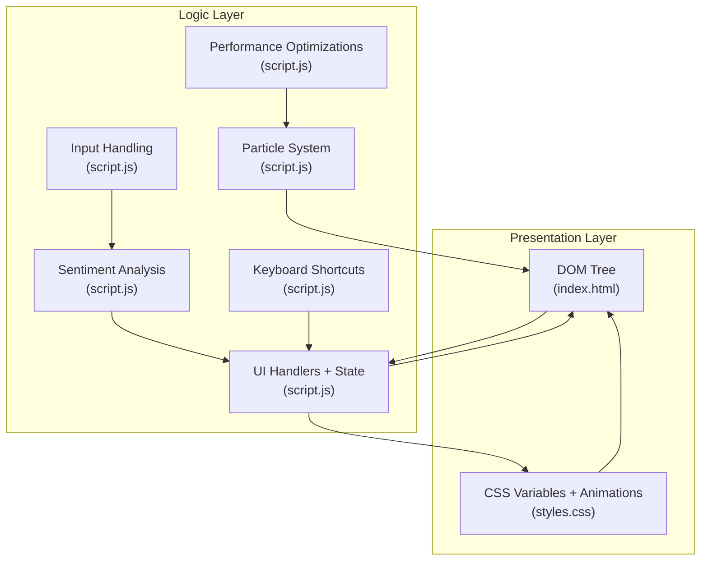
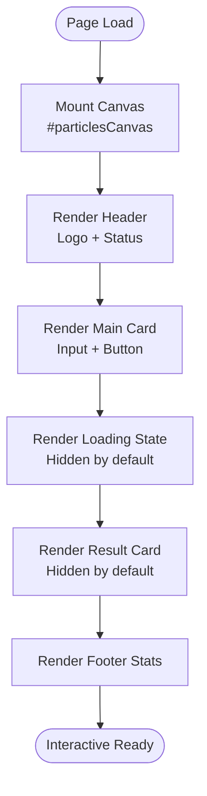
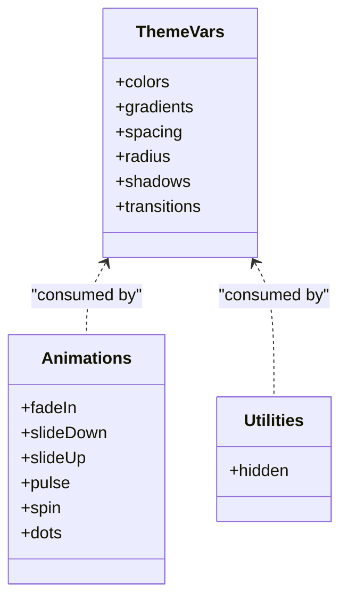
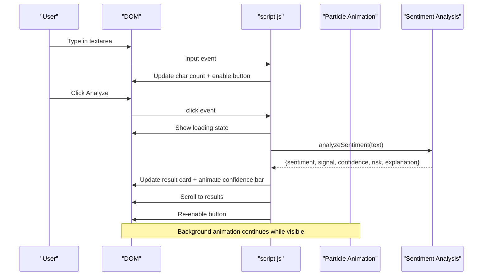
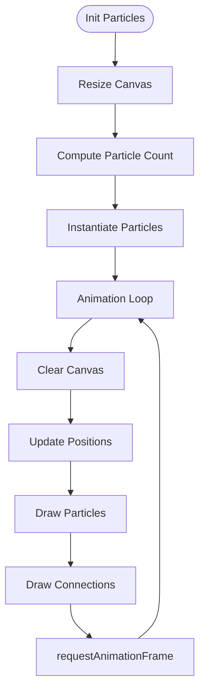
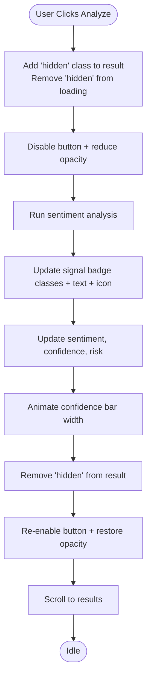
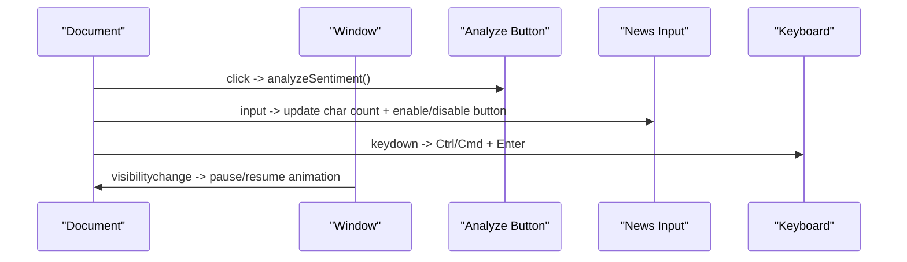
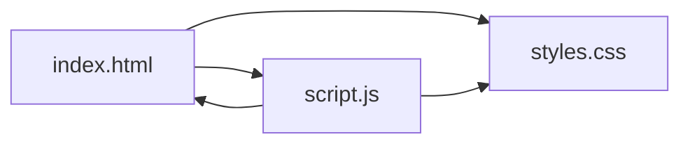

# Core Architecture

<cite>
**Referenced Files in This Document**
- [index.html](file://index.html)
- [script.js](file://script.js)
- [styles.css](file://styles.css)
</cite>

## Table of Contents
1. [Introduction](#introduction)
2. [Project Structure](#project-structure)
3. [Core Components](#core-components)
4. [Architecture Overview](#architecture-overview)
5. [Detailed Component Analysis](#detailed-component-analysis)
6. [Dependency Analysis](#dependency-analysis)
7. [Performance Considerations](#performance-considerations)
8. [Troubleshooting Guide](#troubleshooting-guide)
9. [Conclusion](#conclusion)

## Introduction
This document describes the AI Trading Signal Engine’s core architecture built on a three-file pattern: HTML for structure, CSS for styling, and a single JavaScript file for logic and state management. The system integrates a Canvas-based particle animation engine, DOM-managed UI states, and a CSS custom property theming system. It follows a modular, event-driven design with clear separation of concerns between presentation, logic, and styling.

## Project Structure
The project is intentionally minimal and focused:
- index.html: Declares the page structure, assets, and mounts the JavaScript runtime.
- script.js: Implements the entire application logic in a single file, organized into function groups for particle animation, input handling, sentiment analysis, UI updates, keyboard shortcuts, and performance optimizations.
- styles.css: Defines a dark theme with CSS custom properties, animations, responsive breakpoints, and utility classes.

**Diagram sources**
- [index.html:1-175](file://index.html#L1-L175)
- [script.js:1-404](file://script.js#L1-L404)
- [styles.css:1-816](file://styles.css#L1-L816)

**Section sources**
- [index.html:1-175](file://index.html#L1-L175)
- [script.js:1-404](file://script.js#L1-L404)
- [styles.css:1-816](file://styles.css#L1-L816)

## Core Components
- HTML (Structure): Provides the DOM tree, including the animated background canvas, floating header, input section, analyze button, loading state, result card, and footer statistics.
- CSS (Styling): Supplies a dark theme with neon accents, gradients, glassmorphism effects, animations, and responsive media queries. Uses CSS custom properties for consistent theming.
- JavaScript (Logic): Manages the particle animation system, input handling, sentiment analysis, UI state transitions, keyboard shortcuts, and performance optimizations.

**Section sources**
- [index.html:15-175](file://index.html#L15-L175)
- [styles.css:4-60](file://styles.css#L4-L60)
- [script.js:5-121](file://script.js#L5-L121)

## Architecture Overview
The system adheres to a layered separation of concerns:
- Presentation layer: HTML and CSS define the visual layout and theme.
- Logic layer: JavaScript orchestrates user interactions, state transitions, and rendering updates.
- Data layer: The sentiment analysis function produces structured results consumed by the UI.

**Diagram sources**
- [index.html:15-175](file://index.html#L15-L175)
- [script.js:23-121](file://script.js#L23-L121)
- [script.js:127-275](file://script.js#L127-L275)
- [script.js:145-253](file://script.js#L145-L253)
- [script.js:287-369](file://script.js#L287-L369)
- [script.js:375-395](file://script.js#L375-L395)
- [styles.css:4-60](file://styles.css#L4-L60)

## Detailed Component Analysis

### HTML Structure and DOM Responsibilities
- Root canvas for particle animation and a background chart effect.
- Header with logo, subtitle, and live status indicator.
- Main card containing:
  - Input section with textarea and character counter.
  - Analyze button with glow effect.
  - Loading state with spinner and animated dots.
  - Result card with signal badge, metrics grid, explanation box, and disclaimer.
- Footer stats with performance metrics.

**Diagram sources**
- [index.html:16-170](file://index.html#L16-L170)

**Section sources**
- [index.html:15-175](file://index.html#L15-L175)

### CSS Theming and Responsive Design
- CSS custom properties define a cohesive dark theme with neon accents, gradients, spacing, radius, and shadows.
- Utility classes (e.g., hidden) simplify state toggling.
- Animations (fade, slide, pulse, spin, dots) enhance UX.
- Media queries adapt layout for tablets and phones.

**Diagram sources**
- [styles.css:4-60](file://styles.css#L4-L60)
- [styles.css:673-734](file://styles.css#L673-L734)
- [styles.css:666-668](file://styles.css#L666-L668)

**Section sources**
- [styles.css:4-60](file://styles.css#L4-L60)
- [styles.css:666-668](file://styles.css#L666-L668)
- [styles.css:673-734](file://styles.css#L673-L734)
- [styles.css:739-795](file://styles.css#L739-L795)

### JavaScript: Modular Single-File Approach
The logic is organized into distinct function groups:

- DOM Elements and Result Elements: Centralized element references for input, buttons, loading, result card, and metric displays.
- Particle Animation System: Canvas-based particle engine with resizing, particle class, connection drawing, and animation loop.
- Input Handling: Real-time character counting and enabling/disabling the analyze button.
- Sentiment Analysis Engine (Mock): Keyword-based scoring, sentiment determination, confidence calculation, risk level assignment, and dynamic explanations.
- UI Interaction Handlers: Loading state, result display, color and gradient helpers, and smooth scrolling to results.
- Keyboard Shortcuts: Ctrl/Cmd + Enter to trigger analysis.
- Performance Optimizations: Pausing animation when the tab is not visible.

**Diagram sources**
- [script.js:127-139](file://script.js#L127-L139)
- [script.js:259-275](file://script.js#L259-L275)
- [script.js:145-253](file://script.js#L145-L253)
- [script.js:287-327](file://script.js#L287-L327)

**Section sources**
- [script.js:5-21](file://script.js#L5-L21)
- [script.js:23-121](file://script.js#L23-L121)
- [script.js:127-139](file://script.js#L127-L139)
- [script.js:145-253](file://script.js#L145-L253)
- [script.js:259-327](file://script.js#L259-L327)
- [script.js:375-395](file://script.js#L375-L395)

### Canvas-Based Particle System Architecture
- Canvas sizing adapts to viewport and recalculates particle count dynamically.
- Particles are simple objects with position, speed, size, and opacity.
- Connections are drawn between nearby particles with opacity proportional to distance.
- Animation loop clears the canvas, updates and draws particles, and schedules the next frame.

**Diagram sources**
- [script.js:32-75](file://script.js#L32-L75)
- [script.js:38-65](file://script.js#L38-L65)
- [script.js:78-96](file://script.js#L78-L96)
- [script.js:99-114](file://script.js#L99-L114)

**Section sources**
- [script.js:25-121](file://script.js#L25-L121)

### DOM Manipulation Patterns and State Management
- Hidden utility class toggles visibility of loading and result cards.
- Dynamic class updates apply signal-specific styling (buy/sell/hold).
- Inline styles set transient states (opacity, width) for animations.
- Smooth scroll ensures results are visible after analysis.

**Diagram sources**
- [script.js:278-327](file://script.js#L278-L327)
- [script.js:293-309](file://script.js#L293-L309)

**Section sources**
- [script.js:278-327](file://script.js#L278-L327)
- [styles.css:666-668](file://styles.css#L666-L668)

### Event-Driven Architecture and Cross-Browser Compatibility
- DOM listeners handle input changes, button clicks, and keyboard shortcuts.
- Visibility change listener pauses/resumes animation to save resources.
- CSS custom properties and modern animations are used; scrollbar styling targets WebKit-based browsers.

**Diagram sources**
- [script.js:127-139](file://script.js#L127-L139)
- [script.js:259-275](file://script.js#L259-L275)
- [script.js:375-382](file://script.js#L375-L382)
- [script.js:389-395](file://script.js#L389-L395)

**Section sources**
- [script.js:127-139](file://script.js#L127-L139)
- [script.js:259-275](file://script.js#L259-L275)
- [script.js:375-395](file://script.js#L375-L395)
- [styles.css:800-816](file://styles.css#L800-L816)

## Dependency Analysis
- HTML depends on CSS for styling and on script.js for interactivity.
- script.js depends on DOM APIs and Canvas for rendering; it also depends on CSS custom properties for theming.
- CSS defines reusable variables and animations consumed by HTML elements.

**Diagram sources**
- [index.html:13](file://index.html#L13)
- [index.html:172](file://index.html#L172)
- [styles.css:4-60](file://styles.css#L4-L60)
- [script.js:25-121](file://script.js#L25-L121)

**Section sources**
- [index.html:13](file://index.html#L13)
- [index.html:172](file://index.html#L172)
- [styles.css:4-60](file://styles.css#L4-L60)
- [script.js:25-121](file://script.js#L25-L121)

## Performance Considerations
- Particle system uses requestAnimationFrame and clears the canvas each frame. On tab visibility change, animation is canceled to conserve CPU/GPU resources.
- Confidence bar animation uses a short transition with a delayed width update to ensure smoothness.
- Canvas particle count scales with viewport area to balance performance and visual density.

**Section sources**
- [script.js:99-114](file://script.js#L99-L114)
- [script.js:389-395](file://script.js#L389-L395)
- [script.js:68-75](file://script.js#L68-L75)
- [script.js:306-309](file://script.js#L306-L309)

## Troubleshooting Guide
- If the canvas does not render:
  - Verify the canvas element exists and is appended to the DOM.
  - Ensure the resize handler runs on load and on window resize.
- If the analyze button remains disabled:
  - Confirm the input listener updates the character count and toggles the button state.
- If results do not appear:
  - Check that the result card is shown and the loading state is hidden.
  - Verify the confidence bar width is animated after a brief delay.
- If animations stutter:
  - Confirm the visibility change listener cancels animation frames when the tab is hidden.
- If theming appears inconsistent:
  - Ensure CSS custom properties are defined in :root and used consistently across components.

**Section sources**
- [script.js:117-120](file://script.js#L117-L120)
- [script.js:127-139](file://script.js#L127-L139)
- [script.js:278-327](file://script.js#L278-L327)
- [script.js:389-395](file://script.js#L389-L395)
- [styles.css:4-60](file://styles.css#L4-L60)

## Conclusion
The AI Trading Signal Engine demonstrates a clean, modular architecture using the classic three-file pattern. The single JavaScript file organizes logic into cohesive groups, while CSS custom properties and animations deliver a cohesive, responsive, and visually engaging experience. The event-driven design, combined with performance-conscious optimizations, ensures a smooth user experience across devices.