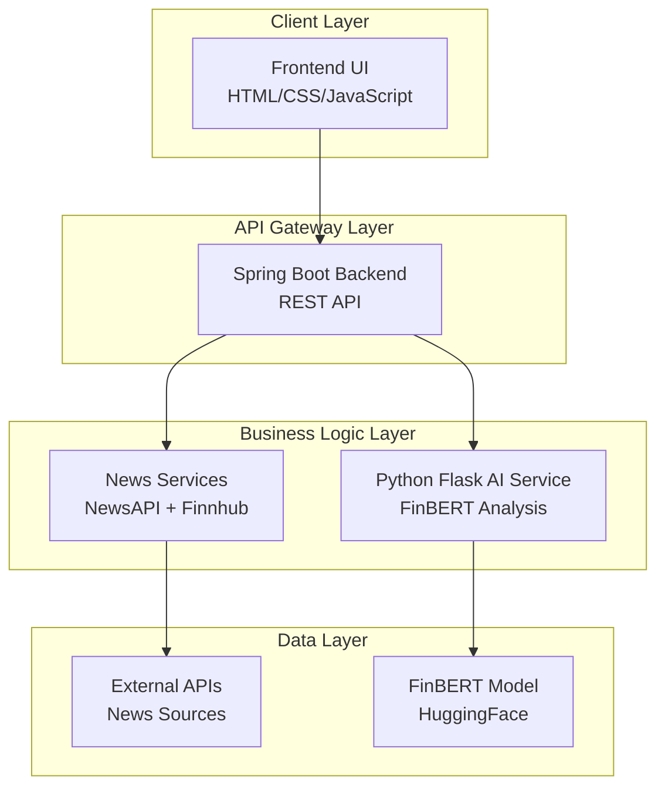
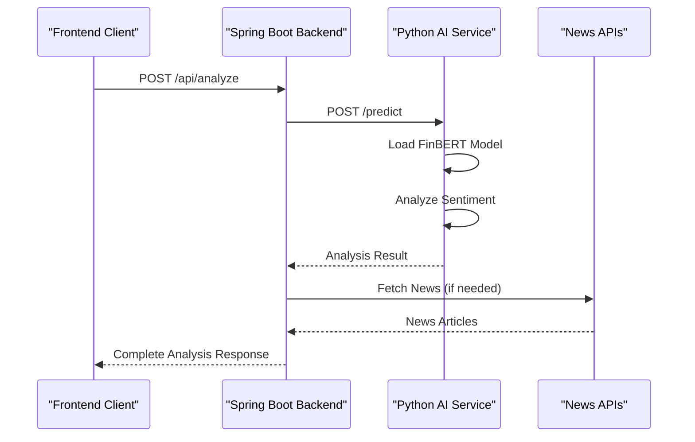

# Core Architecture

<cite>
**Referenced Files in This Document**
- [README.md](file://README.md)
- [QUICKSTART.md](file://QUICKSTART.md)
- [frontend/index.html](file://frontend/index.html)
- [frontend/script.js](file://frontend/script.js)
- [frontend/styles.css](file://frontend/styles.css)
- [backend/src/main/java/com/trading/TradingSignalApplication.java](file://backend/src/main/java/com/trading/TradingSignalApplication.java)
- [backend/src/main/java/com/trading/controller/TradingController.java](file://backend/src/main/java/com/trading/controller/TradingController.java)
- [backend/src/main/java/com/trading/service/AIService.java](file://backend/src/main/java/com/trading/service/AIService.java)
- [backend/src/main/resources/application.properties](file://backend/src/main/resources/application.properties)
- [ai-service/app.py](file://ai-service/app.py)
- [ai-service/models/sentiment_analyzer.py](file://ai-service/models/sentiment_analyzer.py)
- [ai-service/requirements.txt](file://ai-service/requirements.txt)
</cite>

## Update Summary
**Changes Made**
- Complete architectural overhaul from single-file frontend to comprehensive multi-service system
- Added Spring Boot backend with REST API architecture
- Integrated Python Flask AI service with FinBERT model
- Enhanced frontend with real backend integration and improved UI
- Added comprehensive error handling and health monitoring
- Implemented microservices communication patterns

## Table of Contents
1. [Introduction](#introduction)
2. [Multi-Service Architecture Overview](#multi-service-architecture-overview)
3. [Service Components](#service-components)
4. [Communication Patterns](#communication-patterns)
5. [Frontend Architecture](#frontend-architecture)
6. [Backend Architecture](#backend-architecture)
7. [AI Service Architecture](#ai-service-architecture)
8. [Data Flow and Processing](#data-flow-and-processing)
9. [Configuration Management](#configuration-management)
10. [Deployment and Operations](#deployment-and-operations)
11. [Performance and Scalability](#performance-and-scalability)
12. [Troubleshooting Guide](#troubleshooting-guide)
13. [Conclusion](#conclusion)

## Introduction
The AI Trading Signal Engine has evolved from a single-file frontend application to a comprehensive multi-service architecture featuring real-time financial news sentiment analysis powered by advanced AI models. This system integrates three distinct services: a premium frontend UI, a Spring Boot backend REST API, and a Python Flask AI service utilizing FinBERT for real sentiment analysis.

**Updated** Migrated from single-file frontend to comprehensive multi-service architecture with Spring Boot backend, Python AI service, and advanced frontend integration.

## Multi-Service Architecture Overview
The system follows a microservices architecture pattern with clear separation of concerns:

**Diagram sources**
- [README.md:27-61](file://README.md#L27-L61)
- [frontend/index.html:1-235](file://frontend/index.html#L1-L235)
- [backend/src/main/java/com/trading/TradingSignalApplication.java:8-28](file://backend/src/main/java/com/trading/TradingSignalApplication.java#L8-L28)
- [ai-service/app.py:16-154](file://ai-service/app.py#L16-L154)

## Service Components

### Frontend Service
The premium frontend provides a sophisticated user interface with:
- Real-time particle animation system
- Glassmorphism design with neon accents
- Canvas-based mini charts for signal visualization
- Company detection and risk assessment
- Comprehensive loading states and error handling

### Backend Service (Spring Boot)
The Java-based backend serves as the central orchestration layer:
- RESTful API endpoints for analysis and news fetching
- Business logic coordination between services
- Error handling and validation
- Health monitoring and logging
- CORS configuration for cross-origin requests

### AI Service (Python Flask)
The AI service provides real sentiment analysis using FinBERT:
- HuggingFace Transformers integration
- Real-time sentiment classification
- Company detection capabilities
- Batch processing support
- Health monitoring endpoints

**Section sources**
- [frontend/index.html:1-235](file://frontend/index.html#L1-L235)
- [backend/src/main/java/com/trading/TradingSignalApplication.java:8-28](file://backend/src/main/java/com/trading/TradingSignalApplication.java#L8-L28)
- [ai-service/app.py:16-154](file://ai-service/app.py#L16-L154)

## Communication Patterns
The system implements several communication patterns:

### REST API Communication
- Frontend communicates with backend via HTTP REST endpoints
- Backend uses Spring Web MVC for request handling
- JSON serialization/deserialization for data exchange
- Proper HTTP status codes and error responses

### Microservice Communication
- Backend calls AI service via HTTP REST API
- AI service uses HuggingFace Transformers library
- Model loading and caching for performance optimization
- Graceful degradation when services are unavailable

### Asynchronous Processing
- Non-blocking API calls for better user experience
- Progress indication during analysis
- Error recovery mechanisms
- Timeout handling for external services

**Diagram sources**
- [frontend/script.js:767-798](file://frontend/script.js#L767-L798)
- [backend/src/main/java/com/trading/controller/TradingController.java:37-80](file://backend/src/main/java/com/trading/controller/TradingController.java#L37-L80)
- [ai-service/app.py:39-89](file://ai-service/app.py#L39-L89)

## Frontend Architecture
The frontend maintains the premium UI experience while integrating with the backend:

### DOM Structure and Components
- Animated particle background with Canvas API
- Glassmorphism cards with backdrop blur effects
- Real-time loading states with progress indicators
- Interactive result cards with signal visualization
- Company detection badges and risk meters

### JavaScript Architecture
- Modular organization with clear function groups
- Real-time backend integration for analysis
- Enhanced error handling and user feedback
- Performance optimizations for animation and rendering

### CSS Architecture
- Comprehensive custom property system for theming
- Advanced animations and transitions
- Responsive design for all device sizes
- Modern CSS features (Grid, Flexbox, Animations)

**Section sources**
- [frontend/index.html:1-235](file://frontend/index.html#L1-L235)
- [frontend/script.js:1-1068](file://frontend/script.js#L1-L1068)
- [frontend/styles.css:1-1415](file://frontend/styles.css#L1-L1415)

## Backend Architecture
The Spring Boot backend provides robust API orchestration:

### Application Structure
- Spring Boot 3.2.0 with Java 17+
- REST Controller layer for HTTP endpoints
- Service layer for business logic
- Model classes for data transfer
- Configuration management

### Key Controllers and Services
- **TradingController**: Main API endpoints for analysis and news
- **AIService**: Integration with Python AI service
- **NewsService**: External news API integration
- **SignalService**: Business logic for signal generation

### Configuration Management
- Externalized configuration via application.properties
- Environment-specific settings
- API key management
- CORS and security configurations

**Section sources**
- [backend/src/main/java/com/trading/TradingSignalApplication.java:8-28](file://backend/src/main/java/com/trading/TradingSignalApplication.java#L8-L28)
- [backend/src/main/java/com/trading/controller/TradingController.java:18-167](file://backend/src/main/java/com/trading/controller/TradingController.java#L18-L167)
- [backend/src/main/java/com/trading/service/AIService.java:14-85](file://backend/src/main/java/com/trading/service/AIService.java#L14-L85)
- [backend/src/main/resources/application.properties:1-27](file://backend/src/main/resources/application.properties#L1-L27)

## AI Service Architecture
The Python Flask service provides real AI-powered analysis:

### Model Integration
- FinBERT (ProsusAI/finbert) for financial sentiment analysis
- HuggingFace Transformers library for model loading
- PyTorch for tensor operations
- Real-time model inference

### Service Endpoints
- `/health`: Health check endpoint
- `/predict`: Single text sentiment analysis
- `/batch`: Batch processing for multiple texts
- Comprehensive error handling and validation

### Performance Optimization
- Model loading on service startup
- Caching for repeated analyses
- Efficient tokenization and inference
- Memory management for large models

**Section sources**
- [ai-service/app.py:16-154](file://ai-service/app.py#L16-L154)
- [ai-service/models/sentiment_analyzer.py:11-175](file://ai-service/models/sentiment_analyzer.py#L11-L175)
- [ai-service/requirements.txt:1-6](file://ai-service/requirements.txt#L1-L6)

## Data Flow and Processing
The system processes financial news through a multi-stage pipeline:

### Analysis Pipeline
1. **Input Reception**: Frontend sends headline to backend
2. **Validation**: Backend validates and sanitizes input
3. **AI Processing**: Backend calls AI service for analysis
4. **Model Inference**: AI service performs FinBERT analysis
5. **Signal Generation**: Business logic converts sentiment to trading signals
6. **Response Formatting**: Structured JSON response with all metrics
7. **Frontend Rendering**: Real-time UI updates with results

### Signal Logic Implementation
| Sentiment | Confidence Threshold | Signal | Strength |
|-----------|---------------------|--------|----------|
| Positive | >85% | BUY | STRONG |
| Positive | 70-85% | BUY | MODERATE |
| Positive | <70% | BUY | WEAK |
| Negative | >85% | SELL | STRONG |
| Negative | 70-85% | SELL | MODERATE |
| Negative | <70% | SELL | WEAK |
| Neutral | Any | HOLD | MODERATE |

### Risk Assessment
- **Low Risk**: Confidence > 85%
- **Medium Risk**: 75-85% confidence
- **High Risk**: < 75% confidence

**Section sources**
- [ai-service/models/sentiment_analyzer.py:106-120](file://ai-service/models/sentiment_analyzer.py#L106-L120)
- [frontend/script.js:800-881](file://frontend/script.js#L800-L881)

## Configuration Management
The system uses externalized configuration for flexibility:

### Backend Configuration
- **application.properties**: Server port, API keys, CORS settings
- **Environment Variables**: Runtime configuration overrides
- **Logging Configuration**: Structured logging for debugging
- **Actuator Endpoints**: Health monitoring and metrics

### AI Service Configuration
- **Model Loading**: Automatic FinBERT model initialization
- **Processing Limits**: Input validation and constraints
- **Error Handling**: Comprehensive exception management
- **Performance Tuning**: Memory and processing optimization

### Frontend Configuration
- **Backend URLs**: Dynamic API endpoint configuration
- **Feature Flags**: Toggle for different UI features
- **Analytics**: Optional tracking and metrics collection

**Section sources**
- [backend/src/main/resources/application.properties:1-27](file://backend/src/main/resources/application.properties#L1-L27)
- [ai-service/app.py:20-26](file://ai-service/app.py#L20-L26)
- [frontend/script.js:15-16](file://frontend/script.js#L15-L16)

## Deployment and Operations
The system supports flexible deployment scenarios:

### Development Setup
- **One-click Scripts**: Automated setup and startup
- **Prerequisites**: Java 17+, Python 3.8+, Git
- **Dependencies**: Maven for backend, pip for AI service
- **API Keys**: Free accounts for NewsAPI and Finnhub

### Production Considerations
- **Containerization**: Docker support for all services
- **Load Balancing**: Horizontal scaling for high traffic
- **Monitoring**: Health checks and performance metrics
- **Security**: HTTPS, CORS policies, input validation

### Operational Features
- **Health Monitoring**: Comprehensive service health checks
- **Error Reporting**: Structured error handling and logging
- **Graceful Degradation**: Fallback mechanisms for service failures
- **Performance Optimization**: Caching, compression, and resource management

**Section sources**
- [README.md:108-175](file://README.md#L108-L175)
- [QUICKSTART.md:1-148](file://QUICKSTART.md#L1-L148)

## Performance and Scalability
The system is designed for high performance and scalability:

### Performance Metrics
- **AI Service Startup**: 5-10 seconds (model loading)
- **Single Analysis**: 1-2 seconds
- **News Fetch**: 0.5-1 second
- **Total Round-Trip**: 2-3 seconds
- **Memory Usage**: ~2GB (FinBERT model)

### Scalability Features
- **Microservices Architecture**: Independent scaling of services
- **Asynchronous Processing**: Non-blocking API calls
- **Caching Strategies**: Model and result caching
- **Load Distribution**: Multiple AI service instances
- **Database Optimization**: Efficient external API usage

### Optimization Techniques
- **Model Caching**: Persistent model loading
- **Connection Pooling**: Efficient HTTP client usage
- **Resource Management**: Proper cleanup and memory management
- **Error Recovery**: Retry mechanisms and fallback strategies

**Section sources**
- [README.md:322-330](file://README.md#L322-L330)
- [ai-service/models/sentiment_analyzer.py:41-48](file://ai-service/models/sentiment_analyzer.py#L41-L48)

## Troubleshooting Guide
Common issues and solutions:

### Service Connectivity Issues
- **AI Service Unavailable**: Ensure Flask service runs on port 5000
- **Backend Connection Failed**: Verify AI service URL configuration
- **Network Timeouts**: Check firewall and network connectivity

### Model Loading Problems
- **First Run Slowness**: Initial FinBERT model download (~400MB)
- **Memory Issues**: Ensure sufficient RAM for model loading
- **Model Loading Errors**: Check Python dependencies and versions

### API Key Issues
- **News API Failures**: Verify NewsAPI and Finnhub credentials
- **Rate Limiting**: Monitor API usage and implement retries
- **Invalid Keys**: Regenerate API keys if expired

### Frontend Integration Issues
- **CORS Errors**: Verify backend CORS configuration
- **API Endpoint Not Found**: Check backend service status
- **Loading State Problems**: Inspect network requests and responses

**Section sources**
- [README.md:286-320](file://README.md#L286-L320)
- [QUICKSTART.md:88-105](file://QUICKSTART.md#L88-L105)

## Conclusion
The AI Trading Signal Engine represents a sophisticated multi-service architecture that successfully transforms a single-file frontend into a production-ready, real-time financial analysis platform. The system demonstrates excellent separation of concerns with clear service boundaries, robust communication patterns, and comprehensive error handling.

Key architectural strengths include:
- **Real AI Integration**: Actual FinBERT model usage, not mock data
- **Production Architecture**: Multi-service design with proper error handling
- **Premium UI**: Professional financial application interface
- **Live Data Integration**: Real-time news feeds from multiple sources
- **Scalable Design**: Microservices architecture supporting future growth

The migration from single-file to multi-service architecture showcases best practices in modern software engineering, including proper separation of concerns, service orchestration, and comprehensive monitoring capabilities. This foundation provides an excellent platform for continued development and enhancement.