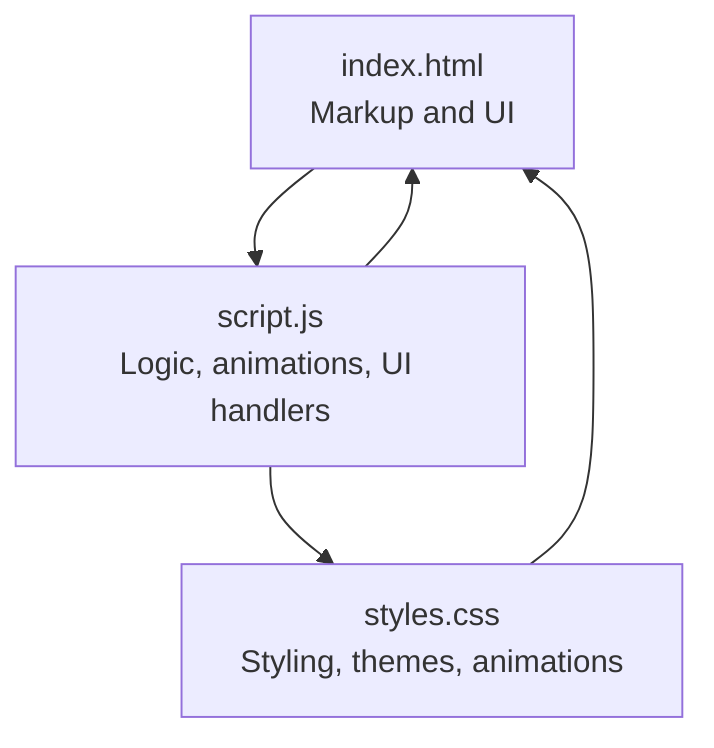
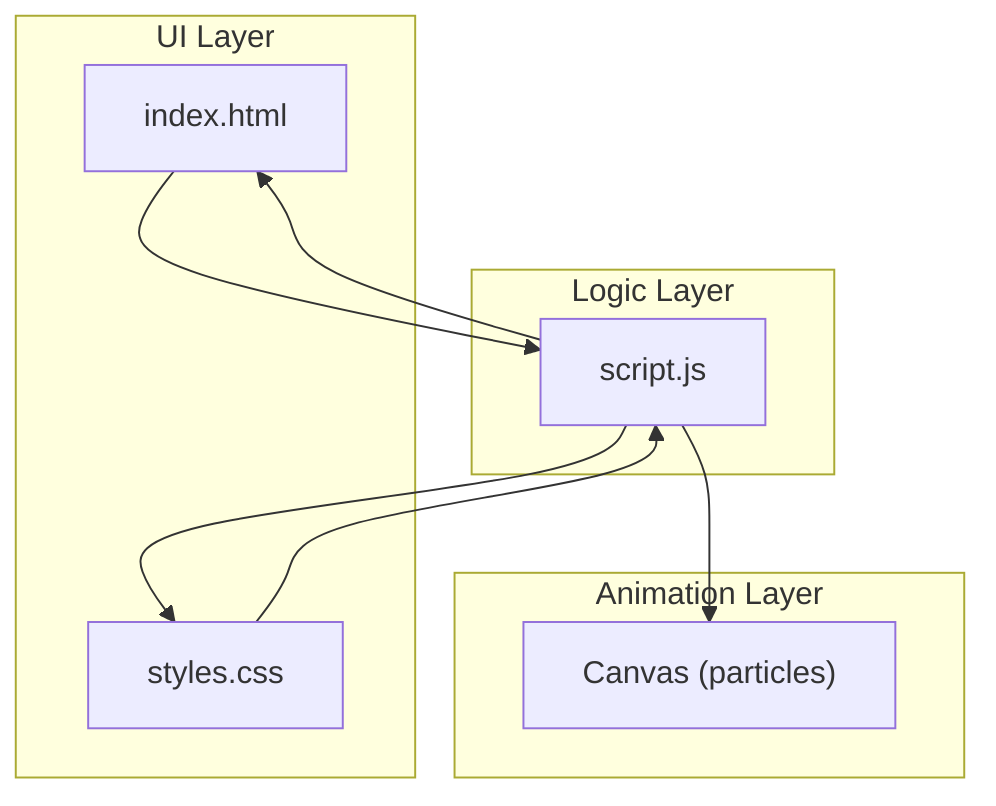
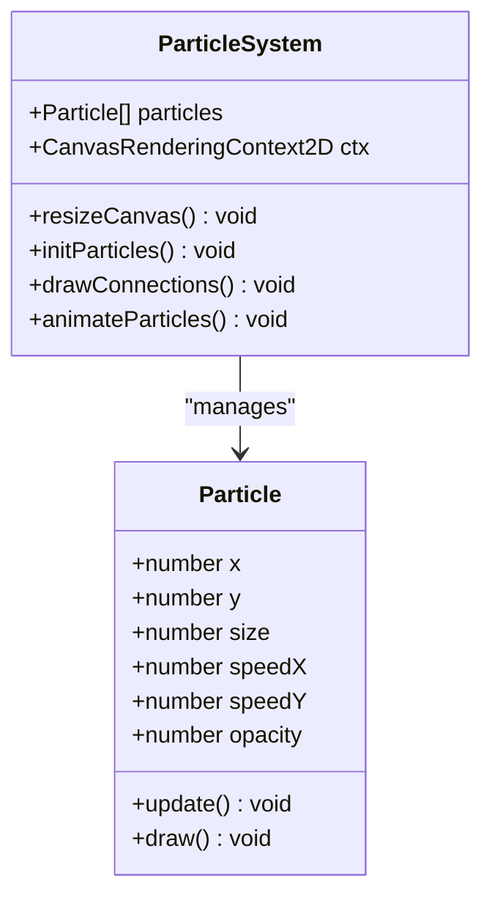
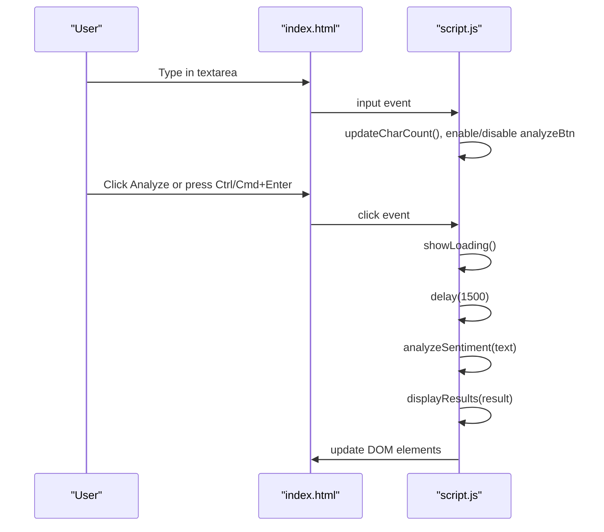
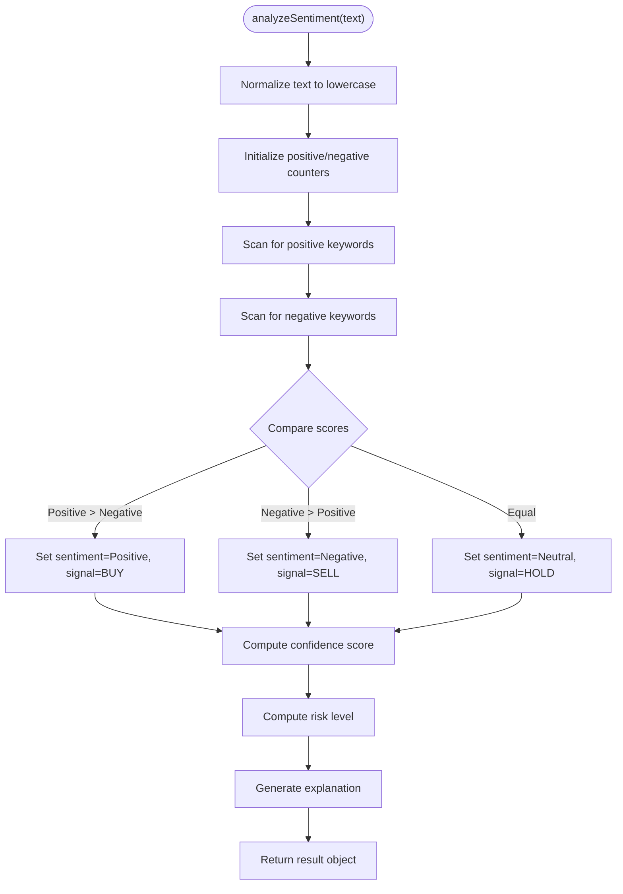
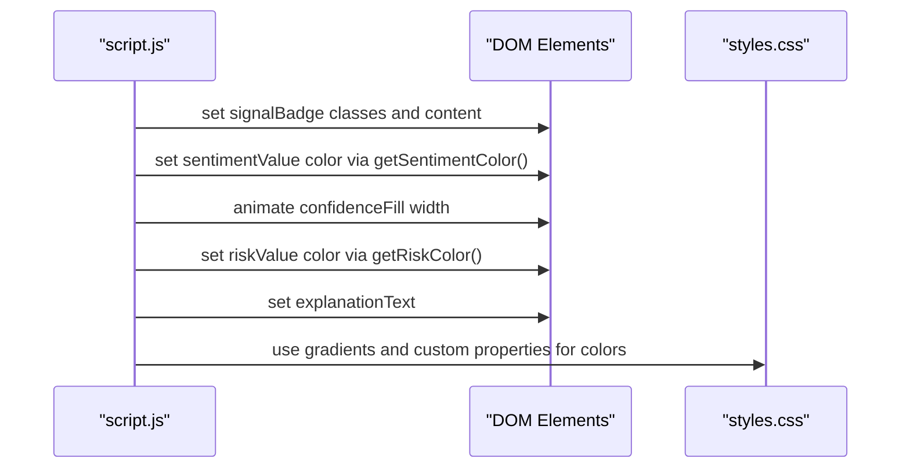
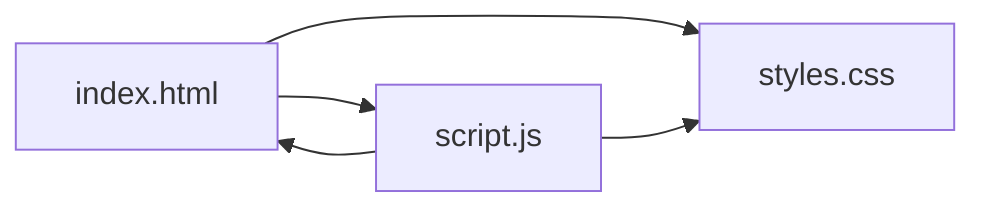

# Customization and Extension Guide

<cite>
**Referenced Files in This Document**
- [index.html](file://index.html)
- [script.js](file://script.js)
- [styles.css](file://styles.css)
</cite>

## Table of Contents
1. [Introduction](#introduction)
2. [Project Structure](#project-structure)
3. [Core Components](#core-components)
4. [Architecture Overview](#architecture-overview)
5. [Detailed Component Analysis](#detailed-component-analysis)
6. [Dependency Analysis](#dependency-analysis)
7. [Performance Considerations](#performance-considerations)
8. [Troubleshooting Guide](#troubleshooting-guide)
9. [Conclusion](#conclusion)
10. [Appendices](#appendices)

## Introduction
This guide explains how to customize and extend the AI Trading Signal Engine. It focuses on:
- Adding new sentiment analysis keywords and modifying the sentiment detection algorithm
- Theming customization via CSS custom properties and visual effects
- Extending the particle animation system
- Integration points for external financial APIs, WebSocket connections, and machine learning models
- Extending signal types, explanation generation, and persistence for user preferences
- Best practices for maintaining compatibility and performance

## Project Structure
The project consists of a single-page application with HTML for markup, CSS for styling and theming, and JavaScript for logic, animations, and UI interactions.

**Diagram sources**
- [index.html:1-226](file://index.html#L1-L226)
- [script.js:1-404](file://script.js#L1-L404)
- [styles.css:1-816](file://styles.css#L1-L816)

**Section sources**
- [index.html:1-226](file://index.html#L1-L226)
- [script.js:1-404](file://script.js#L1-L404)
- [styles.css:1-816](file://styles.css#L1-L816)

## Core Components
- Particle animation system: Canvas-based animated background with connection lines and responsive sizing
- Input handling: Real-time character count, enable/disable behavior, keyboard shortcuts
- Sentiment analysis engine: Keyword-based scoring with dynamic explanations and confidence/risk computation
- UI result rendering: Dynamic updates for sentiment, confidence, risk, and explanation text
- Theming and animations: CSS custom properties, gradients, and keyframe animations

**Section sources**
- [script.js:23-121](file://script.js#L23-L121)
- [script.js:126-139](file://script.js#L126-L139)
- [script.js:145-227](file://script.js#L145-L227)
- [script.js:288-327](file://script.js#L288-L327)
- [styles.css:4-60](file://styles.css#L4-L60)

## Architecture Overview
The runtime architecture is client-side with a clear separation of concerns:
- UI layer (HTML/CSS) renders the interface and applies themes
- Logic layer (JavaScript) orchestrates input handling, sentiment analysis, and result presentation
- Animation layer (Canvas) provides a lightweight, responsive background effect

**Diagram sources**
- [index.html:1-226](file://index.html#L1-L226)
- [script.js:1-404](file://script.js#L1-L404)
- [styles.css:1-816](file://styles.css#L1-L816)

## Detailed Component Analysis

### Particle Animation System
The particle system creates a responsive animated background:
- Canvas initialization and resize handling
- Particle class with position, speed, size, and opacity
- Connection drawing between nearby particles
- Animation loop with requestAnimationFrame

**Diagram sources**
- [script.js:38-65](file://script.js#L38-L65)
- [script.js:68-114](file://script.js#L68-L114)

**Section sources**
- [script.js:23-121](file://script.js#L23-L121)

### Input Handling and Keyboard Shortcuts
- Real-time character counting and button enable/disable logic
- Keyboard shortcut to trigger analysis (Ctrl/Cmd + Enter)
- Loading state management and result display

**Diagram sources**
- [script.js:126-139](file://script.js#L126-L139)
- [script.js:259-275](file://script.js#L259-L275)
- [script.js:278-327](file://script.js#L278-L327)

**Section sources**
- [script.js:126-139](file://script.js#L126-L139)
- [script.js:259-275](file://script.js#L259-L275)
- [script.js:375-382](file://script.js#L375-L382)

### Sentiment Analysis Engine (Keyword-Based)
The sentiment analyzer:
- Normalizes input text to lowercase
- Scans for predefined positive and negative keywords
- Computes sentiment, signal type, confidence, and risk level
- Generates dynamic explanations based on detected signal and keyword counts

**Diagram sources**
- [script.js:145-227](file://script.js#L145-L227)
- [script.js:229-253](file://script.js#L229-L253)

**Section sources**
- [script.js:145-227](file://script.js#L145-L227)
- [script.js:229-253](file://script.js#L229-L253)

### UI Result Rendering and Theming
- Updates signal badge, sentiment, confidence bar, risk level, and explanation text
- Applies theme-aware colors and gradients using CSS custom properties
- Animates confidence bar and scrolls to results

**Diagram sources**
- [script.js:288-327](file://script.js#L288-L327)
- [script.js:329-364](file://script.js#L329-L364)
- [styles.css:4-60](file://styles.css#L4-L60)

**Section sources**
- [script.js:288-327](file://script.js#L288-L327)
- [script.js:329-364](file://script.js#L329-L364)
- [styles.css:4-60](file://styles.css#L4-L60)

## Dependency Analysis
- HTML depends on CSS for styling and JavaScript for interactivity
- JavaScript depends on DOM APIs and Canvas for rendering
- Theming relies on CSS custom properties defined in the root scope

**Diagram sources**
- [index.html:1-226](file://index.html#L1-L226)
- [script.js:1-404](file://script.js#L1-L404)
- [styles.css:1-816](file://styles.css#L1-L816)

**Section sources**
- [index.html:1-226](file://index.html#L1-L226)
- [script.js:1-404](file://script.js#L1-L404)
- [styles.css:1-816](file://styles.css#L1-L816)

## Performance Considerations
- Particle animation pauses when the tab is not visible to conserve resources
- Confidence bar animation uses CSS transitions for smoothness
- Canvas particle count scales with viewport area to balance quality and performance
- Debounce or throttle heavy operations if integrating external APIs or ML models

**Section sources**
- [script.js:388-395](file://script.js#L388-L395)
- [script.js:68-75](file://script.js#L68-L75)

## Troubleshooting Guide
- If the particle animation stops, ensure the visibility change handler restarts the animation loop
- If sentiment analysis does not trigger, verify the input field is not empty and the button is enabled
- If colors appear incorrect, confirm CSS custom properties are defined in the root scope
- If animations stutter, reduce particle count or disable animations on low-power devices

**Section sources**
- [script.js:388-395](file://script.js#L388-L395)
- [script.js:126-139](file://script.js#L126-L139)
- [styles.css:4-60](file://styles.css#L4-L60)

## Conclusion
The AI Trading Signal Engine provides a robust foundation for customization and extension. By leveraging CSS custom properties, extending the sentiment analyzer, and augmenting the animation system, teams can tailor the platform to diverse trading use cases while maintaining performance and visual coherence.

## Appendices

### A. Customizing Sentiment Keywords and Detection Algorithm
- Add new keywords to the positive or negative arrays in the sentiment analyzer
- Adjust scoring logic to weight keywords differently or incorporate phrase matching
- Modify confidence calculation to reflect keyword density or contextual emphasis
- Extend explanation generation to include new categories or dynamic factors

Best practices:
- Keep keyword lists concise and domain-relevant
- Use weighted scoring for nuanced sentiment
- Preserve backward compatibility by appending new keywords rather than replacing defaults

**Section sources**
- [script.js:145-227](file://script.js#L145-L227)
- [script.js:229-253](file://script.js#L229-L253)

### B. Theming Customization via CSS Custom Properties
- Override color palette variables in the root scope to change the theme
- Adjust gradients, shadows, and radii to match brand guidelines
- Use custom properties consistently across components for maintainability

Examples of variables to customize:
- Backgrounds, text colors, neon accents
- Gradients for buttons and confidence bars
- Spacing and radius tokens

**Section sources**
- [styles.css:4-60](file://styles.css#L4-L60)

### C. Extending Visual Effects and Animations
- Add new keyframes for additional UI animations
- Introduce new particle behaviors (e.g., flocking, attraction/repulsion)
- Increase or decrease particle count based on device capabilities
- Add WebGL or off-DOM effects for advanced visuals (optional)

**Section sources**
- [script.js:38-65](file://script.js#L38-L65)
- [script.js:68-114](file://script.js#L68-L114)
- [styles.css:673-734](file://styles.css#L673-L734)

### D. Integration Points for External Financial APIs and WebSockets
- Replace the mock sentiment analyzer with a call to a backend service or public API
- Use WebSocket connections to stream real-time financial news or tick data
- Implement caching and rate limiting to handle API quotas and latency

Guidelines:
- Encapsulate API calls behind a dedicated module
- Add loading states and error handling for network requests
- Throttle frequent updates to preserve performance

[No sources needed since this section provides general guidance]

### E. Machine Learning Model Integration
- Deploy a lightweight NLP model in a worker or service worker
- Use serverless inference endpoints for scalable processing
- Cache predictions for repeated inputs to reduce latency

Considerations:
- Ensure model responses are normalized to the existing result schema
- Add fallback logic for offline or degraded modes

[No sources needed since this section provides general guidance]

### F. Extending Signal Types and Explanation Generation
- Add new signal categories (e.g., “STRONG BUY”, “STRONG SELL”) and corresponding UI badges
- Enhance explanation generation with domain-specific insights or historical patterns
- Introduce multi-modal explanations combining sentiment, technical cues, and macro factors

**Section sources**
- [script.js:180-198](file://script.js#L180-L198)
- [script.js:229-253](file://script.js#L229-L253)

### G. Persistence for User Preferences
- Store user preferences (theme, language, preferred signals) in localStorage or IndexedDB
- Sync preferences across sessions and devices via a backend service
- Respect privacy and minimize stored data

**Section sources**
- [script.js:388-395](file://script.js#L388-L395)

### H. Compatibility and Best Practices
- Maintain a stable DOM structure to avoid breaking UI updates
- Use CSS custom properties for all theming to simplify upgrades
- Keep animation loops decoupled from UI logic for easier testing and maintenance
- Validate external integrations with feature flags to ensure graceful degradation

**Section sources**
- [index.html:1-226](file://index.html#L1-L226)
- [styles.css:4-60](file://styles.css#L4-L60)
- [script.js:288-327](file://script.js#L288-L327)