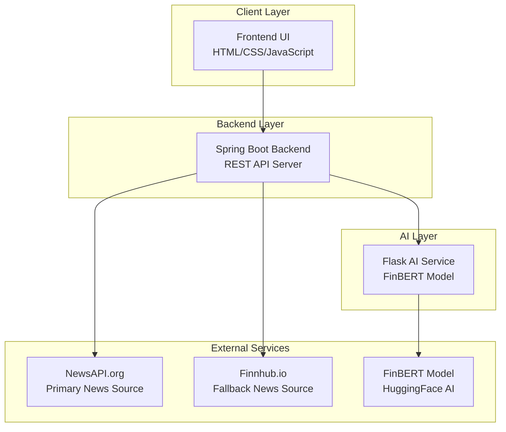
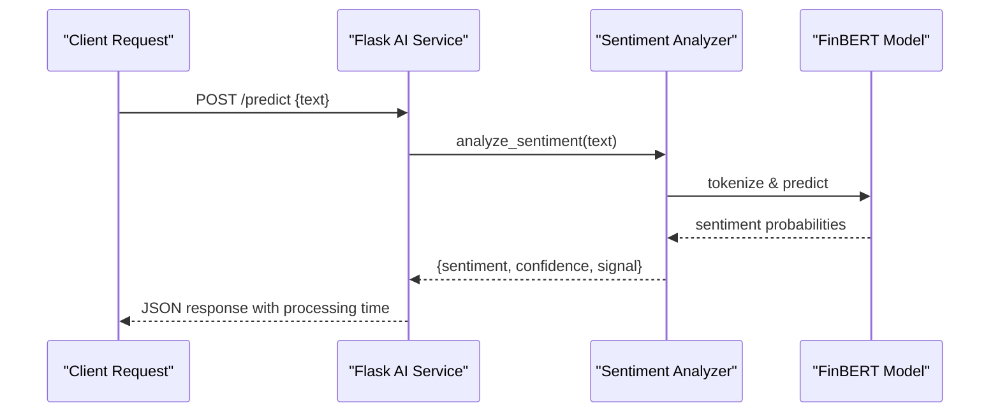
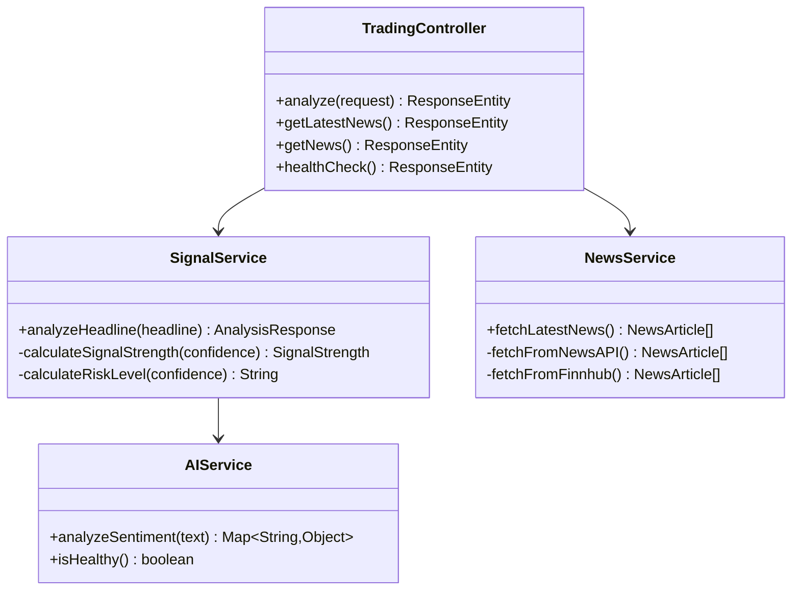

# Customization and Extension Guide

<cite>
**Referenced Files in This Document**
- [README.md](file://README.md)
- [QUICKSTART.md](file://QUICKSTART.md)
- [index.html](file://frontend/index.html)
- [script.js](file://frontend/script.js)
- [styles.css](file://frontend/styles.css)
- [TradingSignalApplication.java](file://backend/src/main/java/com/trading/TradingSignalApplication.java)
- [TradingController.java](file://backend/src/main/java/com/trading/controller/TradingController.java)
- [AIService.java](file://backend/src/main/java/com/trading/service/AIService.java)
- [NewsService.java](file://backend/src/main/java/com/trading/service/NewsService.java)
- [SignalService.java](file://backend/src/main/java/com/trading/service/SignalService.java)
- [app.py](file://ai-service/app.py)
- [sentiment_analyzer.py](file://ai-service/models/sentiment_analyzer.py)
- [requirements.txt](file://ai-service/requirements.txt)
</cite>

## Update Summary
**Changes Made**
- Added comprehensive documentation for multi-service deployment architecture
- Documented new AI service integration points and backend API customization
- Added detailed coverage of Flask AI service configuration and extension points
- Updated integration guides for external financial APIs and real-time data streams
- Enhanced extension mechanisms for adding new signal types and AI model integration
- Added performance considerations for distributed microservices architecture

## Table of Contents
1. [Introduction](#introduction)
2. [Multi-Service Architecture Overview](#multi-service-architecture-overview)
3. [Project Structure](#project-structure)
4. [Core Components](#core-components)
5. [AI Service Integration](#ai-service-integration)
6. [Backend API Customization](#backend-api-customization)
7. [Extension Points](#extension-points)
8. [Integration Guides](#integration-guides)
9. [Performance Considerations](#performance-considerations)
10. [Troubleshooting Guide](#troubleshooting-guide)
11. [Conclusion](#conclusion)
12. [Appendices](#appendices)

## Introduction
This guide explains how to customize and extend the AI Trading Signal Engine, a production-grade, real-time financial news sentiment analysis platform. The system now features a sophisticated multi-service architecture with separate frontend, backend, and AI service components, enabling advanced customization and extension capabilities.

**Updated** Added comprehensive coverage of the new multi-service deployment configuration and AI service integration points.

## Multi-Service Architecture Overview
The AI Trading Signal Engine operates as a distributed microservices architecture with three distinct components:



**Diagram sources**
- [TradingSignalApplication.java:13-28](file://backend/src/main/java/com/trading/TradingSignalApplication.java#L13-L28)
- [app.py:152-155](file://ai-service/app.py#L152-L155)

**Section sources**
- [README.md:27-61](file://README.md#L27-L61)
- [TradingSignalApplication.java:8-29](file://backend/src/main/java/com/trading/TradingSignalApplication.java#L8-L29)

## Project Structure
The project follows a modular architecture with clear separation of concerns:

```
KalpathonHackathon/
├── frontend/                 # Premium UI (HTML/CSS/JS)
│   ├── index.html           # Main HTML structure
│   ├── styles.css           # Premium styling (1200+ lines)
│   └── script.js            # Interactive logic + backend integration
├── backend/                  # Spring Boot Backend (Port 8080)
│   ├── pom.xml              # Maven dependencies
│   └── src/main/
│       ├── java/com/trading/
│       │   ├── TradingSignalApplication.java
│       │   ├── controller/
│       │   │   └── TradingController.java
│       │   ├── service/
│       │   │   ├── AIService.java
│       │   │   ├── NewsService.java
│       │   │   └── SignalService.java
│       │   ├── model/
│       │   │   ├── AnalysisRequest.java
│       │   │   ├── AnalysisResponse.java
│       │   │   ├── NewsArticle.java
│       │   │   └── SignalStrength.java
│       │   └── config/
│       │       └── WebConfig.java
│       └── resources/
│           └── application.properties
├── ai-service/               # Python Flask AI Service (Port 5000)
│   ├── requirements.txt     # Python dependencies
│   ├── app.py               # Flask API server
│   └── models/
│       └── sentiment_analyzer.py  # FinBERT integration
├── setup.bat                # One-click setup script
├── start.bat                # One-click start script
└── README.md                # Comprehensive documentation
```

**Section sources**
- [README.md:65-104](file://README.md#L65-L104)

## Core Components

### Frontend Component
The premium frontend provides a Bloomberg-level user interface with:
- Real-time AI analysis integration
- Animated particle background system
- Glassmorphism design with neon accents
- Responsive layout for desktop and mobile
- Interactive news fetching and analysis

### Backend Component (Spring Boot)
The Java backend serves as the orchestration layer:
- RESTful API endpoints for analysis and news fetching
- Service layer for AI integration and news aggregation
- Error handling and health monitoring
- Configuration management for external services

### AI Service Component (Flask)
The Python AI service provides FinBERT-powered sentiment analysis:
- Real-time financial sentiment analysis
- Company detection and entity recognition
- Multi-factor explanation generation
- Batch processing capabilities

**Section sources**
- [frontend/index.html:1-235](file://frontend/index.html#L1-L235)
- [backend/src/main/java/com/trading/TradingSignalApplication.java:1-30](file://backend/src/main/java/com/trading/TradingSignalApplication.java#L1-L30)
- [ai-service/app.py:1-155](file://ai-service/app.py#L1-L155)

## AI Service Integration

### Flask AI Service Architecture
The AI service implements a production-ready Flask application with comprehensive error handling and health monitoring:



**Diagram sources**
- [app.py:39-96](file://ai-service/app.py#L39-L96)
- [sentiment_analyzer.py:58-104](file://ai-service/models/sentiment_analyzer.py#L58-L104)

### AI Service Configuration
The AI service supports multiple deployment configurations:

**Environment Variables:**
- `AI_SERVICE_URL`: Base URL for AI service integration
- `NEWSAPI_KEY`: Primary news API authentication
- `FINNHUB_KEY`: Fallback news API authentication

**Service Endpoints:**
- `/health` - Health check endpoint
- `/predict` - Single text sentiment analysis
- `/batch` - Batch processing for multiple texts

**Section sources**
- [AIService.java:19-26](file://backend/src/main/java/com/trading/service/AIService.java#L19-L26)
- [app.py:29-96](file://ai-service/app.py#L29-L96)

## Backend API Customization

### Spring Boot Controller Architecture
The backend implements a comprehensive REST API with multiple endpoints:



**Diagram sources**
- [TradingController.java:18-167](file://backend/src/main/java/com/trading/controller/TradingController.java#L18-L167)
- [SignalService.java:13-100](file://backend/src/main/java/com/trading/service/SignalService.java#L13-L100)
- [AIService.java:14-86](file://backend/src/main/java/com/trading/service/AIService.java#L14-L86)

### API Endpoint Documentation
The backend exposes three primary endpoints:

**1. Analyze Headline (`POST /api/analyze`)**
- Accepts financial news headlines for sentiment analysis
- Integrates with Flask AI service for real-time processing
- Returns comprehensive analysis with confidence scores and risk assessment

**2. Fetch Latest News (`GET /api/news/latest`)**
- Retrieves real-time financial news from multiple sources
- Implements automatic fallback between NewsAPI and Finnhub
- Returns structured news articles with metadata

**3. Health Check (`GET /api/health`)**
- Monitors service availability and dependencies
- Validates AI service connectivity
- Provides system status information

**Section sources**
- [TradingController.java:37-166](file://backend/src/main/java/com/trading/controller/TradingController.java#L37-L166)
- [README.md:178-241](file://README.md#L178-L241)

## Extension Points

### Adding New AI Models
The system supports integration of multiple AI models beyond FinBERT:

**Model Integration Process:**
1. Create new analyzer class in `ai-service/models/`
2. Implement standardized interface methods
3. Update Flask routes to support new model
4. Add model-specific configuration options

**Supported Model Types:**
- Transformer-based models (BERT, RoBERTa, GPT)
- Specialized financial NLP models
- Ensemble models combining multiple approaches

### Extending Signal Types
The signal generation system can accommodate new trading signals:

**Signal Categories:**
- **Strong Signals**: `STRONG_BUY`, `STRONG_SELL`
- **Moderate Signals**: `BUY`, `SELL` 
- **Weak Signals**: `WEAK_BUY`, `WEAK_SELL`
- **Conditional Signals**: `WAIT`, `HOLD`

**Implementation Steps:**
1. Update `SignalStrength` enum in backend models
2. Modify confidence thresholds in `SignalService`
3. Extend frontend UI to display new signal types
4. Update risk calculation logic

### Customizing News Sources
The news aggregation system supports multiple financial data providers:

**Current Providers:**
- NewsAPI.org (primary)
- Finnhub.io (fallback)

**Adding New Providers:**
1. Create new service class in backend
2. Implement standardized interface
3. Add API key configuration
4. Update fallback logic

**Section sources**
- [SignalService.java:77-98](file://backend/src/main/java/com/trading/service/SignalService.java#L77-L98)
- [NewsService.java:38-183](file://backend/src/main/java/com/trading/service/NewsService.java#L38-L183)

## Integration Guides

### External Financial API Integration
The system provides flexible integration points for external financial data:

**API Configuration:**
- Edit `backend/src/main/resources/application.properties`
- Add API keys for supported providers
- Configure endpoint URLs and authentication

**Supported Integration Patterns:**
- Real-time streaming via WebSockets
- Scheduled data feeds via cron jobs
- On-demand API calls for specific requests
- Hybrid approach combining multiple sources

### WebSocket Real-Time Data Streams
For real-time financial data integration:

**WebSocket Implementation:**
1. Create WebSocket endpoint in backend
2. Implement message broadcasting
3. Add client-side connection handling
4. Configure connection pooling and reconnection

**Data Stream Types:**
- Live market data feeds
- Breaking news alerts
- Technical indicator updates
- Custom user-defined streams

### Machine Learning Model Integration
The AI service supports various machine learning frameworks:

**Model Framework Support:**
- HuggingFace Transformers (current implementation)
- TensorFlow/Keras models
- PyTorch Lightning modules
- ONNX runtime models

**Integration Requirements:**
- Standardized input/output formats
- Model versioning and compatibility
- Performance optimization and caching
- Error handling and fallback mechanisms

**Section sources**
- [requirements.txt:1-6](file://ai-service/requirements.txt#L1-L6)
- [app.py:100-139](file://ai-service/app.py#L100-L139)

## Performance Considerations

### Multi-Service Performance Optimization
The distributed architecture introduces several performance considerations:

**Service Communication:**
- Implement connection pooling for AI service calls
- Add circuit breaker patterns for fault tolerance
- Use asynchronous processing for non-critical operations
- Cache frequently accessed data across services

**Resource Management:**
- Monitor memory usage for FinBERT model (~2GB)
- Optimize particle system based on device capabilities
- Implement request throttling for external APIs
- Use connection keep-alive for persistent connections

**Scalability Patterns:**
- Horizontal scaling for Flask AI service
- Load balancing for high-traffic scenarios
- Database connection pooling for user preferences
- CDN caching for static assets

### Deployment Configuration
Configure service ports and resource allocation:

**Default Ports:**
- Frontend: Static file serving (browser default)
- Backend: `localhost:8080`
- AI Service: `localhost:5000`

**Resource Requirements:**
- Minimum 4GB RAM for optimal performance
- SSD storage for model caching
- Dedicated GPU for accelerated inference (optional)
- Network bandwidth for real-time data feeds

**Section sources**
- [README.md:322-330](file://README.md#L322-L330)
- [README.md:108-168](file://README.md#L108-L168)

## Troubleshooting Guide

### Multi-Service Architecture Issues
Common problems in the distributed system:

**Service Connectivity Problems:**
- Verify Flask AI service is running on port 5000
- Check Spring Boot backend can reach AI service
- Validate network firewall settings
- Monitor service health endpoints

**API Key Configuration:**
- Ensure NewsAPI.org and Finnhub.io keys are valid
- Check API quota limits and expiration dates
- Verify application.properties contains correct keys
- Test individual API endpoints separately

**Performance Issues:**
- Monitor FinBERT model loading time (first run ~400MB download)
- Check memory usage for AI service
- Verify particle system performance on different devices
- Optimize network requests and caching strategies

**Deployment Problems:**
- Ensure all prerequisites are installed (Java 17+, Python 3.8+)
- Check Maven and pip dependency installations
- Verify port availability (8080, 5000)
- Review log files for detailed error messages

**Section sources**
- [README.md:286-320](file://README.md#L286-L320)
- [QUICKSTART.md:88-105](file://QUICKSTART.md#L88-L105)

## Conclusion
The AI Trading Signal Engine provides a robust, production-ready foundation for financial sentiment analysis with its multi-service architecture. The system's modular design enables extensive customization and extension while maintaining high performance and reliability. Teams can leverage the documented extension points to integrate new AI models, customize signal types, and connect to various financial data sources while preserving the premium user experience.

## Appendices

### A. Customizing Sentiment Analysis Keywords and Detection Algorithm
The system now supports both frontend keyword analysis and backend AI-powered analysis:

**Frontend Keyword Analysis:**
- Customize positive/negative word lists in `script.js`
- Modify confidence calculation algorithms
- Extend explanation generation logic
- Add new keyword detection patterns

**Backend AI Integration:**
- Extend `SentimentAnalyzer` class in `sentiment_analyzer.py`
- Add new company detection patterns
- Customize explanation generation
- Implement ensemble models combining multiple approaches

**Best Practices:**
- Maintain backward compatibility when extending
- Use weighted scoring for nuanced sentiment
- Implement fallback mechanisms for edge cases
- Test with real financial news datasets

**Section sources**
- [script.js:387-479](file://frontend/script.js#L387-L479)
- [sentiment_analyzer.py:11-175](file://ai-service/models/sentiment_analyzer.py#L11-L175)

### B. Theming Customization via CSS Custom Properties
The premium UI supports extensive theming customization:

**Root Variables:**
- Background colors (`--bg-primary`, `--bg-secondary`)
- Neon accent colors (`--neon-green`, `--neon-red`, `--neon-blue`)
- Gradient definitions (`--gradient-primary`, `--gradient-btn`)
- Shadow effects (`--shadow-glow-*`)
- Typography tokens (`--spacing-*`, `--radius-*`)

**Customization Examples:**
- Create custom color schemes for different market sectors
- Implement dark/light mode switching
- Add brand-specific color palettes
- Customize animation timing and easing functions

**Section sources**
- [styles.css:4-73](file://frontend/styles.css#L4-L73)

### C. Extending Visual Effects and Animations
The particle system and UI animations provide multiple extension points:

**Particle System Extensions:**
- Modify particle physics and collision detection
- Add new visual effects (flocking, attraction/repulsion)
- Implement WebGL acceleration for complex animations
- Add interactive particle manipulation

**UI Animation Enhancements:**
- Extend keyframe animations for new components
- Add micro-interactions for enhanced user feedback
- Implement custom transition effects
- Create reusable animation utilities

**Section sources**
- [script.js:38-136](file://frontend/script.js#L38-L136)
- [styles.css:102-158](file://frontend/styles.css#L102-L158)

### D. Integration Points for External Financial APIs and WebSockets
The system provides flexible integration mechanisms:

**API Integration Patterns:**
- RESTful API consumption with retry logic
- WebSocket real-time data streaming
- GraphQL queries for complex data relationships
- Event-driven architecture for reactive updates

**Webhook Implementation:**
- Configure webhook endpoints for external notifications
- Implement secure webhook validation
- Add retry mechanisms for failed deliveries
- Monitor webhook delivery status

**Data Transformation:**
- Implement custom data mapping for different API formats
- Add data validation and sanitization
- Create caching layers for improved performance
- Establish data synchronization strategies

### E. Machine Learning Model Integration
Multiple ML framework integration options:

**Model Framework Support:**
- HuggingFace Transformers (current FinBERT implementation)
- TensorFlow Serving for production deployments
- ONNX Runtime for cross-platform inference
- Custom PyTorch models with optimized pipelines

**Model Management:**
- Implement model versioning and A/B testing
- Add model performance monitoring and metrics
- Create automated model retraining pipelines
- Establish model rollback and recovery procedures

**Inference Optimization:**
- Implement model quantization for reduced memory usage
- Add batch processing for improved throughput
- Create model caching strategies
- Optimize inference pipeline for real-time requirements

### F. Extending Signal Types and Explanation Generation
The signal generation system supports comprehensive customization:

**Signal Enhancement:**
- Add new signal categories (e.g., `STRONG_BUY`, `WEAK_SELL`)
- Implement multi-timeframe analysis
- Add technical indicator integration
- Create sentiment intensity scoring

**Explanation Generation:**
- Extend natural language generation for domain-specific insights
- Add historical pattern matching and comparison
- Implement multi-modal explanations combining technical and fundamental analysis
- Create personalized explanation formats based on user preferences

**Risk Assessment:**
- Implement dynamic risk scoring based on market volatility
- Add correlation analysis with broader market trends
- Create scenario-based risk evaluation
- Integrate with external risk rating services

**Section sources**
- [SignalService.java:77-98](file://backend/src/main/java/com/trading/service/SignalService.java#L77-L98)
- [sentiment_analyzer.py:121-170](file://ai-service/models/sentiment_analyzer.py#L121-L170)

### G. Persistence for User Preferences
The system supports user preference storage and synchronization:

**Local Storage Options:**
- Browser localStorage for simple preference storage
- IndexedDB for larger datasets and structured data
- Session storage for temporary preferences
- Cookie-based preferences for cross-session persistence

**Backend Integration:**
- User preference database tables
- Preference synchronization across devices
- GDPR-compliant data handling and deletion
- Preference migration and backup strategies

**Preference Categories:**
- Theme and UI customization preferences
- Analysis parameter preferences
- Alert and notification settings
- Data sharing and privacy preferences

### H. Multi-Service Deployment Configuration
Production deployment considerations:

**Containerization:**
- Docker containerization for frontend, backend, and AI services
- Kubernetes deployment for scalable microservices
- Environment-specific configuration management
- Secret management for API keys and credentials

**Monitoring and Logging:**
- Distributed tracing for multi-service requests
- Centralized logging for debugging and analytics
- Health check endpoints for service monitoring
- Performance metrics collection and alerting

**Security Considerations:**
- API gateway for request routing and security
- Cross-origin resource sharing (CORS) configuration
- Authentication and authorization for protected endpoints
- Data encryption for sensitive user information

**Scalability Patterns:**
- Load balancing across service instances
- Database connection pooling and clustering
- Message queuing for asynchronous processing
- CDN caching for static assets and frequently accessed data

**Section sources**
- [TradingSignalApplication.java:13-28](file://backend/src/main/java/com/trading/TradingSignalApplication.java#L13-L28)
- [app.py:152-155](file://ai-service/app.py#L152-L155)
- [README.md:108-168](file://README.md#L108-L168)