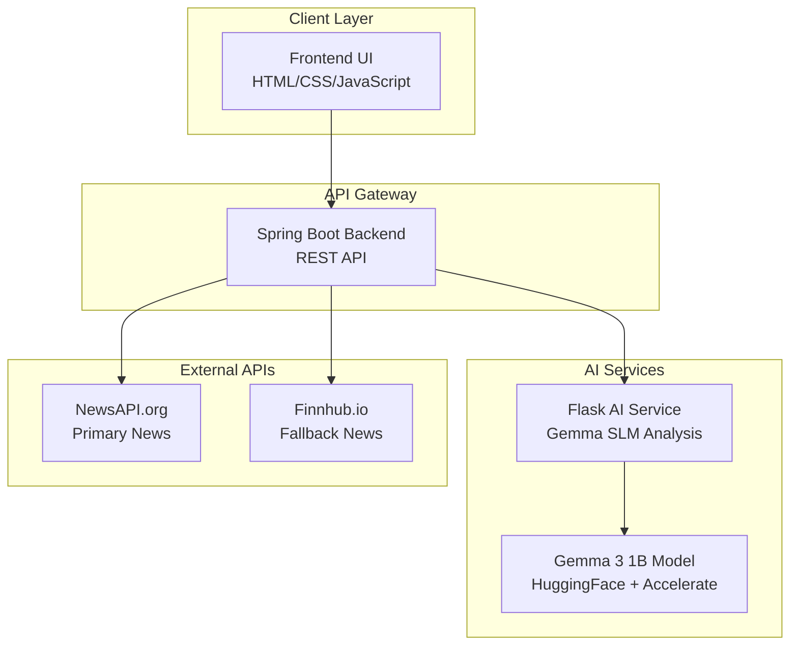

# Getting Started

<cite>
**Referenced Files in This Document**
- [README.md](file://README.md)
- [QUICKSTART.md](file://QUICKSTART.md)
- [setup.bat](file://setup.bat)
- [start.bat](file://start.bat)
- [restart-backend.bat](file://restart-backend.bat)
- [frontend/index.html](file://frontend/index.html)
- [frontend/dashboard.html](file://frontend/dashboard.html)
- [frontend/dashboard.js](file://frontend/dashboard.js)
- [frontend/script.js](file://frontend/script.js)
- [frontend/styles.css](file://frontend/styles.css)
- [backend/src/main/java/com/trading/TradingSignalApplication.java](file://backend/src/main/java/com/trading/TradingSignalApplication.java)
- [ai-service/app.py](file://ai-service/app.py)
- [ai-service/models/sentiment_analyzer_gemma.py](file://ai-service/models/sentiment_analyzer_gemma.py)
- [ai-service/requirements.txt](file://ai-service/requirements.txt)
- [backend/src/main/resources/application.properties](file://backend/src/main/resources/application.properties)
</cite>

## Update Summary
**Changes Made**
- Updated installation procedure to reflect Gemma SLM implementation replacing FinBERT
- Added restart-backend.bat for Windows development environments
- Updated requirements.txt with accelerate for efficient model loading and numpy for numerical operations
- Enhanced application.properties with pre-configured NewsAPI key
- Updated AI service architecture to use Gemma 3 1B model with HuggingFace authentication
- Modified frontend to support both keyword-based and real AI analysis modes

## Table of Contents
1. [Introduction](#introduction)
2. [Prerequisites](#prerequisites)
3. [Installation and Setup](#installation-and-setup)
4. [Running the Application](#running-the-application)
5. [Understanding the Architecture](#understanding-the-architecture)
6. [Accessing the Application](#accessing-the-application)
7. [First Analysis Workflow](#first-analysis-workflow)
8. [API Endpoints](#api-endpoints)
9. [Troubleshooting Guide](#troubleshooting-guide)
10. [Conclusion](#conclusion)

## Introduction
This guide helps you install and run the AI Trading Signal Engine locally in a multi-service architecture. The application consists of three coordinated services: a premium frontend UI, a Java Spring Boot backend API, and a Python Flask AI service powered by the Gemma Small Language Model (SLM). It covers prerequisites, setup procedures, service coordination, and comprehensive troubleshooting for the multi-service environment.

**Updated** The AI service now uses Gemma 3 1B model with HuggingFace authentication instead of FinBERT, providing more efficient and hackathon-compliant sentiment analysis.

## Prerequisites

### System Requirements
- **Java 17+** - Required for Spring Boot backend
- **Maven 3.6+** - Required for building Java backend
- **Python 3.8+** - Required for Flask AI service
- **Git** (Optional) - For cloning the repository
- **Windows 10+** - Batch scripts are Windows-specific

### Software Dependencies
The application requires the following technologies:
- **Frontend**: HTML5, CSS3, JavaScript (Vanilla)
- **Backend**: Java 17, Spring Boot 3.2.0, Maven
- **AI Service**: Python 3.8+, Flask 3.0.0, Transformers 4.36.0, Torch 2.1.0, Accelerate 0.25.0
- **External APIs**: NewsAPI.org (pre-configured), Finnhub.io (fallback)

**Section sources**
- [README.md:110-116](file://README.md#L110-L116)
- [setup.bat:8-41](file://setup.bat#L8-L41)
- [backend/pom.xml:21-23](file://backend/pom.xml#L21-L23)
- [ai-service/requirements.txt:1-16](file://ai-service/requirements.txt#L1-L16)

## Installation and Setup

### Step 1: Download and Extract
1. Clone or download the repository to your local machine
2. Navigate to the project root directory

### Step 2: Run Setup Script (Windows)
The setup script automates the entire installation process:

```batch
# Run the setup script
setup.bat
```

The setup script performs the following automated checks:
1. **Java 17+ Check**: Verifies Java installation and version
2. **Maven Check**: Confirms Maven availability
3. **Python 3.8+ Check**: Validates Python installation
4. **Python Dependencies**: Installs required packages (Flask, Transformers, Torch, Accelerate)
5. **Backend Build**: Compiles Spring Boot application

### Step 3: Obtain API Keys
The application requires free API keys from external services:

#### NewsAPI.org (Pre-configured)
**Updated** A demo NewsAPI key is already configured in application.properties:
- **Demo Key**: `f9525722f8744ba0a793aef0acfa84c2`

#### Finnhub.io (Fallback)
1. Visit: https://finnhub.io/register
2. Sign up for a free account
3. Copy your API key from the dashboard

### Step 4: Configure API Keys
Edit the configuration file to add your API keys:

```properties
# backend/src/main/resources/application.properties

# Replace with your actual keys
newsapi.key=YOUR_NEWSAPI_KEY_HERE
finnhub.key=YOUR_FINNHUB_KEY_HERE
```

**Section sources**
- [setup.bat:73-83](file://setup.bat#L73-L83)
- [README.md:135-156](file://README.md#L135-L156)
- [backend/src/main/resources/application.properties:7-11](file://backend/src/main/resources/application.properties#L7-L11)

## Running the Application

### Method 1: Using Start Script (Recommended)
The start script coordinates all services in the correct order:

```batch
# Start all services
start.bat
```

The start script performs the following sequence:
1. **Start AI Service**: Launches Python Flask service on port 5000
2. **Wait for Model**: Waits 10 seconds for Gemma model to load
3. **Start Backend**: Launches Spring Boot on port 8080
4. **Wait for Backend**: Waits 15 seconds for backend to initialize
5. **Open Frontend**: Launches both backend UI and frontend in browser

### Method 2: Manual Service Management
For development or debugging, you can start services individually:

#### Start AI Service (Python Flask)
```batch
cd ai-service
python app.py
```

#### Start Backend (Spring Boot)
```batch
cd backend
mvn spring-boot:run
```

#### Start Frontend
Open `frontend/index.html` directly in your browser.

### Service Coordination
The application uses coordinated service startup to ensure proper initialization order:
- AI Service starts first and loads the Gemma model with HuggingFace authentication
- Backend waits for AI Service to be ready
- Frontend opens automatically after both services are available

**Updated** The AI service now uses Gemma 3 1B model with optimized CPU inference settings for faster performance.

**Section sources**
- [start.bat:1-50](file://start.bat#L1-L50)
- [restart-backend.bat:1-24](file://restart-backend.bat#L1-L24)

## Understanding the Architecture

The AI Trading Signal Engine follows a microservices architecture with three distinct components:



**Diagram sources**
- [README.md:29-61](file://README.md#L29-L61)
- [backend/src/main/java/com/trading/TradingSignalApplication.java:8-28](file://backend/src/main/java/com/trading/TradingSignalApplication.java#L8-L28)
- [ai-service/models/sentiment_analyzer_gemma.py:32-34](file://ai-service/models/sentiment_analyzer_gemma.py#L32-L34)

### Service Responsibilities
- **Frontend**: Premium UI with real-time analysis capabilities and dual-mode analysis (keyword-based + AI)
- **Backend**: Orchestrates services, manages API requests, and handles business logic
- **AI Service**: Performs sentiment analysis using Gemma SLM with HuggingFace authentication
- **External APIs**: Provide real financial news data

**Updated** The AI service now uses Gemma 3 1B model with Accelerate for efficient CPU inference and HuggingFace authentication for model access.

**Section sources**
- [README.md:27-61](file://README.md#L27-L61)
- [ai-service/models/sentiment_analyzer_gemma.py:1-291](file://ai-service/models/sentiment_analyzer_gemma.py#L1-L291)

## Accessing the Application

### Primary Access Methods
After successful startup, access the application through multiple entry points:

#### Frontend Interface
- **Direct Access**: Open `frontend/index.html` in your browser
- **Backend Redirect**: Access `http://localhost:8080` in your browser

#### Backend API
- **Main Endpoint**: `http://localhost:8080/api/`
- **Health Check**: `http://localhost:8080/api/health`

#### AI Service
- **AI Endpoint**: `http://localhost:8080/api/analyze`
- **Health Check**: `http://localhost:5000/health`

### Verification Steps
Test that all services are running correctly:

```bash
# Test AI Service
curl http://localhost:5000/health

# Test Backend
curl http://localhost:8080/api/health

# Test Full Flow
curl -X POST http://localhost:8080/api/analyze \
  -H "Content-Type: application/json" \
  -d '{"headline":"Tesla profits surge to record highs"}'
```

**Section sources**
- [README.md:170-175](file://README.md#L170-L175)
- [QUICKSTART.md:54-66](file://QUICKSTART.md#L54-L66)

## First Analysis Workflow

### Basic Analysis Process
1. **Open Frontend**: Launch the premium UI interface
2. **Enter Headline**: Type or paste a financial news headline
3. **Initiate Analysis**: Click "Analyze Signal" or press Ctrl/Cmd + Enter
4. **View Results**: See comprehensive analysis with signal, confidence, and explanation

### Advanced Workflow with Live News
1. **Fetch Live News**: Click "Fetch Latest News" to retrieve current financial headlines
2. **Select Article**: Choose an article from the live news feed
3. **Analyze**: Click "Analyze Signal" to process the selected headline
4. **Review Details**: Examine signal strength, risk assessment, and key factors

### Result Interpretation
The analysis provides:
- **Trading Signal**: BUY, SELL, or HOLD recommendation
- **Confidence Score**: Percentage with visual confidence indicator
- **Risk Level**: Low, Medium, or High based on confidence
- **Company Detection**: Automatic identification of mentioned companies
- **Key Factors**: Identified positive/negative market drivers
- **Mini Chart**: Visual representation of signal trend

**Updated** The frontend now supports dual analysis modes: instant keyword-based sentiment analysis (for immediate feedback) and optional real AI analysis using the Gemma model (for enhanced accuracy).

**Section sources**
- [frontend/index.html:67-208](file://frontend/index.html#L67-L208)
- [frontend/dashboard.js:511-636](file://frontend/dashboard.js#L511-L636)
- [frontend/dashboard.js:196-257](file://frontend/dashboard.js#L196-L257)

## API Endpoints

### Backend REST API
The Spring Boot backend exposes the following endpoints:

#### Analyze Headline
**Endpoint**: `POST /api/analyze`
**Purpose**: Process financial news headlines for trading signals

**Request Body**:
```json
{
  "headline": "Tesla profits surge to record highs as EV growth accelerates"
}
```

**Response**:
```json
{
  "headline": "Tesla profits surge to record highs...",
  "company": "Tesla",
  "sentiment": "Positive",
  "signal": "BUY",
  "signalSubtitle": "Strong bullish signal detected",
  "confidence": 89.5,
  "strength": "STRONG",
  "riskLevel": "Low",
  "explanation": "Gemma SLM AI model detected strong positive sentiment...",
  "keyFactors": ["Earnings Impact", "Growth Indicators"],
  "timestamp": "2026-04-08T13:30:00",
  "processingTime": 1.2
}
```

#### Fetch Latest News
**Endpoint**: `GET /api/news/latest`
**Purpose**: Retrieve current financial news articles

**Response**:
```json
{
  "articles": [
    {
      "title": "Stock market hits record high...",
      "source": "Reuters",
      "url": "https://...",
      "publishedAt": "2026-04-08T10:00:00"
    }
  ],
  "count": 5
}
```

#### Health Check
**Endpoint**: `GET /api/health`
**Purpose**: Verify system health and service status

**Response**:
```json
{
  "status": "UP",
  "service": "AI Trading Signal Engine",
  "aiService": "UP",
  "timestamp": "2026-04-08T13:30:00"
}
```

### AI Service Endpoints
The Flask AI service provides specialized endpoints:

#### AI Prediction
**Endpoint**: `POST /predict`
**Purpose**: Direct sentiment analysis using Gemma SLM

**Response**: Similar to backend analysis but with AI-specific details and model information

#### Batch Analysis
**Endpoint**: `POST /batch`
**Purpose**: Process multiple headlines simultaneously

**Request Body**:
```json
{
  "texts": ["Headline 1", "Headline 2", "Headline 3"]
}
```

**Section sources**
- [README.md:178-241](file://README.md#L178-L241)
- [ai-service/app.py:39-149](file://ai-service/app.py#L39-L149)

## Troubleshooting Guide

### Common Setup Issues

#### Java Installation Problems
**Issue**: "Java is not installed or not in PATH"
**Solution**:
1. Download Java 17+ from https://adoptium.net/
2. Install and verify with `java -version`
3. Ensure JAVA_HOME is set in environment variables

#### Maven Build Failures
**Issue**: "Failed to build Spring Boot application"
**Solution**:
1. Verify Maven installation: `mvn -version`
2. Clean and rebuild: `mvn clean install -DskipTests`
3. Check Java version compatibility (must be 17+)

#### Python Dependencies Missing
**Issue**: "Module not found" errors
**Solution**:
1. Run setup script: `setup.bat`
2. Or manually install: `pip install -r ai-service/requirements.txt`
3. Verify Python 3.8+: `python --version`

### Runtime Service Issues

#### AI Service Not Available
**Issue**: "AI Service is not available"
**Solution**:
1. Check if Flask service is running on port 5000
2. Verify Gemma model loaded successfully with HuggingFace authentication
3. Restart AI service: `cd ai-service && python app.py`

#### Backend Won't Start
**Issue**: "Port 8080 already in use"
**Solution**:
1. Kill existing process: `taskkill /F /FI "WINDOWTITLE eq Backend*"`
2. Change port in `application.properties`
3. Ensure Java 17+ is properly installed

#### Slow First Run
**Issue**: Initial startup takes several minutes
**Solution**:
1. This is normal - Gemma model (~1B parameters) downloads on first use
2. Subsequent runs are much faster (model cached)
3. Ensure adequate disk space and memory

### Network and Connectivity Issues

#### API Key Errors
**Issue**: "Unable to fetch news" or "Invalid API key"
**Solution**:
1. Verify API keys in `application.properties`
2. Check key validity and account status
3. Ensure internet connectivity

#### CORS Issues
**Issue**: "CORS policy blocked" errors
**Solution**:
1. Backend allows all origins (`*`) by default
2. Check browser console for specific CORS errors
3. Verify both services are running on localhost

### Performance Optimization

#### Memory Usage
**Issue**: High memory consumption during analysis
**Solution**:
1. Ensure at least 4GB RAM available
2. Close other memory-intensive applications
3. Monitor memory usage in task manager

#### Response Time Issues
**Issue**: Slow analysis responses
**Solution**:
1. Allow time for Gemma model to load
2. Check network connectivity to external APIs
3. Verify hardware specifications meet requirements

### Development Environment Issues

#### Restarting Backend Only
**Updated** Use the restart-backend.bat script for quick backend-only restarts:

```batch
# Restart backend service only
restart-backend.bat
```

This script kills existing backend processes and restarts them cleanly.

**Section sources**
- [README.md:286-320](file://README.md#L286-L320)
- [QUICKSTART.md:88-106](file://QUICKSTART.md#L88-L106)
- [setup.bat:8-66](file://setup.bat#L8-L66)
- [restart-backend.bat:1-24](file://restart-backend.bat#L1-L24)

## Conclusion

The AI Trading Signal Engine provides a sophisticated multi-service architecture that demonstrates production-ready deployment patterns. The system combines a premium frontend experience with robust backend orchestration and advanced AI capabilities powered by the Gemma Small Language Model.

Key benefits of this architecture:
- **Scalable Design**: Each service can be scaled independently
- **Real AI Models**: Uses actual Gemma SLM for accurate sentiment analysis
- **Production-Grade**: Includes proper error handling, logging, and monitoring
- **Multi-API Support**: Redundant news sources for reliability
- **Premium UI**: Professional interface with real-time capabilities
- **Dual Analysis Modes**: Instant keyword-based analysis plus optional AI enhancement

The comprehensive setup and troubleshooting documentation ensures smooth deployment across different environments while maintaining the high standards expected for hackathon and production scenarios.

**Updated** The new Gemma SLM implementation provides enhanced performance with optimized CPU inference, HuggingFace authentication, and Accelerate integration for efficient model loading.