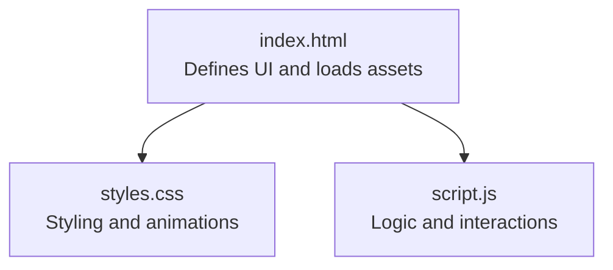
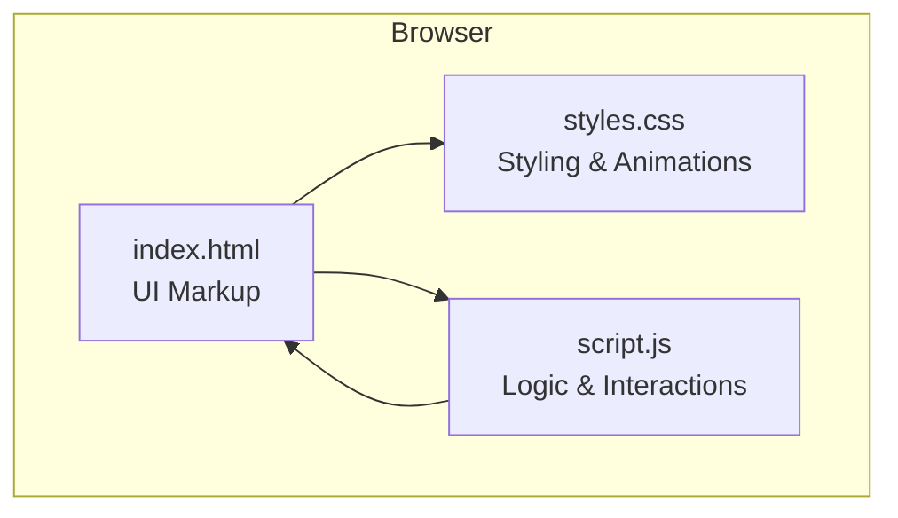
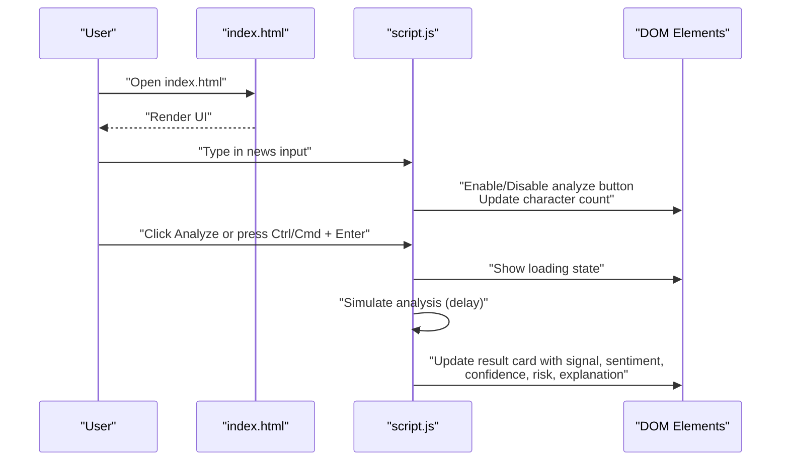
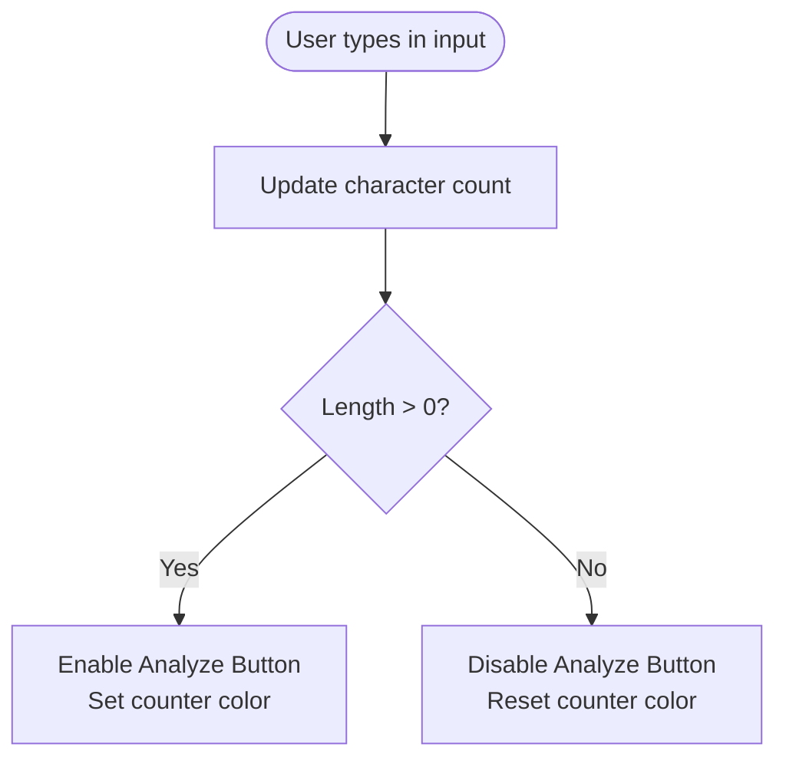
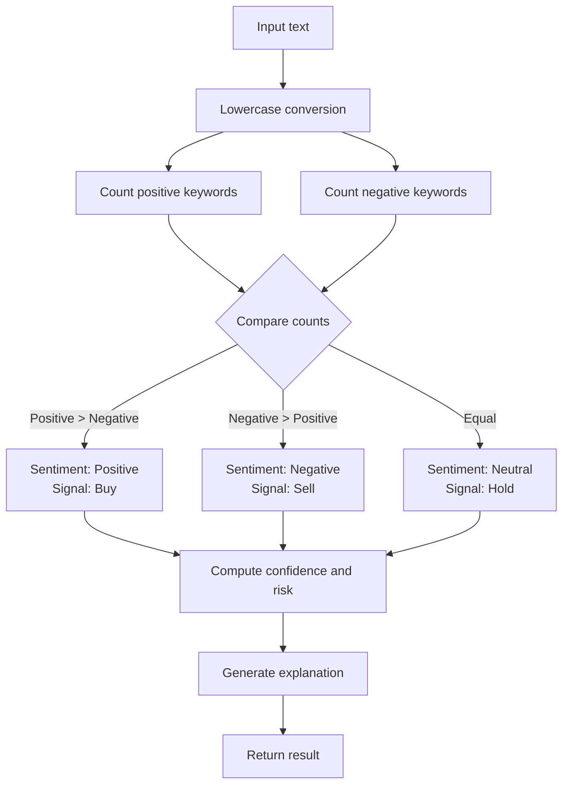
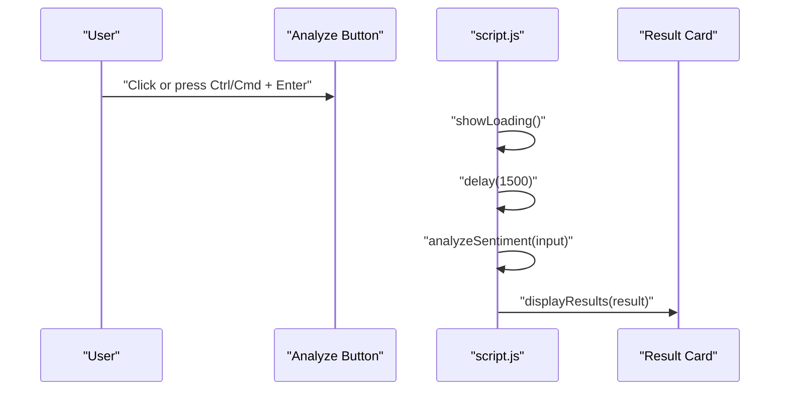
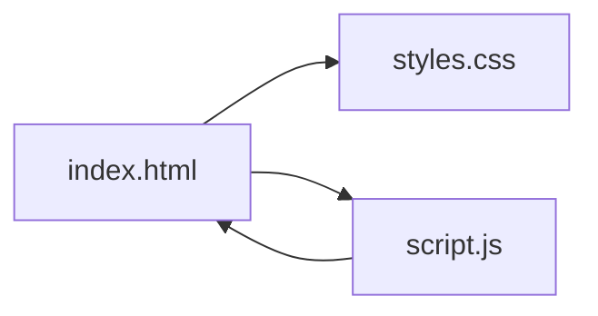

# Getting Started

<cite>
**Referenced Files in This Document**
- [index.html](file://index.html)
- [script.js](file://script.js)
- [styles.css](file://styles.css)
</cite>

## Table of Contents
1. [Introduction](#introduction)
2. [Project Structure](#project-structure)
3. [Core Components](#core-components)
4. [Architecture Overview](#architecture-overview)
5. [Detailed Component Analysis](#detailed-component-analysis)
6. [Dependency Analysis](#dependency-analysis)
7. [Performance Considerations](#performance-considerations)
8. [Troubleshooting Guide](#troubleshooting-guide)
9. [Conclusion](#conclusion)
10. [Appendices](#appendices)

## Introduction
This guide helps you install and run the AI Trading Signal Engine locally in your browser. It covers prerequisites, launching the app, navigating the interface, performing your first analysis, interpreting results, and troubleshooting common issues. The application is a client-side web app that runs entirely in your browser without requiring a backend server.

## Project Structure
The application consists of three files:
- index.html: The HTML page that defines the UI layout and includes the stylesheet and script.
- styles.css: The styling for the dark theme, animations, responsive layout, and interactive elements.
- script.js: The JavaScript logic for input handling, simulated sentiment analysis, UI updates, keyboard shortcuts, and performance optimizations.

**Diagram sources**
- [index.html:1-175](file://index.html#L1-L175)
- [styles.css:1-816](file://styles.css#L1-L816)
- [script.js:1-404](file://script.js#L1-L404)

**Section sources**
- [index.html:1-175](file://index.html#L1-L175)
- [script.js:1-404](file://script.js#L1-L404)
- [styles.css:1-816](file://styles.css#L1-L816)

## Core Components
- HTML container and layout: The page sets up the header, input area, analyze button, loading state, results card, and footer statistics.
- Input handling: A textarea captures financial news headlines with character counting and enables/disables the analyze button.
- Simulated sentiment engine: A keyword-based analyzer determines sentiment, generates a trading signal, confidence, risk level, and explanation.
- UI interactions: Loading animations, result rendering, and keyboard shortcuts.
- Visual design: Dark theme with neon accents, animated backgrounds, and responsive layout.

**Section sources**
- [index.html:42-150](file://index.html#L42-L150)
- [script.js:127-139](file://script.js#L127-L139)
- [script.js:145-227](file://script.js#L145-L227)
- [script.js:259-327](file://script.js#L259-L327)
- [styles.css:248-294](file://styles.css#L248-L294)

## Architecture Overview
The application is a single-page client-side app. The HTML page renders the UI, the CSS applies styling and animations, and the JavaScript handles user interactions, simulates analysis, and updates the UI.

**Diagram sources**
- [index.html:1-175](file://index.html#L1-L175)
- [styles.css:1-816](file://styles.css#L1-L816)
- [script.js:1-404](file://script.js#L1-L404)

## Detailed Component Analysis

### Installation and Running Locally
Follow these steps to run the application on your machine:
1. Save the three files (index.html, script.js, styles.css) in the same folder on your computer.
2. Open index.html in a modern web browser.
   - The app will load immediately without any build process.
3. Verify the interface appears with the header, input area, analyze button, and footer stats.

Prerequisites:
- Modern web browser with JavaScript enabled.
- No server required; open index.html directly from your file system.

Recommended browsers:
- Chrome, Firefox, Safari, Edge (latest versions).
- The app uses standard web APIs and CSS features widely supported by modern browsers.

**Section sources**
- [index.html:1-175](file://index.html#L1-L175)
- [script.js:375-382](file://script.js#L375-L382)
- [styles.css:76-84](file://styles.css#L76-L84)

### Accessing the Application
- Launch your browser and open index.html from the folder where you saved the files.
- The page will render the AI Trading Signal Engine interface with animated background effects.

**Section sources**
- [index.html:15-40](file://index.html#L15-L40)
- [styles.css:89-109](file://styles.css#L89-L109)

### Understanding the Interface Layout
- Header: Logo and subtitle with a live status indicator.
- Input Section: A textarea labeled “Financial News Input” with a character counter and placeholder text.
- Analyze Button: Prominent gradient button labeled “Analyze Signal.”
- Loading State: Animated loader with dots and subtext while processing.
- Result Card: Displays the trading signal badge, sentiment, confidence, risk level, and AI explanation.
- Footer Stats: Displays aggregated metrics such as total news analyzed, accuracy rate, and response time.

**Section sources**
- [index.html:25-40](file://index.html#L25-L40)
- [index.html:45-63](file://index.html#L45-L63)
- [index.html:65-70](file://index.html#L65-L70)
- [index.html:72-87](file://index.html#L72-L87)
- [index.html:89-148](file://index.html#L89-L148)
- [index.html:152-168](file://index.html#L152-L168)

### Performing the First Analysis
Basic workflow:
1. Paste a financial news headline into the input area.
2. Click the “Analyze Signal” button or press Ctrl/Cmd + Enter.
3. Observe the loading animation.
4. Review the results card showing the signal, sentiment, confidence, risk level, and explanation.

Keyboard shortcut:
- Ctrl/Cmd + Enter triggers analysis when the input is not empty and the button is enabled.

Input validation:
- The button is disabled when the input is empty.
- The character counter enforces a 500-character limit.

**Section sources**
- [script.js:127-139](file://script.js#L127-L139)
- [script.js:259-275](file://script.js#L259-L275)
- [script.js:375-382](file://script.js#L375-L382)
- [index.html:52-62](file://index.html#L52-L62)

### Interpreting Results
- Signal Badge: Shows the recommendation (Buy, Sell, or Hold) with a colored glow and emoji.
- Sentiment: Indicates whether the sentiment is Positive, Negative, or Neutral.
- Confidence: Numeric percentage with a progress bar and gradient color indicating low, medium, or high confidence.
- Risk Level: Low, Medium, or High based on confidence.
- Explanation: A contextual explanation generated from the input text and sentiment.

**Section sources**
- [index.html:90-148](file://index.html#L90-L148)
- [script.js:288-327](file://script.js#L288-L327)
- [script.js:329-364](file://script.js#L329-L364)

### Browser Compatibility and Recommendations
- The app uses modern CSS (variables, gradients, animations) and vanilla JavaScript.
- Recommended browsers: Chrome, Firefox, Safari, Edge (latest versions).
- The design is responsive and adapts to smaller screens.

**Section sources**
- [styles.css:4-60](file://styles.css#L4-L60)
- [styles.css:739-795](file://styles.css#L739-L795)
- [script.js:375-382](file://script.js#L375-L382)

## Architecture Overview

**Diagram sources**
- [index.html:52-70](file://index.html#L52-L70)
- [script.js:127-139](file://script.js#L127-L139)
- [script.js:259-327](file://script.js#L259-L327)

## Detailed Component Analysis

### Input Handling and Validation
- The input listener updates the character counter and toggles the analyze button’s enabled state.
- The button is disabled when the input is empty and re-enabled when text is present.
- A maximum length of 500 characters is enforced.

**Diagram sources**
- [script.js:127-139](file://script.js#L127-L139)
- [index.html:52-62](file://index.html#L52-L62)

**Section sources**
- [script.js:127-139](file://script.js#L127-L139)
- [index.html:52-62](file://index.html#L52-L62)

### Sentiment Analysis Engine (Mock)
- The analyzer converts input to lowercase and counts occurrences of predefined positive and negative keywords.
- Determines sentiment and assigns a trading signal (Buy, Sell, Hold).
- Generates a confidence score and risk level based on keyword counts and randomness.
- Produces a contextual explanation string.

**Diagram sources**
- [script.js:145-227](file://script.js#L145-L227)

**Section sources**
- [script.js:145-227](file://script.js#L145-L227)

### UI Interaction Handlers
- On click or keyboard shortcut, the app shows the loading state, waits briefly, runs the analyzer, and displays results.
- The result card animates into view and updates all metrics dynamically.

**Diagram sources**
- [script.js:259-275](file://script.js#L259-L275)
- [script.js:278-327](file://script.js#L278-L327)

**Section sources**
- [script.js:259-275](file://script.js#L259-L275)
- [script.js:278-327](file://script.js#L278-L327)

### Keyboard Shortcuts
- Ctrl/Cmd + Enter triggers analysis when the input is not empty and the button is enabled.

**Section sources**
- [script.js:375-382](file://script.js#L375-L382)

### Performance Optimizations
- Particle animation pauses when the tab is not visible to save resources.
- Canvas-based particle system scales particle count based on viewport size.

**Section sources**
- [script.js:388-395](file://script.js#L388-L395)
- [script.js:68-75](file://script.js#L68-L75)

## Dependency Analysis
- index.html depends on styles.css for visuals and script.js for interactivity.
- script.js depends on DOM elements defined in index.html and uses no external libraries.
- styles.css defines variables and animations used across the UI.

**Diagram sources**
- [index.html:13](file://index.html#L13)
- [index.html:172](file://index.html#L172)
- [script.js:1-21](file://script.js#L1-L21)

**Section sources**
- [index.html:13](file://index.html#L13)
- [index.html:172](file://index.html#L172)
- [script.js:1-21](file://script.js#L1-L21)

## Performance Considerations
- The app is lightweight and runs entirely in the browser.
- Animations and particle effects are optimized to pause when the tab is inactive.
- Canvas particle count scales with screen size to balance performance and visual quality.

[No sources needed since this section provides general guidance]

## Troubleshooting Guide
Common issues and fixes:
- Page does not load or shows blank content:
  - Ensure all three files (index.html, script.js, styles.css) are in the same folder.
  - Open index.html directly in your browser (do not drag-and-drop into an existing tab).
- Analyze button remains disabled:
  - Type at least one character into the input field.
  - Confirm the character counter updates and the button becomes enabled.
- Loading animation does not appear:
  - Verify the button is enabled and click again.
  - Check the browser console for errors (press F12 to open developer tools).
- Unexpected results:
  - Try rephrasing the headline to include more explicit positive/negative keywords.
  - Keep the input under 500 characters.
- Browser compatibility issues:
  - Use a modern browser (Chrome, Firefox, Safari, Edge).
  - Disable ad blockers or pop-up blockers that might interfere with local file access.
- Performance on low-end devices:
  - Close other tabs to free memory.
  - The app automatically reduces particle activity when the tab is not visible.

**Section sources**
- [script.js:127-139](file://script.js#L127-L139)
- [script.js:259-275](file://script.js#L259-L275)
- [script.js:375-382](file://script.js#L375-L382)
- [script.js:388-395](file://script.js#L388-L395)

## Conclusion
You can run the AI Trading Signal Engine locally by opening index.html in a modern browser. Use the input area to paste financial news headlines, click Analyze Signal or press Ctrl/Cmd + Enter, and review the generated signal, sentiment, confidence, risk level, and explanation. The app is designed for simplicity and immediate results without any server or installation steps.

[No sources needed since this section summarizes without analyzing specific files]

## Appendices

### Quick Reference
- Open index.html in your browser to launch the app.
- Paste a headline in the input area.
- Click Analyze Signal or press Ctrl/Cmd + Enter.
- Review the signal badge, sentiment, confidence, risk level, and explanation.
- Use the footer stats for context on performance metrics.

[No sources needed since this section provides general guidance]