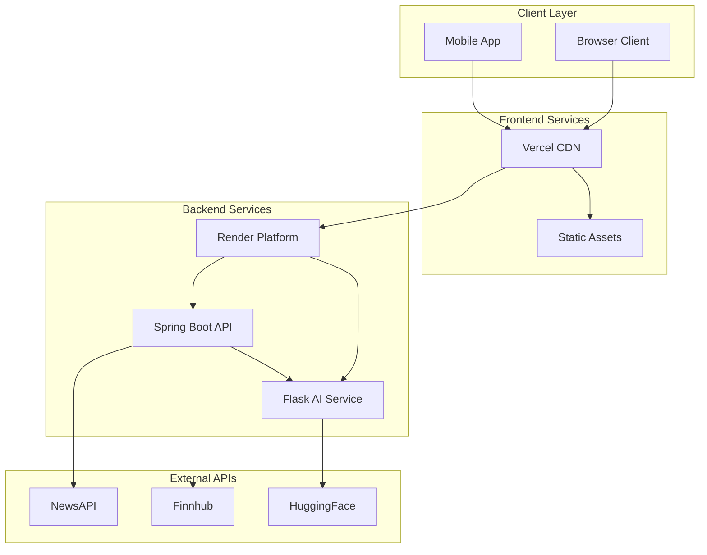
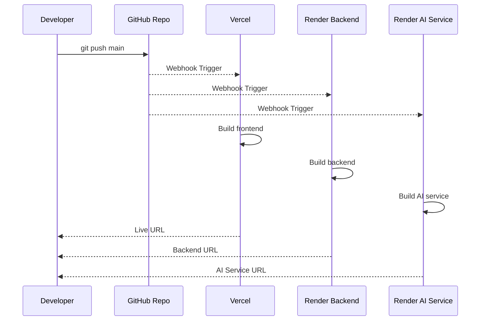
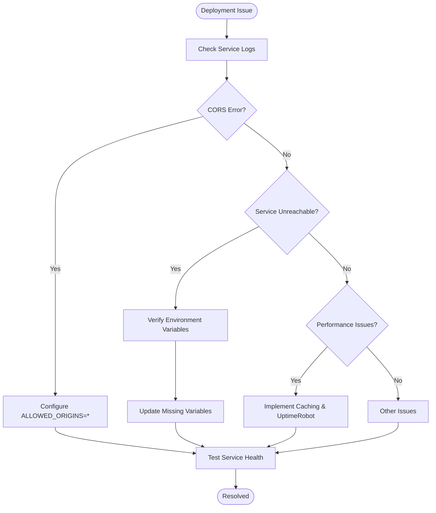

# Cloud Deployment Guide

<cite>
**Referenced Files in This Document**
- [CLOUD_DEPLOYMENT_GUIDE.md](file://CLOUD_DEPLOYMENT_GUIDE.md)
- [DEPLOYMENT.md](file://DEPLOYMENT.md)
- [DEPLOYMENT_CHECKLIST.md](file://DEPLOYMENT_CHECKLIST.md)
- [DEPLOYMENT_GUIDE.md](file://DEPLOYMENT_GUIDE.md)
- [QUICK_DEPLOY.md](file://QUICK_DEPLOY.md)
- [RENDER_VERCEL_DEPLOYMENT.md](file://RENDER_VERCEL_DEPLOYMENT.md)
- [render.yaml](file://render.yaml)
- [vercel.json](file://vercel.json)
- [api-config.js](file://frontend/api-config.js)
- [application.properties](file://backend/src/main/resources/application.properties)
- [WebConfig.java](file://backend/src/main/java/com/trading/config/WebConfig.java)
- [pom.xml](file://backend/pom.xml)
- [requirements.txt](file://ai-service/requirements.txt)
- [deploy.bat](file://deploy.bat)
- [setup.bat](file://setup.bat)
- [README.md](file://README.md)
</cite>

## Table of Contents
1. [Introduction](#introduction)
2. [Project Architecture](#project-architecture)
3. [Cloud Deployment Options](#cloud-deployment-options)
4. [Render + Vercel Deployment](#render--vercel-deployment)
5. [Free Tier Limitations](#free-tier-limitations)
6. [Environment Configuration](#environment-configuration)
7. [Deployment Automation](#deployment-automation)
8. [Monitoring and Maintenance](#monitoring-and-maintenance)
9. [Troubleshooting Guide](#troubleshooting-guide)
10. [Best Practices](#best-practices)
11. [Conclusion](#conclusion)

## Introduction

This comprehensive Cloud Deployment Guide provides step-by-step instructions for deploying the Grow My Trade AI Trading Signal Platform to production cloud environments. The platform consists of three interconnected microservices: a React frontend, a Spring Boot backend, and a Flask AI service powered by the Gemma language model.

The deployment architecture leverages Render for backend and AI service hosting, and Vercel for frontend delivery. All services are designed to be cloud-ready with automatic environment detection, ensuring seamless transitions between local development and production environments.

## Project Architecture

The Grow My Trade platform follows a microservices architecture with clear separation of concerns:



**Diagram sources**
- [RENDER_VERCEL_DEPLOYMENT.md:34-61](file://RENDER_VERCEL_DEPLOYMENT.md#L34-L61)
- [README.md:55-78](file://README.md#L55-L78)

The architecture ensures scalability, fault isolation, and optimal performance through CDN distribution and cloud-native deployment patterns.

## Cloud Deployment Options

### Local Deployment (Recommended for Demos)

Local deployment offers the fastest response times and complete offline functionality:

- **Advantages**: No internet dependency, instant responses, easy debugging
- **Best for**: Hackathon presentations, testing, development
- **Setup**: Single command execution with pre-configured batch scripts

### Cloud Deployment (Production Ready)

Production deployment utilizes Render and Vercel for scalable, globally distributed services:

- **Frontend**: Vercel with CDN distribution
- **Backend**: Render with auto-scaling capabilities  
- **AI Service**: Render with GPU-optimized instances
- **Cost**: $0/month on free tiers

### Hybrid Approach

Recommended strategy combining local speed with cloud reliability:

1. **Primary**: Local deployment for live demonstrations
2. **Backup**: Cloud deployment for remote presentations
3. **Redundancy**: Video recording as ultimate backup

**Section sources**
- [DEPLOYMENT_GUIDE.md:30-48](file://DEPLOYMENT_GUIDE.md#L30-L48)
- [DEPLOYMENT_GUIDE.md:160-175](file://DEPLOYMENT_GUIDE.md#L160-L175)

## Render + Vercel Deployment

### Backend Service Deployment (Render)

#### Service Configuration

The backend service requires Java 17+ and Maven for building:

```yaml
services:
  - type: web
    name: trading-signal-backend
    env: java
    region: oregon
    plan: free
    branch: main
    rootDir: backend
    buildCommand: mvn clean install -DskipTests
    startCommand: java -jar target/trading-signal-engine-1.0.0.jar
    envVars:
      - key: NEWSAPI_KEY
        sync: false
      - key: FINNHUB_KEY
        sync: false
      - key: AI_SERVICE_URL
        sync: false
      - key: JAVA_OPTS
        value: -Xmx512m
    healthCheckPath: /api/health
```

#### Environment Variables Setup

Critical environment variables for backend operation:

| Variable | Purpose | Example Value |
|----------|---------|---------------|
| `NEWSAPI_KEY` | Financial news API access | `f9525722f8744ba0a793aef0acfa84c2` |
| `FINNHUB_KEY` | Stock market data access | `d7b7809r01ql9e4linj0` |
| `AI_SERVICE_URL` | AI service endpoint | `https://trading-ai-service.onrender.com` |
| `JAVA_OPTS` | JVM memory allocation | `-Xmx512m` |
| `ALLOWED_ORIGINS` | CORS configuration | `*` |

**Section sources**
- [render.yaml:1-41](file://render.yaml#L1-L41)
- [application.properties:8-17](file://backend/src/main/resources/application.properties#L8-L17)

### AI Service Deployment (Render)

#### Service Configuration

The AI service utilizes Python 3.10 with Flask framework:

```yaml
services:
  - type: web
    name: trading-ai-service
    env: python
    region: oregon
    plan: free
    branch: main
    rootDir: ai-service
    buildCommand: pip install -r requirements.txt
    startCommand: python app.py
    envVars:
      - key: HF_TOKEN
        sync: false
      - key: PORT
        value: 5000
      - key: PYTHON_VERSION
        value: 3.10.0
    healthCheckPath: /health
```

#### Dependencies and Requirements

The AI service requires specific Python packages for sentiment analysis:

| Package | Version | Purpose |
|---------|---------|---------|
| `flask` | >=3.0.0 | Web framework |
| `transformers` | >=4.36.0 | AI model integration |
| `torch` | >=2.1.0 | Machine learning framework |
| `accelerate` | >=0.25.0 | Efficient model loading |
| `numpy` | >=1.24.0 | Numerical computations |
| `requests` | >=2.31.0 | HTTP client |

**Section sources**
- [render.yaml:23-41](file://render.yaml#L23-L41)
- [requirements.txt:1-16](file://ai-service/requirements.txt#L1-L16)

### Frontend Deployment (Vercel)

#### Configuration Setup

Vercel deployment configuration for static asset delivery:

```json
{
  "version": 2,
  "name": "grow-my-trade",
  "builds": [
    {
      "src": "frontend/**",
      "use": "@vercel/static"
    }
  ],
  "routes": [
    {
      "src": "/(.*)",
      "dest": "/frontend/$1"
    }
  ],
  "env": {
    "PLATFORM": "vercel"
  }
}
```

#### Environment Variables

Frontend-specific environment variables:

| Variable | Purpose | Example Value |
|----------|---------|---------------|
| `NEXT_PUBLIC_BACKEND_URL` | Backend API endpoint | `https://trading-signal-backend.onrender.com/api` |
| `NEXT_PUBLIC_AI_SERVICE_URL` | AI service endpoint | `https://trading-ai-service.onrender.com` |
| `PLATFORM` | Deployment platform identifier | `vercel` |

**Section sources**
- [vercel.json:1-20](file://vercel.json#L1-L20)
- [api-config.js:32-38](file://frontend/api-config.js#L32-L38)

## Free Tier Limitations

### Render Platform Constraints

| Service | Free Tier Limits | Impact |
|---------|------------------|---------|
| **Backend** | 750 hours/month | ~30 days continuous uptime |
| **AI Service** | 750 hours/month | ~30 days continuous uptime |
| **Storage** | 5GB SSD | Sufficient for application files |
| **Bandwidth** | Unlimited | No data transfer restrictions |

### API Service Limitations

| Service | Free Tier Limits | Workarounds |
|---------|------------------|-------------|
| **NewsAPI** | 100 requests/day | Batch processing, caching |
| **Finnhub** | 60 requests/minute | Rate limiting, optimization |
| **HuggingFace** | Unlimited | Model download quotas |

### Performance Considerations

**Cold Start Behavior**:
- Free tier services spin down after 15 minutes of inactivity
- First request after idle: 30-60 seconds
- Subsequent requests: Normal speed (2-5 seconds)

**Recommended Solutions**:
1. **UptimeRobot**: Free monitoring service (50 monitors)
2. **Always-on Services**: Upgrade to Render Standard ($7/month)
3. **Caching Strategy**: Implement intelligent caching for repeated requests

**Section sources**
- [CLOUD_DEPLOYMENT_GUIDE.md:299-318](file://CLOUD_DEPLOYMENT_GUIDE.md#L299-L318)
- [RENDER_VERCEL_DEPLOYMENT.md:461-484](file://RENDER_VERCEL_DEPLOYMENT.md#L461-L484)

## Environment Configuration

### Automatic Environment Detection

The frontend implements sophisticated environment detection:

```javascript
const hostname = window.location.hostname;
const isLocalhost = hostname === 'localhost' || 
                   hostname === '127.0.0.1' ||
                   hostname === '';
const isVercel = hostname.includes('vercel.app') || 
                hostname.includes('now.sh') ||
                process.env.PLATFORM === 'vercel';
const isRender = hostname.includes('onrender.com');
```

### Configuration Matrix

| Environment | Backend URL | AI Service URL | Purpose |
|-------------|-------------|----------------|---------|
| **Local** | `http://localhost:8080/api` | `http://localhost:5000` | Development & Testing |
| **Vercel** | Dynamic from `NEXT_PUBLIC_BACKEND_URL` | Dynamic from `NEXT_PUBLIC_AI_SERVICE_URL` | Production Frontend |
| **Render** | Cloud URL pattern | Cloud URL pattern | Production Backend/AI |
| **Fallback** | Default cloud URLs | Default cloud URLs | Disaster Recovery |

### Backend Configuration Properties

The backend uses Spring Boot's externalized configuration:

```properties
# API Keys from environment variables
newsapi.key=${NEWSAPI_KEY:f9525722f8744ba0a793aef0acfa84c2}
finnhub.key=${FINNHUB_KEY:YOUR_FINNHUB_KEY}

# AI Service Configuration
ai.service.url=${AI_SERVICE_URL:http://localhost:5000}

# CORS Configuration
allowed.origins=${ALLOWED_ORIGINS:*}
```

**Section sources**
- [api-config.js:7-16](file://frontend/api-config.js#L7-L16)
- [api-config.js:17-39](file://frontend/api-config.js#L17-L39)
- [application.properties:8-17](file://backend/src/main/resources/application.properties#L8-L17)

## Deployment Automation

### Continuous Integration Pipeline

The deployment pipeline supports automatic updates on code changes:



**Diagram sources**
- [RENDER_VERCEL_DEPLOYMENT.md:527-549](file://RENDER_VERCEL_DEPLOYMENT.md#L527-L549)

### Batch Script Automation

Windows batch scripts streamline the deployment process:

#### Setup Script (`setup.bat`)
- Validates Java, Maven, and Python installations
- Installs Python dependencies automatically
- Builds Spring Boot application with Maven
- Provides clear error messaging and recovery steps

#### Deployment Script (`deploy.bat`)
- Checks system prerequisites
- Builds backend JAR if not present
- Installs Python dependencies
- Provides step-by-step deployment guidance

**Section sources**
- [setup.bat:1-85](file://setup.bat#L1-L85)
- [deploy.bat:1-87](file://deploy.bat#L1-L87)

## Monitoring and Maintenance

### Health Check Endpoints

Comprehensive monitoring setup ensures service reliability:

| Service | Health Endpoint | Expected Response | Monitoring |
|---------|----------------|-------------------|------------|
| **Backend** | `/api/health` | `{"status": "UP", "service": "AI Trading Signal Engine"}` | Render Logs |
| **AI Service** | `/health` | `{"status": "healthy", "model_loaded": true}` | Render Logs |
| **Frontend** | Root URL | HTML content | Vercel Analytics |

### Performance Monitoring

**Render Dashboard Features**:
- Real-time resource usage tracking
- Deployment history and rollback capability
- Custom alert configuration
- Bandwidth and performance metrics

**Vercel Dashboard Features**:
- Site analytics and visitor insights
- Bandwidth usage monitoring
- Deployment status and logs
- Custom domain management

### Maintenance Procedures

**Regular Tasks**:
1. Monitor service uptime and response times
2. Review error logs for pattern identification
3. Update API keys as needed
4. Optimize caching strategies
5. Perform capacity planning based on usage trends

**Section sources**
- [RENDER_VERCEL_DEPLOYMENT.md:487-508](file://RENDER_VERCEL_DEPLOYMENT.md#L487-L508)
- [DEPLOYMENT_CHECKLIST.md:120-127](file://DEPLOYMENT_CHECKLIST.md#L120-L127)

## Troubleshooting Guide

### Common Deployment Issues

#### CORS Configuration Problems

**Symptoms**: `Access-Control-Allow-Origin` errors in browser console

**Solutions**:
1. Verify backend CORS configuration allows all origins
2. Check environment variable `ALLOWED_ORIGINS` is set to `*`
3. Ensure frontend and backend are using HTTPS consistently

#### Service Connectivity Issues

**Backend-AI Service Communication**:
- Verify `AI_SERVICE_URL` environment variable
- Check AI service health endpoint response
- Monitor Render logs for connection errors

**Frontend-Backend Communication**:
- Validate API configuration in `api-config.js`
- Test backend health endpoint directly
- Check network connectivity between services

#### Performance Optimization

**Cold Start Mitigation**:
- Implement UptimeRobot monitoring service
- Design caching strategies for frequently accessed data
- Optimize model loading and initialization sequences

**Memory Management**:
- Monitor JVM heap usage with `JAVA_OPTS`
- Implement connection pooling for external API calls
- Use efficient data structures for news processing

### Error Resolution Flowchart



**Diagram sources**
- [CLOUD_DEPLOYMENT_GUIDE.md:321-381](file://CLOUD_DEPLOYMENT_GUIDE.md#L321-L381)
- [RENDER_VERCEL_DEPLOYMENT.md:363-458](file://RENDER_VERCEL_DEPLOYMENT.md#L363-L458)

**Section sources**
- [CLOUD_DEPLOYMENT_GUIDE.md:321-381](file://CLOUD_DEPLOYMENT_GUIDE.md#L321-L381)
- [RENDER_VERCEL_DEPLOYMENT.md:363-458](file://RENDER_VERCEL_DEPLOYMENT.md#L363-L458)

## Best Practices

### Security Implementation

**API Key Management**:
- Never commit API keys to version control
- Use environment variables exclusively
- Implement proper key rotation procedures
- Restrict API key permissions to minimum required

**CORS Security**:
- Configure allowed origins appropriately
- Implement proper authentication for sensitive endpoints
- Use HTTPS for all production traffic
- Regular security audits and updates

### Performance Optimization

**Frontend Optimization**:
- Leverage Vercel's global CDN for static assets
- Implement lazy loading for heavy components
- Use efficient chart rendering libraries
- Minimize bundle sizes with tree shaking

**Backend Optimization**:
- Implement connection pooling for external APIs
- Use caching for frequently accessed data
- Optimize database queries (if implemented)
- Monitor and tune JVM parameters

### Scalability Planning

**Horizontal Scaling**:
- Design stateless services for easy scaling
- Implement proper load balancing
- Use database connection pooling
- Monitor service metrics and auto-scaling triggers

**Cost Management**:
- Monitor usage patterns and optimize accordingly
- Consider upgrade paths for increased demand
- Implement cost controls and budget alerts
- Plan for seasonal traffic variations

### Development Workflow

**Version Control**:
- Use feature branches for development
- Implement pull request reviews
- Automated testing in CI/CD pipeline
- Release tagging and documentation updates

**Quality Assurance**:
- Comprehensive testing across environments
- Performance benchmarking
- Security vulnerability scanning
- User acceptance testing protocols

**Section sources**
- [DEPLOYMENT.md:169-183](file://DEPLOYMENT.md#L169-L183)
- [DEPLOYMENT_CHECKLIST.md:130-140](file://DEPLOYMENT_CHECKLIST.md#L130-L140)

## Conclusion

The Grow My Trade platform provides a robust, cloud-ready solution for AI-powered trading signal generation. With its microservices architecture, automated deployment processes, and comprehensive monitoring capabilities, the platform delivers professional-grade functionality suitable for both hackathon demonstrations and production environments.

The deployment strategy emphasizes flexibility and reliability, offering multiple deployment options to suit various use cases and requirements. Whether prioritizing local speed for demos or cloud scalability for production, the platform maintains consistent performance and user experience.

Key advantages of this deployment approach include:

- **Zero Code Changes**: Automatic environment detection eliminates deployment-specific modifications
- **Complete Automation**: CI/CD pipeline enables seamless updates with minimal manual intervention
- **Cost-Effective**: Free tier utilization maximizes functionality within budget constraints
- **Production-Ready**: Scalable architecture supports growth and increased demand
- **Developer-Friendly**: Comprehensive documentation and troubleshooting resources

The platform's architecture and deployment strategy position it as an excellent foundation for further development, feature enhancement, and production scaling as requirements evolve.