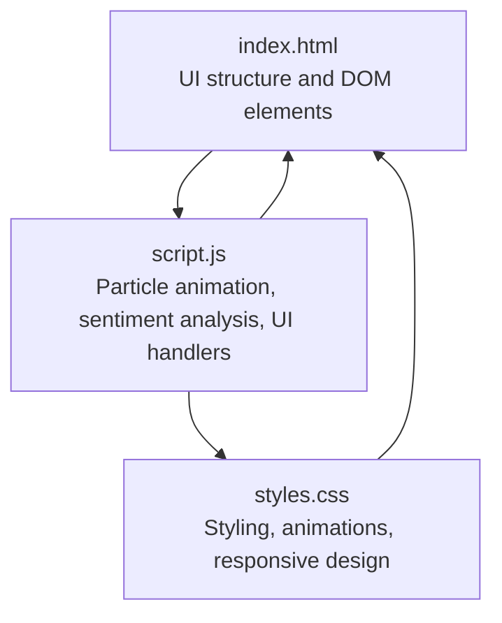
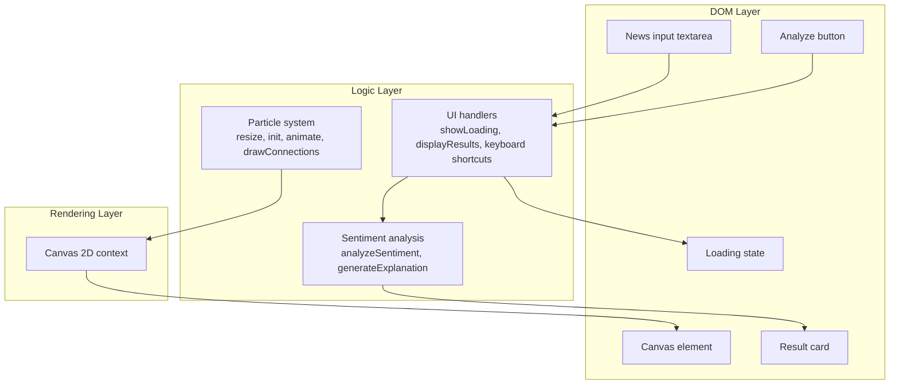
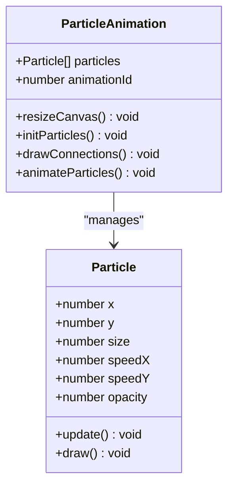
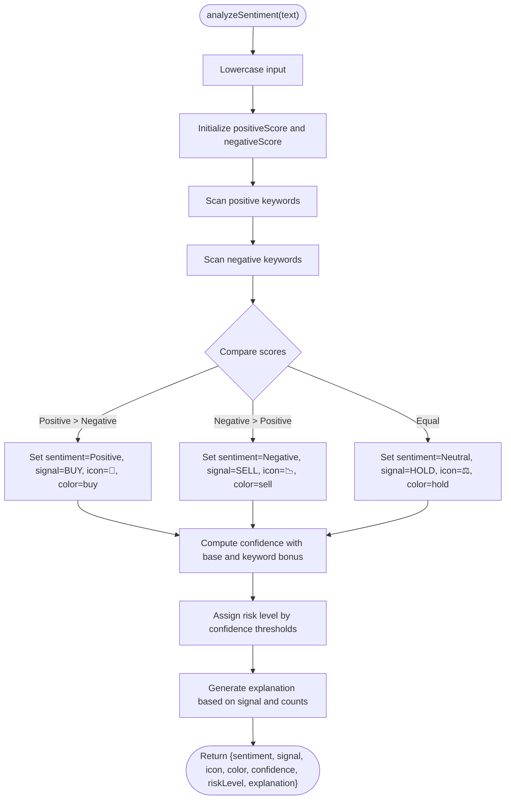
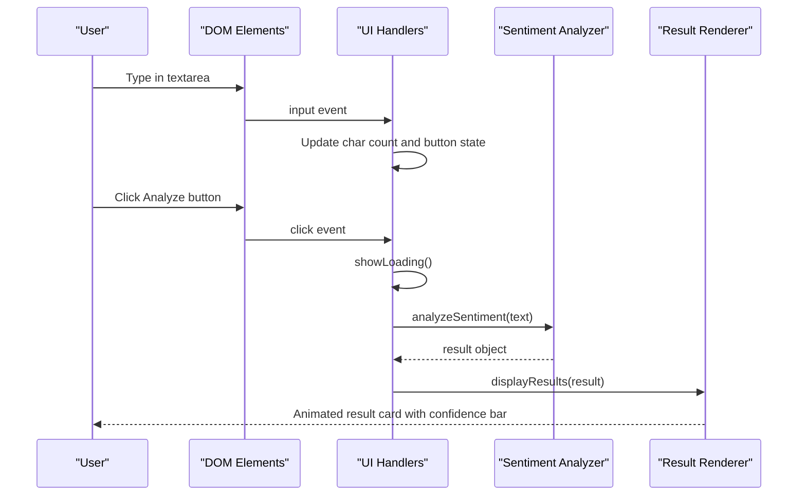
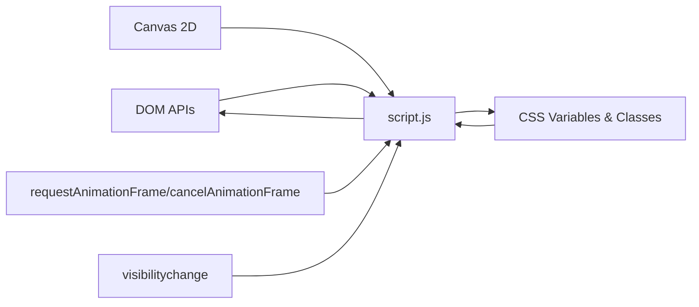

# JavaScript Implementation

<cite>
**Referenced Files in This Document**
- [index.html](file://index.html)
- [script.js](file://script.js)
- [styles.css](file://styles.css)
</cite>

## Table of Contents
1. [Introduction](#introduction)
2. [Project Structure](#project-structure)
3. [Core Components](#core-components)
4. [Architecture Overview](#architecture-overview)
5. [Detailed Component Analysis](#detailed-component-analysis)
6. [Dependency Analysis](#dependency-analysis)
7. [Performance Considerations](#performance-considerations)
8. [Troubleshooting Guide](#troubleshooting-guide)
9. [Conclusion](#conclusion)
10. [Appendices](#appendices)

## Introduction
This document explains the JavaScript implementation powering the AI Trading Signal Engine. It covers three main functional areas:
- Canvas-based particle animation system with connection visualization and visibility-aware performance optimization
- Sentiment analysis engine with keyword-based scoring, positive/negative dictionaries, and dynamic explanation generation
- UI interaction handlers including input validation, loading state handling, result presentation logic, and keyboard shortcut support

The implementation is a single-page application with a dark, neon-themed UI and a responsive layout. The JavaScript orchestrates DOM updates, animation frames, and simulated analysis results.

## Project Structure
The project consists of three files:
- index.html: HTML structure for the UI, including the animated background canvas, input area, analyze button, loading state, and result card
- script.js: Core logic for particle animation, sentiment analysis, and UI interactions
- styles.css: Styling for the UI, animations, gradients, and responsive design

**Diagram sources**
- [index.html](file://index.html)
- [script.js](file://script.js)
- [styles.css](file://styles.css)

**Section sources**
- [index.html](file://index.html)
- [script.js](file://script.js)
- [styles.css](file://styles.css)

## Core Components
- Particle animation system: Canvas-based physics simulation with wrapping edges, per-particle opacity and speed, and connection drawing when particles are within a threshold distance
- Sentiment analysis engine: Keyword-based scoring against predefined positive and negative dictionaries, confidence calculation, risk level assignment, and dynamic explanation generation
- UI interaction handlers: Input character counting and button enablement, loading state toggling, result rendering with animated confidence bar, and keyboard shortcuts

**Section sources**
- [script.js](file://script.js)

## Architecture Overview
The runtime architecture ties DOM elements to JavaScript functions and the Canvas rendering pipeline. The flow is:
- DOM elements are selected and cached
- Particle system initializes on load and animates continuously
- User input triggers analysis after validation
- Results are rendered into the result card with animations and styling

**Diagram sources**
- [script.js](file://script.js)
- [index.html](file://index.html)

## Detailed Component Analysis

### Particle Animation System
The particle system runs on a Canvas 2D context and renders a dynamic background with:
- Dynamic particle count based on viewport area
- Wrapping edges so particles reappear on opposite sides
- Opacity and size variation per particle
- Connection lines drawn between nearby particles

Key behaviors:
- Canvas resize handler adjusts particle count and bounds
- Animation loop clears the canvas, updates and draws each particle, then draws connections
- Visibility change pauses animation to save resources

**Diagram sources**
- [script.js](file://script.js)

Implementation highlights:
- Canvas sizing and initialization: [script.js](file://script.js)
- Particle class definition and methods: [script.js](file://script.js)
- Connection drawing logic: [script.js](file://script.js)
- Animation loop and requestAnimationFrame management: [script.js](file://script.js)
- Visibility-aware pause/resume: [script.js](file://script.js)

Parameters and return values:
- resizeCanvas(): No parameters, no return
- initParticles(): No parameters, no return
- drawConnections(): No parameters, no return
- animateParticles(): No parameters, no return
- Particle.update(): No parameters, no return
- Particle.draw(): No parameters, no return

Integration patterns:
- Canvas element and context are initialized once and reused across frames
- Animation loop is restarted when the page becomes visible again

**Section sources**
- [script.js](file://script.js)

### Sentiment Analysis Engine (Mock)
The sentiment analyzer performs keyword-based scoring:
- Converts input to lowercase for case-insensitive matching
- Scans for occurrences of predefined positive and negative keywords
- Computes sentiment as BUY, SELL, or HOLD based on counts
- Generates confidence percentage with a base and bonus derived from keyword counts
- Assigns risk level based on confidence thresholds
- Produces a dynamic explanation tailored to the signal and keyword counts

**Diagram sources**
- [script.js](file://script.js)

Implementation highlights:
- Keyword dictionaries and scoring: [script.js](file://script.js)
- Sentiment determination and signal assignment: [script.js](file://script.js)
- Confidence calculation and risk level mapping: [script.js](file://script.js)
- Dynamic explanation generation: [script.js](file://script.js)

Parameters and return values:
- analyzeSentiment(text): expects a string, returns an object with keys: sentiment, signal, icon, color, confidence, riskLevel, explanation
- generateExplanation(signal, sentiment, posCount, negCount, text): expects signal string and counts, returns a string explanation

Integration patterns:
- Called asynchronously after the user clicks Analyze
- Results are passed to displayResults for UI rendering

**Section sources**
- [script.js](file://script.js)

### UI Interaction Handlers
The UI handlers manage:
- Input validation and button enablement with character counting
- Loading state presentation and button disabling during analysis
- Result rendering with animated confidence bar and color-coded badges
- Keyboard shortcut support (Ctrl/Cmd + Enter) to trigger analysis

**Diagram sources**
- [script.js](file://script.js)
- [index.html](file://index.html)

Implementation highlights:
- Input handling and character counter: [script.js](file://script.js)
- Loading state and button state management: [script.js](file://script.js)
- Result rendering and animations: [script.js](file://script.js)
- Keyboard shortcut handling: [script.js](file://script.js)

Parameters and return values:
- showLoading(): no parameters, no return
- displayResults(result): expects result object from analyzeSentiment, no return
- delay(ms): expects milliseconds, returns a Promise resolving after ms

Integration patterns:
- The analyze button is disabled while loading and re-enabled after results
- The result card slides into view smoothly after rendering

**Section sources**
- [script.js](file://script.js)
- [index.html](file://index.html)

## Dependency Analysis
The JavaScript module depends on:
- DOM APIs for element selection and manipulation
- Canvas 2D context for rendering
- Browser APIs for animation frames and visibility state
- CSS variables and classes for styling and animations

**Diagram sources**
- [script.js](file://script.js)
- [styles.css](file://styles.css)

**Section sources**
- [script.js](file://script.js)
- [styles.css](file://styles.css)

## Performance Considerations
- Particle system scaling: particle count is capped and scaled with viewport area to keep performance predictable
- Connection drawing: distance threshold limits expensive line drawing between pairs
- Visibility-aware animation: animation pauses when the tab is not visible to conserve CPU/GPU cycles
- DOM updates: minimal DOM writes per frame; confidence bar animation uses a short transition
- Asynchronous delay: simulated analysis delay prevents blocking the UI thread

Recommendations:
- Consider spatial partitioning (grid/octree) for O(n log n) neighbor searches if particle counts grow large
- Use offscreen canvas for heavy computations if needed
- Debounce input events for character counting if extended usage scenarios arise
- Monitor memory usage for long sessions; ensure arrays are not growing unbounded

**Section sources**
- [script.js](file://script.js)

## Troubleshooting Guide
Common issues and resolutions:
- Canvas not resizing: ensure resize handler runs on load and on window resize
- Particles not visible: verify canvas dimensions and context initialization
- Animation stutter: confirm requestAnimationFrame is used consistently and paused on visibility change
- Button remains disabled: check input event handler and ensure it enables the button when text length > 0
- Results not appearing: verify displayResults updates all DOM nodes and removes hidden classes
- Keyboard shortcut not working: ensure event listener targets the correct key combination and that the button is enabled

Debugging tips:
- Use console logs for lifecycle events (initialize, animate, render)
- Inspect DOM classes and inline styles for hidden states and transitions
- Validate keyword dictionary matches and case normalization

**Section sources**
- [script.js](file://script.js)
- [index.html](file://index.html)

## Conclusion
The JavaScript implementation delivers a visually engaging, responsive trading signal interface with:
- A performant particle animation system using Canvas
- A keyword-based sentiment analyzer with dynamic explanations
- Robust UI handlers managing input, loading, and results with keyboard support

The modular structure and clear separation of concerns make the code maintainable and extensible for future enhancements.

## Appendices

### API Definitions and Parameters
- analyzeSentiment(text)
  - Parameters: text (string)
  - Returns: object with keys: sentiment (string), signal (string), icon (string), color (string), confidence (number), riskLevel (string), explanation (string)
  - Example usage: [script.js](file://script.js)
- generateExplanation(signal, sentiment, posCount, negCount, text)
  - Parameters: signal (string), sentiment (string), posCount (number), negCount (number), text (string)
  - Returns: explanation (string)
  - Example usage: [script.js](file://script.js)
- showLoading()
  - Parameters: none
  - Returns: none
  - Example usage: [script.js](file://script.js)
- displayResults(result)
  - Parameters: result (object from analyzeSentiment)
  - Returns: none
  - Example usage: [script.js](file://script.js)
- delay(ms)
  - Parameters: ms (number)
  - Returns: Promise
  - Example usage: [script.js](file://script.js)

### DOM Element References
- Canvas and context: [index.html](file://index.html), [script.js](file://script.js)
- Input and button: [index.html](file://index.html), [script.js](file://script.js)
- Result card and badges: [index.html](file://index.html), [script.js](file://script.js)