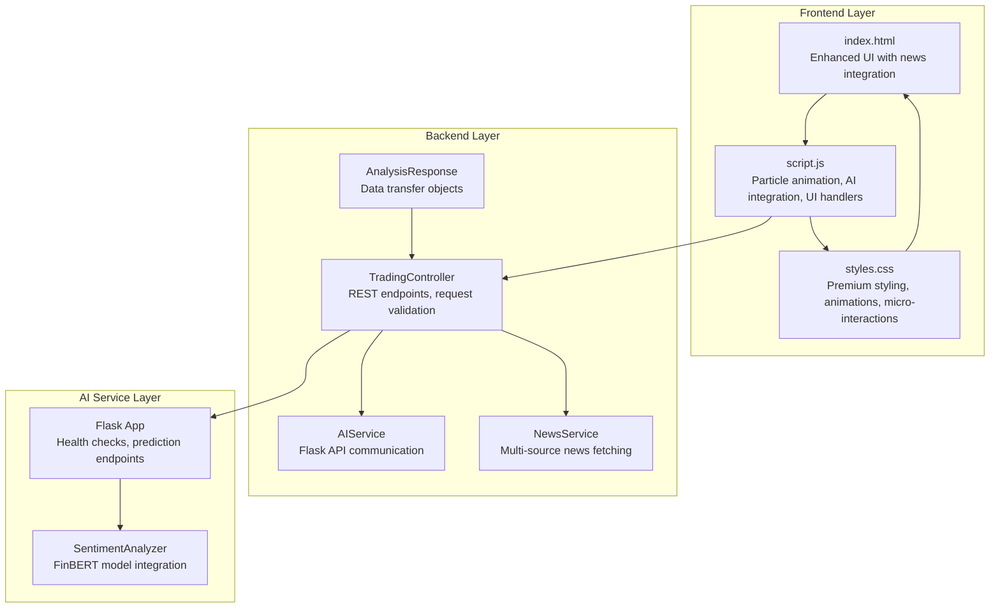
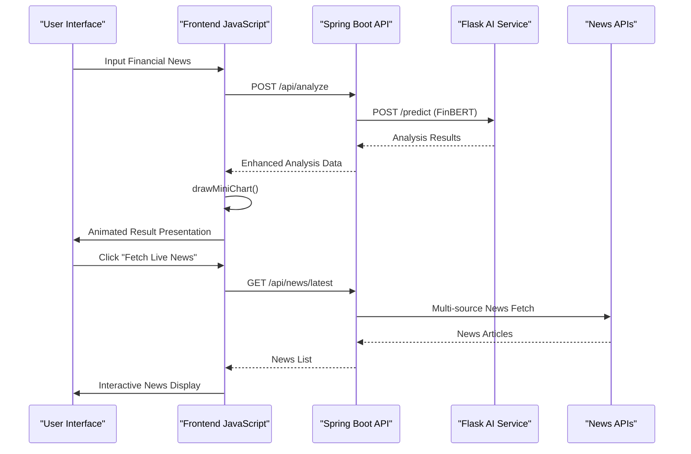
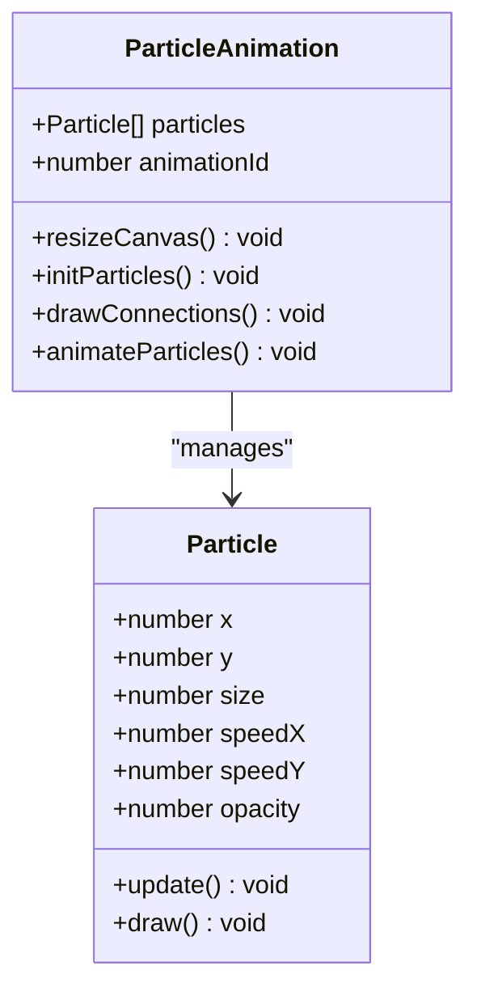
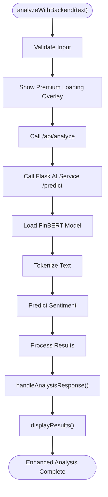
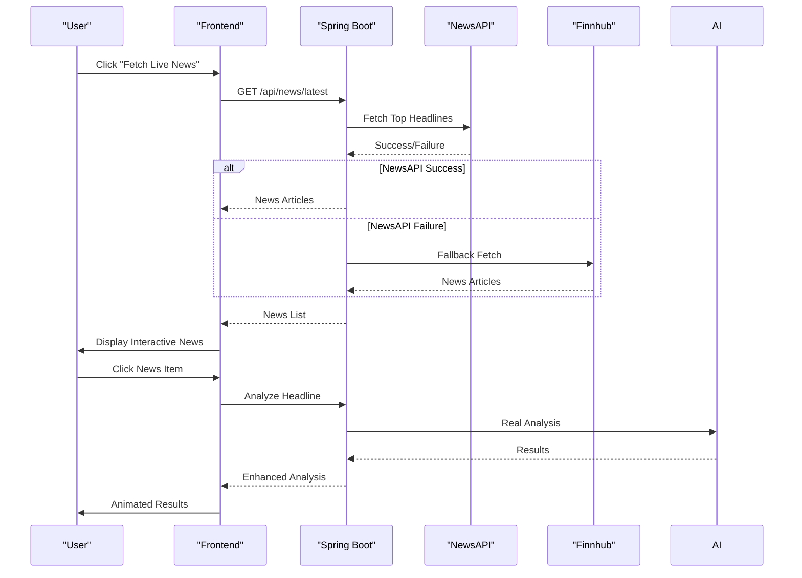
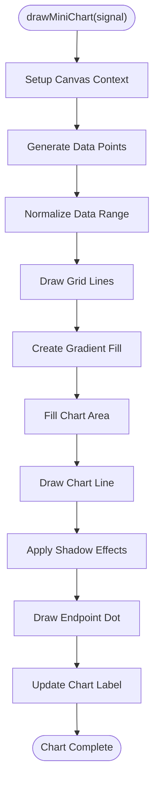
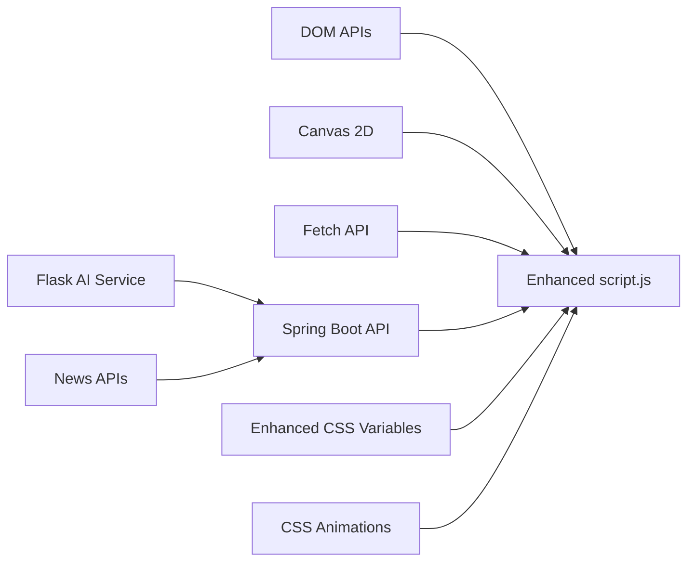

# JavaScript Implementation

<cite>
**Referenced Files in This Document**
- [index.html](file://frontend/index.html)
- [script.js](file://frontend/script.js)
- [styles.css](file://frontend/styles.css)
- [TradingController.java](file://backend/src/main/java/com/trading/controller/TradingController.java)
- [AIService.java](file://backend/src/main/java/com/trading/service/AIService.java)
- [NewsService.java](file://backend/src/main/java/com/trading/service/NewsService.java)
- [AnalysisResponse.java](file://backend/src/main/java/com/trading/model/AnalysisResponse.java)
- [app.py](file://ai-service/app.py)
- [sentiment_analyzer.py](file://ai-service/models/sentiment_analyzer.py)
</cite>

## Update Summary
**Changes Made**
- Enhanced frontend with real-time news integration and live news fetching capabilities
- Added canvas-based mini charts with dynamic visualization for trading signals
- Integrated REST API communication with Spring Boot backend services
- Implemented company detection engine with comprehensive corporate pattern matching
- Added keyword extraction system for identifying key market factors
- Enhanced UI with premium loading overlays, error handling, and micro-interactions
- Added comprehensive backend architecture with AI service integration

## Table of Contents
1. [Introduction](#introduction)
2. [Project Structure](#project-structure)
3. [Core Components](#core-components)
4. [Architecture Overview](#architecture-overview)
5. [Detailed Component Analysis](#detailed-component-analysis)
6. [Dependency Analysis](#dependency-analysis)
7. [Performance Considerations](#performance-considerations)
8. [Troubleshooting Guide](#troubleshooting-guide)
9. [Conclusion](#conclusion)
10. [Appendices](#appendices)

## Introduction
This document explains the enhanced JavaScript implementation powering the AI Trading Signal Engine. The system now features a sophisticated three-tier architecture with real-time news integration, canvas-based mini charts, and REST API communication with Spring Boot backend services. The implementation covers four main functional areas:

- **Canvas-based particle animation system** with connection visualization, performance optimization with visibility detection, and animation frame management
- **Enhanced sentiment analysis engine** with real AI integration via FinBERT model, company detection, and keyword extraction
- **Real-time news integration** with live news fetching from multiple sources and interactive news browsing
- **UI interaction handlers** with premium loading states, error handling, result presentation logic, and keyboard shortcut support

The implementation is a modern single-page application with a dark, neon-themed UI featuring responsive design, micro-interactions, and real-time data visualization.

## Project Structure
The project consists of three main layers:
- **Frontend Layer**: HTML structure with enhanced UI components, JavaScript logic for particle animation, sentiment analysis, and UI interactions
- **Backend Layer**: Spring Boot REST API with controllers, services, and model classes for AI integration and news services
- **AI Service Layer**: Python Flask service with FinBERT model for real sentiment analysis

**Diagram sources**
- [index.html](file://frontend/index.html)
- [script.js](file://frontend/script.js)
- [styles.css](file://frontend/styles.css)
- [TradingController.java](file://backend/src/main/java/com/trading/controller/TradingController.java)
- [AIService.java](file://backend/src/main/java/com/trading/service/AIService.java)
- [NewsService.java](file://backend/src/main/java/com/trading/service/NewsService.java)
- [AnalysisResponse.java](file://backend/src/main/java/com/trading/model/AnalysisResponse.java)
- [app.py](file://ai-service/app.py)
- [sentiment_analyzer.py](file://ai-service/models/sentiment_analyzer.py)

**Section sources**
- [index.html](file://frontend/index.html)
- [script.js](file://frontend/script.js)
- [styles.css](file://frontend/styles.css)
- [TradingController.java](file://backend/src/main/java/com/trading/controller/TradingController.java)

## Core Components
- **Enhanced Particle Animation System**: Canvas-based physics simulation with wrapping edges, per-particle opacity and speed, connection drawing, and visibility-aware performance optimization
- **Real AI Integration Engine**: REST API communication with Spring Boot backend, FinBERT model integration, and comprehensive sentiment analysis with company detection
- **Live News Integration**: Multi-source news fetching from NewsAPI and Finnhub, interactive news browsing, and automatic headline analysis
- **Canvas Mini Charts**: Dynamic chart generation with quadratic curves, gradient fills, and signal-specific visualizations
- **Premium UI Interaction Handlers**: Enhanced loading states, error handling, result rendering with animations, and comprehensive keyboard shortcuts

**Section sources**
- [script.js](file://frontend/script.js)
- [TradingController.java](file://backend/src/main/java/com/trading/controller/TradingController.java)
- [AIService.java](file://backend/src/main/java/com/trading/service/AIService.java)

## Architecture Overview
The enhanced runtime architecture features a sophisticated three-tier system with real-time data flow:

**Diagram sources**
- [script.js](file://frontend/script.js)
- [TradingController.java](file://backend/src/main/java/com/trading/controller/TradingController.java)
- [AIService.java](file://backend/src/main/java/com/trading/service/AIService.java)
- [NewsService.java](file://backend/src/main/java/com/trading/service/NewsService.java)

## Detailed Component Analysis

### Enhanced Particle Animation System
The particle system continues to provide a dynamic background with enhanced performance optimizations:

Key behaviors:
- Canvas resize handler adjusts particle count and bounds based on viewport area
- Animation loop with requestAnimationFrame for optimal performance
- Connection drawing logic with distance threshold optimization
- Visibility-aware pause/resume to conserve resources
- Enhanced particle physics with wrapping edges and smooth motion

**Diagram sources**
- [script.js](file://frontend/script.js)

**Section sources**
- [script.js](file://frontend/script.js)

### Real AI Integration Engine
The enhanced sentiment analyzer now integrates with a real AI service using FinBERT model:

**Diagram sources**
- [script.js](file://frontend/script.js)
- [app.py](file://ai-service/app.py)
- [sentiment_analyzer.py](file://ai-service/models/sentiment_analyzer.py)

Implementation highlights:
- **Backend Integration**: REST API communication with Spring Boot controller
- **AI Service Communication**: Flask service integration with health checks
- **Enhanced Analysis**: Real sentiment analysis with confidence scoring
- **Company Detection**: Comprehensive corporate pattern matching
- **Keyword Extraction**: Advanced factor identification system

**Section sources**
- [script.js](file://frontend/script.js)
- [TradingController.java](file://backend/src/main/java/com/trading/controller/TradingController.java)
- [AIService.java](file://backend/src/main/java/com/trading/service/AIService.java)
- [app.py](file://ai-service/app.py)
- [sentiment_analyzer.py](file://ai-service/models/sentiment_analyzer.py)

### Live News Integration System
The system now provides real-time news integration with multiple sources:

Key features:
- **Multi-source News Fetching**: Automatic fallback between NewsAPI and Finnhub
- **Interactive News Browsing**: Click-to-analyze functionality
- **News List Display**: Animated news items with metadata
- **Automatic Analysis**: Direct headline analysis from news feed

**Diagram sources**
- [script.js](file://frontend/script.js)
- [TradingController.java](file://backend/src/main/java/com/trading/controller/TradingController.java)
- [NewsService.java](file://backend/src/main/java/com/trading/service/NewsService.java)

**Section sources**
- [script.js](file://frontend/script.js)
- [TradingController.java](file://backend/src/main/java/com/trading/controller/TradingController.java)
- [NewsService.java](file://backend/src/main/java/com/trading/service/NewsService.java)

### Canvas Mini Charts Visualization
The enhanced UI now features dynamic mini charts for signal visualization:

Key features:
- **Signal-specific Charts**: BUY (green), SELL (red), HOLD (orange) visualizations
- **Quadratic Curve Rendering**: Smooth chart lines with mathematical curve calculations
- **Gradient Fill Effects**: Professional gradient backgrounds with transparency
- **Dynamic Data Generation**: Randomized data points based on signal type
- **Endpoint Markers**: Visual indicators for chart endpoints

**Diagram sources**
- [script.js](file://frontend/script.js)

**Section sources**
- [script.js](file://frontend/script.js)

### Premium UI Interaction Handlers
The enhanced UI system provides comprehensive user experience improvements:

Key features:
- **Premium Loading Overlay**: Advanced loading animation with progress bar
- **Error Handling**: Toast notifications and graceful error recovery
- **Micro-interactions**: Ripple effects, hover animations, and smooth transitions
- **Keyboard Shortcuts**: Ctrl/Cmd + Enter for quick analysis
- **Result Animations**: Staggered animations and smooth transitions

**Section sources**
- [script.js](file://frontend/script.js)
- [styles.css](file://frontend/styles.css)

## Dependency Analysis
The enhanced JavaScript module now depends on a comprehensive ecosystem:

**Diagram sources**
- [script.js](file://frontend/script.js)
- [styles.css](file://frontend/styles.css)
- [TradingController.java](file://backend/src/main/java/com/trading/controller/TradingController.java)
- [AIService.java](file://backend/src/main/java/com/trading/service/AIService.java)

**Section sources**
- [script.js](file://frontend/script.js)
- [styles.css](file://frontend/styles.css)
- [TradingController.java](file://backend/src/main/java/com/trading/controller/TradingController.java)

## Performance Considerations
Enhanced performance optimizations include:

- **Canvas Optimization**: Efficient particle rendering with distance-based connection drawing
- **Memory Management**: Proper cleanup of intervals and animation frames
- **Network Efficiency**: Optimized API calls with proper error handling
- **Real-time Updates**: Debounced input handling and efficient DOM updates
- **Resource Conservation**: Visibility-aware animation pausing and lazy loading
- **AI Model Loading**: Single-time model initialization with caching

Recommendations:
- Consider implementing WebSocket connections for real-time updates
- Add request batching for multiple news fetch operations
- Implement local storage for cached analysis results
- Add progressive loading for large news feeds
- Consider implementing service workers for offline functionality

**Section sources**
- [script.js](file://frontend/script.js)
- [AIService.java](file://backend/src/main/java/com/trading/service/AIService.java)

## Troubleshooting Guide
Enhanced troubleshooting procedures:

**Backend Integration Issues:**
- Verify Flask AI service is running on port 5000
- Check Spring Boot application properties for AI service URL
- Ensure CORS configuration allows frontend access
- Validate API keys for NewsAPI and Finnhub services

**Real-time News Issues:**
- Verify API keys are configured in application.properties
- Check network connectivity to external news APIs
- Monitor API rate limits and quotas
- Test fallback mechanisms between NewsAPI and Finnhub

**Canvas Performance Issues:**
- Monitor particle count based on viewport size
- Check for memory leaks in animation frames
- Verify proper cleanup of event listeners
- Monitor GPU usage on mobile devices

**Section sources**
- [script.js](file://frontend/script.js)
- [TradingController.java](file://backend/src/main/java/com/trading/controller/TradingController.java)
- [AIService.java](file://backend/src/main/java/com/trading/service/AIService.java)

## Conclusion
The enhanced JavaScript implementation delivers a sophisticated, production-ready trading signal interface with:

- **Real AI Integration**: Professional-grade sentiment analysis using FinBERT model
- **Live News Capabilities**: Multi-source news integration with interactive browsing
- **Advanced Visualization**: Canvas-based mini charts with professional styling
- **Premium User Experience**: Enhanced animations, micro-interactions, and responsive design
- **Robust Architecture**: Three-tier system with proper error handling and performance optimization

The modular architecture and comprehensive feature set make this implementation suitable for production deployment with room for future enhancements.

## Appendices

### Enhanced API Definitions and Parameters
- **analyzeWithBackend(headline)**
  - Parameters: headline (string)
  - Returns: Promise resolving to AnalysisResponse object
  - Example usage: [script.js](file://frontend/script.js)

- **handleAnalysisResponse(data)**
  - Parameters: data (AnalysisResponse from backend)
  - Returns: void
  - Example usage: [script.js](file://frontend/script.js)

- **fetchLatestNews()**
  - Parameters: none
  - Returns: Promise resolving to news articles array
  - Example usage: [script.js](file://frontend/script.js)

- **drawMiniChart(signal)**
  - Parameters: signal (string: 'BUY', 'SELL', or 'HOLD')
  - Returns: void
  - Example usage: [script.js](file://frontend/script.js)

### Enhanced DOM Element References
- **Canvas Elements**: particlesCanvas, miniChart
- **Input Elements**: newsInput, fetchNewsBtn
- **Result Elements**: resultCard, signalBadge, companyBadge
- **Loading Elements**: loadingOverlay, loaderProgressBar

### Backend Integration Points
- **Analysis Endpoint**: POST `/api/analyze` with AnalysisRequest
- **News Endpoint**: GET `/api/news/latest` for live news
- **Health Check**: GET `/api/health` for service status
- **AI Service**: POST `/predict` for sentiment analysis

### AI Service Integration
- **Model**: FinBERT (ProsusAI/finbert)
- **Endpoints**: `/health`, `/predict`, `/batch`
- **Response Format**: AnalysisResponse with confidence, sentiment, and factors
- **Processing**: Real-time sentiment analysis with company detection