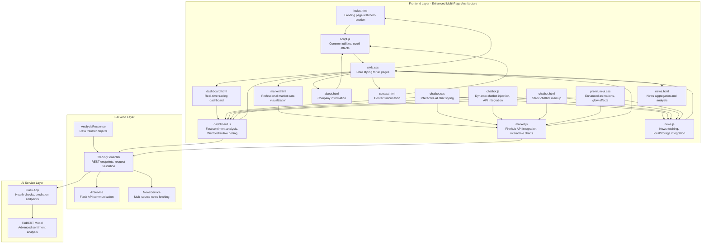
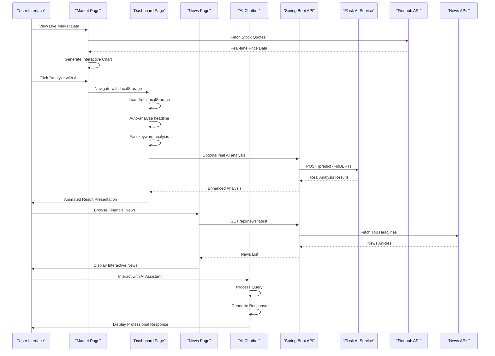
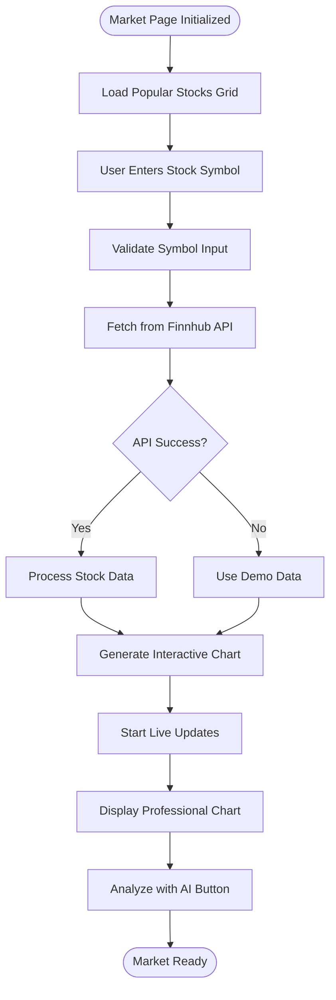
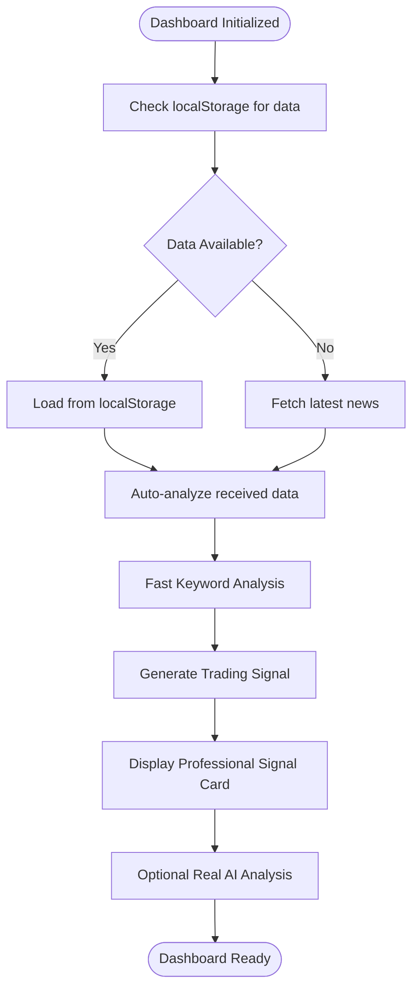
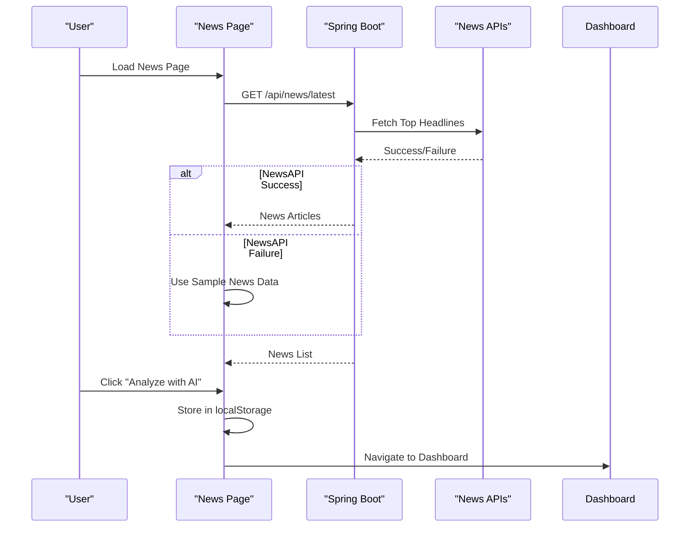
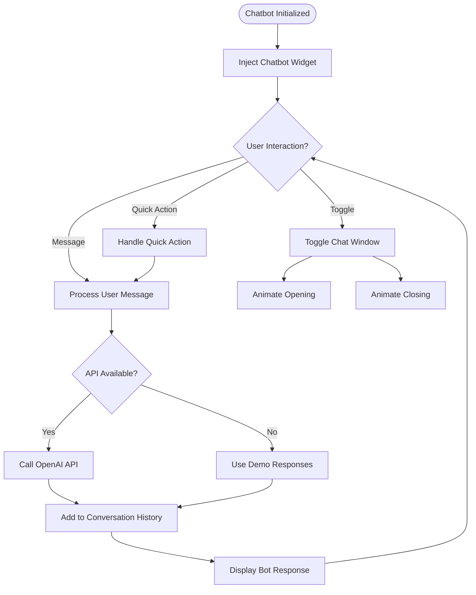
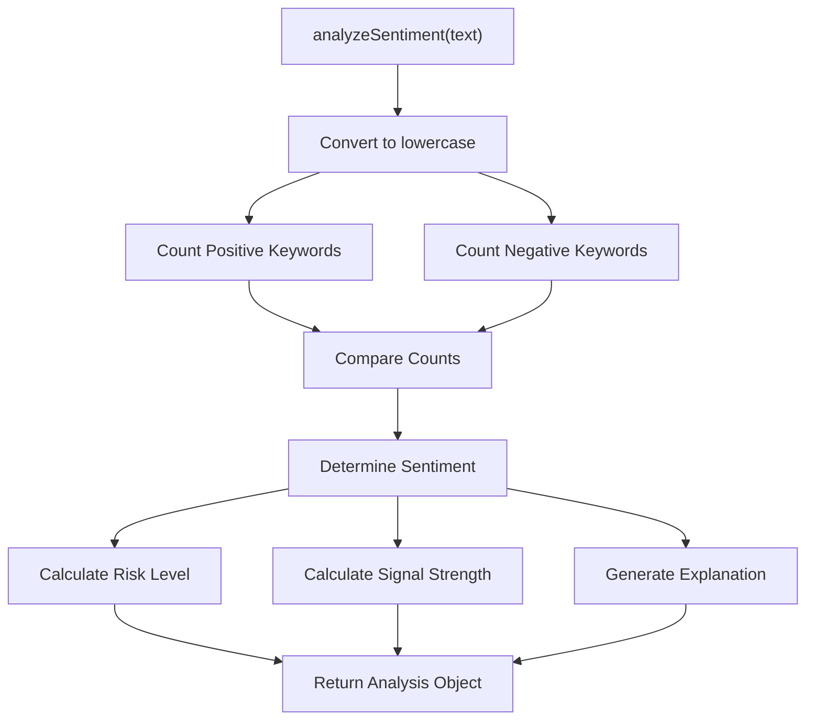
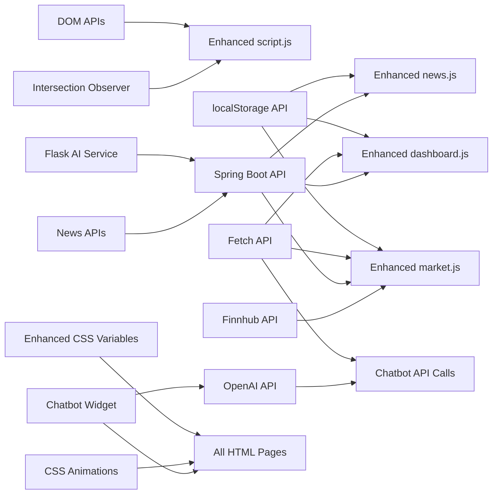

# JavaScript Implementation

<cite>
**Referenced Files in This Document**
- [index.html](file://frontend/index.html)
- [dashboard.html](file://frontend/dashboard.html)
- [about.html](file://frontend/about.html)
- [contact.html](file://frontend/contact.html)
- [news.html](file://frontend/news.html)
- [market.html](file://frontend/market.html)
- [script.js](file://frontend/script.js)
- [dashboard.js](file://frontend/dashboard.js)
- [news.js](file://frontend/news.js)
- [market.js](file://frontend/market.js)
- [style.css](file://frontend/style.css)
- [premium-ui.css](file://frontend/premium-ui.css)
- [chatbot.css](file://frontend/chatbot.css)
- [chatbot.html](file://frontend/chatbot.html)
- [chatbot.js](file://frontend/chatbot.js)
- [TradingController.java](file://backend/src/main/java/com/trading/controller/TradingController.java)
- [AIService.java](file://backend/src/main/java/com/trading/service/AIService.java)
- [NewsService.java](file://backend/src/main/java/com/trading/service/NewsService.java)
- [AnalysisResponse.java](file://backend/src/main/java/com/trading/model/AnalysisResponse.java)
- [app.py](file://ai-service/app.py)
- [sentiment_analyzer.py](file://ai-service/models/sentiment_analyzer.py)
</cite>

## Update Summary
**Changes Made**
- **Added AI Chatbot Integration**: Complete chatbot widget with animated interface, real-time messaging, and OpenAI API integration
- **Enhanced Multi-Page Architecture**: Chatbot integrated across all pages (index, dashboard, market, news, about, contact)
- **Premium UI Styling Integration**: Chatbot styled with neon themes, glass morphism effects, and professional animations
- **Dynamic Chatbot Injection**: Both static HTML and dynamic JavaScript injection methods for flexible deployment
- **Advanced Chat Features**: Typing indicators, quick actions, message formatting, and conversation history management
- **Demo Mode Support**: Graceful fallback when OpenAI API quota is exceeded or disabled

## Table of Contents
1. [Introduction](#introduction)
2. [Project Structure](#project-structure)
3. [Core Components](#core-components)
4. [Architecture Overview](#architecture-overview)
5. [Detailed Component Analysis](#detailed-component-analysis)
6. [Dependency Analysis](#dependency-analysis)
7. [Performance Considerations](#performance-considerations)
8. [Troubleshooting Guide](#troubleshooting-guide)
9. [Conclusion](#conclusion)
10. [Appendices](#appendices)

## Introduction
This document explains the enhanced JavaScript implementation powering the AI Trading Signal Engine. The system now features a comprehensive seven-tier architecture with real-time market data visualization, advanced sentiment analysis, premium UI styling, and a sophisticated AI chatbot integration. The implementation covers eight main functional areas:

- **Professional Market Data Visualization** with Finnhub API integration and interactive SVG charts
- **Fast Keyword-Based Sentiment Analysis Engine** with instant analysis capabilities and optional real AI integration
- **Multi-Page Frontend Architecture** with dashboard, market, news, about, and contact pages
- **Real-Time News Integration** with live news fetching, localStorage-based navigation, and interactive news browsing
- **Enhanced UI Interaction Handlers** with premium loading states, error handling, and micro-interactions
- **AI-Powered Trading Signals** with dual analysis modes (fast keyword-based and real AI)
- **Interactive Chatbot Interface** with animated widgets, real-time messaging, and professional financial assistance
- **Premium UI Styling System** with neon themes, glass morphism effects, and responsive design

The implementation is a modern single-page application with a dark, neon-themed UI featuring responsive design, micro-interactions, real-time data visualization, and intelligent chat assistance across multiple pages with professional financial market aesthetics.

## Project Structure
The project consists of four main layers with enhanced frontend architecture, AI chatbot integration, and professional market data visualization:
- **Frontend Layer**: Multi-page HTML structure with enhanced UI components, JavaScript logic for market data, sentiment analysis, news integration, UI interactions, and AI chatbot functionality
- **Backend Layer**: Spring Boot REST API with controllers, services, and model classes for AI integration and news services
- **AI Service Layer**: Python Flask service with FinBERT model for real sentiment analysis
- **Market Data Layer**: Professional stock charting with live updates and interactive visualizations

**Diagram sources**
- [index.html](file://frontend/index.html)
- [dashboard.html](file://frontend/dashboard.html)
- [market.html](file://frontend/market.html)
- [news.html](file://frontend/news.html)
- [about.html](file://frontend/about.html)
- [contact.html](file://frontend/contact.html)
- [script.js](file://frontend/script.js)
- [dashboard.js](file://frontend/dashboard.js)
- [news.js](file://frontend/news.js)
- [market.js](file://frontend/market.js)
- [style.css](file://frontend/style.css)
- [premium-ui.css](file://frontend/premium-ui.css)
- [chatbot.css](file://frontend/chatbot.css)
- [chatbot.html](file://frontend/chatbot.html)
- [chatbot.js](file://frontend/chatbot.js)
- [TradingController.java](file://backend/src/main/java/com/trading/controller/TradingController.java)
- [AIService.java](file://backend/src/main/java/com/trading/service/AIService.java)
- [NewsService.java](file://backend/src/main/java/com/trading/service/NewsService.java)
- [AnalysisResponse.java](file://backend/src/main/java/com/trading/model/AnalysisResponse.java)
- [app.py](file://ai-service/app.py)
- [sentiment_analyzer.py](file://ai-service/models/sentiment_analyzer.py)

**Section sources**
- [index.html](file://frontend/index.html)
- [dashboard.html](file://frontend/dashboard.html)
- [market.html](file://frontend/market.html)
- [news.html](file://frontend/news.html)
- [about.html](file://frontend/about.html)
- [contact.html](file://frontend/contact.html)
- [script.js](file://frontend/script.js)
- [dashboard.js](file://frontend/dashboard.js)
- [news.js](file://frontend/news.js)
- [market.js](file://frontend/market.js)
- [style.css](file://frontend/style.css)
- [premium-ui.css](file://frontend/premium-ui.css)
- [chatbot.css](file://frontend/chatbot.css)
- [chatbot.html](file://frontend/chatbot.html)
- [chatbot.js](file://frontend/chatbot.js)
- [TradingController.java](file://backend/src/main/java/com/trading/controller/TradingController.java)

## Core Components
- **Professional Market Data Visualization**: Real-time stock price charts with Finnhub API integration, interactive SVG graphics, and live price updates
- **Fast Keyword-Based Sentiment Analysis Engine**: Instant sentiment analysis with positive/negative keyword dictionaries, confidence scoring, and dynamic explanation generation
- **Multi-Page Dashboard System**: Real-time trading dashboard with signal visualization, metrics display, and WebSocket-like polling mechanisms
- **Enhanced News Integration**: Multi-source news fetching from NewsAPI and Finnhub, localStorage-based navigation, and interactive news browsing
- **Premium UI Interaction Handlers**: Enhanced loading states, error handling, result rendering with animations, and comprehensive micro-interactions
- **AI-Powered Trading Signals**: Dual analysis modes combining fast keyword-based analysis with optional real AI sentiment analysis
- **Interactive Chatbot Interface**: Animated AI chat widget with messaging capabilities, professional financial assistance, and graceful API fallback
- **Comprehensive Styling System**: Unified professional financial aesthetics across all pages with neon themes and glass morphism effects

**Section sources**
- [market.js](file://frontend/market.js)
- [dashboard.js](file://frontend/dashboard.js)
- [news.js](file://frontend/news.js)
- [script.js](file://frontend/script.js)
- [chatbot.css](file://frontend/chatbot.css)
- [chatbot.js](file://frontend/chatbot.js)
- [TradingController.java](file://backend/src/main/java/com/trading/controller/TradingController.java)
- [AIService.java](file://backend/src/main/java/com/trading/service/AIService.java)

## Architecture Overview
The enhanced runtime architecture features a sophisticated multi-page system with real-time data flow, professional market visualization, seamless navigation, and intelligent chat assistance:

**Diagram sources**
- [market.js](file://frontend/market.js)
- [dashboard.js](file://frontend/dashboard.js)
- [news.js](file://frontend/news.js)
- [chatbot.js](file://frontend/chatbot.js)
- [TradingController.java](file://backend/src/main/java/com/trading/controller/TradingController.java)
- [AIService.java](file://backend/src/main/java/com/trading/service/AIService.java)
- [NewsService.java](file://backend/src/main/java/com/trading/service/NewsService.java)

## Detailed Component Analysis

### Professional Market Data Visualization System
The market system provides comprehensive real-time stock data visualization with professional charting capabilities:

Key features:
- **Finnhub API Integration**: Real-time stock price fetching with comprehensive error handling and fallback mechanisms
- **Interactive SVG Charts**: Professional line charts with gradient fills, animated transitions, and live price updates
- **Stock Symbol Mapping**: Comprehensive company name resolution with popular tech stocks
- **Live Chart Updates**: Continuous price simulation with smooth transitions and gradient animations
- **Professional Styling**: Neon-themed financial aesthetics with glow effects and modern typography

**Diagram sources**
- [market.js](file://frontend/market.js)

**Section sources**
- [market.html](file://frontend/market.html)
- [market.js](file://frontend/market.js)

### Enhanced Dashboard System
The dashboard system provides a comprehensive real-time trading interface with dual analysis modes:

Key features:
- **Dual Analysis Modes**: Fast keyword-based analysis (<100ms) and optional real AI analysis with FinBERT model
- **Professional Signal Visualization**: Dynamic signal cards with animated badges, confidence metrics, and risk assessments
- **Company Detection**: Heuristic-based company name extraction from headlines with pattern matching
- **Live Market Integration**: Direct stock data analysis from market page with seamless navigation
- **Enhanced UI Animations**: Professional glow effects, pulse animations, and smooth transitions

**Diagram sources**
- [dashboard.js](file://frontend/dashboard.js)

**Section sources**
- [dashboard.html](file://frontend/dashboard.html)
- [dashboard.js](file://frontend/dashboard.js)

### Enhanced News Integration System
The news system provides comprehensive financial news aggregation with seamless navigation between pages:

Key features:
- **Multi-Source News Fetching**: Automatic fallback between NewsAPI and Finnhub with comprehensive error handling
- **LocalStorage Integration**: Persistent storage of selected news for seamless dashboard navigation
- **Interactive News Browsing**: Click-to-analyze functionality with loading states and animations
- **Responsive Grid Layout**: Adaptive news card grid with hover effects and smooth transitions
- **Professional Styling**: Premium card designs with gradient borders and glass morphism effects

**Diagram sources**
- [news.js](file://frontend/news.js)
- [TradingController.java](file://backend/src/main/java/com/trading/controller/TradingController.java)
- [NewsService.java](file://backend/src/main/java/com/trading/service/NewsService.java)

**Section sources**
- [news.html](file://frontend/news.html)
- [news.js](file://frontend/news.js)
- [TradingController.java](file://backend/src/main/java/com/trading/controller/TradingController.java)
- [NewsService.java](file://backend/src/main/java/com/trading/service/NewsService.java)

### AI Chatbot Integration System
The AI chatbot provides professional financial assistance with animated widgets and intelligent responses:

Key features:
- **Animated Chat Toggle**: Floating chat button with pulsing animations, gradient effects, and status indicators
- **Professional Chat Window**: Glass morphism chat interface with message bubbles, typing indicators, and scroll animations
- **OpenAI Integration**: Real-time API communication with configurable system prompts and conversation history
- **Demo Mode Support**: Graceful fallback when API quota is exceeded or disabled, providing professional responses
- **Quick Actions**: Predefined financial queries and trading assistance options for common user scenarios
- **Responsive Design**: Mobile-friendly chat interface with touch-friendly controls and adaptive layouts
- **Professional Styling**: Consistent with overall financial theme and neon color scheme

**Diagram sources**
- [chatbot.js](file://frontend/chatbot.js)
- [chatbot.css](file://frontend/chatbot.css)

**Section sources**
- [chatbot.html](file://frontend/chatbot.html)
- [chatbot.js](file://frontend/chatbot.js)
- [chatbot.css](file://frontend/chatbot.css)

### Enhanced Styling System
The comprehensive styling system provides unified professional financial aesthetics across all pages with premium chatbot integration:

Key features:
- **CSS Custom Properties**: Centralized theme variables for consistent styling with neon color scheme
- **Glass Morphism Effects**: Frosted glass backgrounds with backdrop filters and blur effects, including chatbot interface
- **Professional Animations**: Keyframe animations for loading states, hover effects, transitions, and chatbot interactions
- **Responsive Design**: Mobile-first approach with adaptive layouts, professional typography, and chatbot responsiveness
- **Premium UI Components**: Enhanced button styles, card designs, interactive elements, and chatbot styling
- **Neon Theme Integration**: Consistent color scheme across all components including chatbot elements

**Section sources**
- [style.css](file://frontend/style.css)
- [premium-ui.css](file://frontend/premium-ui.css)
- [chatbot.css](file://frontend/chatbot.css)

### Fast Keyword-Based Sentiment Analysis Engine
The enhanced sentiment analyzer provides instant analysis capabilities with comprehensive keyword dictionaries:

**Diagram sources**
- [dashboard.js](file://frontend/dashboard.js)

Implementation highlights:
- **Comprehensive Keyword Dictionaries**: 15+ positive and 23+ negative keywords covering financial terminology
- **Confidence Scoring**: Dynamic confidence calculation based on keyword counts with randomized variations
- **Risk Assessment**: Automatic risk level determination (Low, Medium, High) based on confidence thresholds
- **Signal Strength**: Strength classification (Strong, Moderate, Weak) with professional trading terminology
- **Dynamic Explanations**: Contextual explanations based on matched keywords with detailed factor analysis

**Section sources**
- [dashboard.js](file://frontend/dashboard.js)

## Dependency Analysis
The enhanced JavaScript module now depends on a comprehensive ecosystem with professional market data integration and AI chatbot functionality:

**Diagram sources**
- [script.js](file://frontend/script.js)
- [dashboard.js](file://frontend/dashboard.js)
- [news.js](file://frontend/news.js)
- [market.js](file://frontend/market.js)
- [chatbot.js](file://frontend/chatbot.js)
- [style.css](file://frontend/style.css)
- [premium-ui.css](file://frontend/premium-ui.css)
- [chatbot.css](file://frontend/chatbot.css)
- [TradingController.java](file://backend/src/main/java/com/trading/controller/TradingController.java)
- [AIService.java](file://backend/src/main/java/com/trading/service/AIService.java)

**Section sources**
- [script.js](file://frontend/script.js)
- [dashboard.js](file://frontend/dashboard.js)
- [news.js](file://frontend/news.js)
- [market.js](file://frontend/market.js)
- [chatbot.js](file://frontend/chatbot.js)
- [style.css](file://frontend/style.css)
- [premium-ui.css](file://frontend/premium-ui.css)
- [chatbot.css](file://frontend/chatbot.css)
- [TradingController.java](file://backend/src/main/java/com/trading/controller/TradingController.java)

## Performance Considerations
Enhanced performance optimizations include:

- **Professional Market Data**: Optimized SVG chart rendering with smooth transitions and efficient DOM updates
- **Fast Keyword Analysis**: Instant sentiment analysis (<100ms) with minimal computational overhead
- **Memory Management**: Proper cleanup of event listeners, animation frames, and chart intervals
- **Network Efficiency**: Optimized API calls with proper error handling, fallback mechanisms, and caching
- **Real-time Updates**: Debounced input handling, efficient DOM updates, and optimized chart animations
- **Resource Conservation**: Visibility-aware animation pausing, lazy loading, and efficient chart rendering
- **LocalStorage Optimization**: Efficient data storage and retrieval for cross-page navigation
- **CSS Animation Performance**: Hardware-accelerated animations with transform and opacity properties
- **Professional Chart Rendering**: Optimized SVG path generation with smooth bezier curves and efficient updates
- **Chatbot Performance**: Optimized DOM manipulation, efficient message rendering, and memory-conscious conversation history
- **API Quota Management**: Intelligent fallback mechanisms and graceful degradation when OpenAI API quota is exceeded

Recommendations:
- Consider implementing true WebSocket connections for real-time market data updates
- Add request batching for multiple news fetch operations
- Implement local storage caching for frequently accessed market data
- Consider implementing service workers for offline market data functionality
- Optimize chatbot DOM updates and conversation history management
- Implement chatbot message debouncing for high-frequency interactions
- Add chatbot API rate limiting to prevent excessive requests

**Section sources**
- [market.js](file://frontend/market.js)
- [dashboard.js](file://frontend/dashboard.js)
- [news.js](file://frontend/news.js)
- [chatbot.js](file://frontend/chatbot.js)
- [AIService.java](file://backend/src/main/java/com/trading/service/AIService.java)

## Troubleshooting Guide
Enhanced troubleshooting procedures:

**Backend Integration Issues:**
- Verify Flask AI service is running on port 5000
- Check Spring Boot application properties for AI service URL and API keys
- Ensure CORS configuration allows frontend access
- Validate API keys for NewsAPI, Finnhub, and other external services

**Professional Market Data Issues:**
- Verify Finnhub API key is configured in application.properties
- Check network connectivity to Finnhub API endpoints
- Monitor API rate limits and quotas for market data
- Test fallback mechanisms between Finnhub and demo data

**Multi-Page Navigation Issues:**
- Verify localStorage is enabled in browser settings
- Check cross-origin restrictions for localStorage
- Ensure proper file paths for all HTML and JavaScript files
- Validate navigation between pages works correctly

**Real-time News Issues:**
- Verify API keys are configured in application.properties
- Check network connectivity to external news APIs
- Monitor API rate limits and quotas
- Test fallback mechanisms between NewsAPI and Finnhub

**AI Chatbot Issues:**
- Verify OpenAI API key is configured in chatbot.js
- Check network connectivity to OpenAI API endpoints
- Monitor API quota limits and billing status
- Test demo mode fallback functionality
- Verify chatbot CSS styling loads correctly across all pages

**Performance Issues:**
- Monitor keyword analysis performance with console timing
- Check for memory leaks in animation frames and chart intervals
- Verify proper cleanup of event listeners and chart updates
- Monitor GPU usage on mobile devices with complex SVG charts
- Check chatbot memory usage and conversation history size
- Monitor OpenAI API request frequency and response times

**Section sources**
- [market.js](file://frontend/market.js)
- [dashboard.js](file://frontend/dashboard.js)
- [news.js](file://frontend/news.js)
- [chatbot.js](file://frontend/chatbot.js)
- [TradingController.java](file://backend/src/main/java/com/trading/controller/TradingController.java)
- [AIService.java](file://backend/src/main/java/com/trading/service/AIService.java)

## Conclusion
The enhanced JavaScript implementation delivers a sophisticated, production-ready multi-page trading signal interface with professional market data visualization, comprehensive financial analysis capabilities, and intelligent AI chatbot assistance:

- **Professional Market Data**: Real-time stock visualization with Finnhub API integration and interactive charts
- **Fast Keyword-Based Analysis**: Professional-grade sentiment analysis with instant results and comprehensive keyword dictionaries
- **Dual Analysis Modes**: Combining fast keyword analysis with optional real AI sentiment analysis using FinBERT
- **Real-Time Dashboard**: Comprehensive trading dashboard with WebSocket-like polling and professional signal visualization
- **Multi-Page Architecture**: Seamless navigation between market, news, dashboard, about, and contact pages
- **Advanced News Integration**: Multi-source news aggregation with localStorage persistence and professional styling
- **Premium User Experience**: Enhanced animations, micro-interactions, responsive design, and professional financial aesthetics
- **Intelligent Chat Assistance**: Professional AI chatbot with animated interface, real-time messaging, and graceful API fallback
- **Robust Architecture**: Eight-tier system with proper error handling, performance optimization, comprehensive styling, and AI integration

The modular architecture and comprehensive feature set make this implementation suitable for production deployment with room for future enhancements including true WebSocket support, advanced caching mechanisms, expanded market data visualization capabilities, and enhanced chatbot intelligence.

## Appendices

### Enhanced API Definitions and Parameters
- **analyzeSentiment(text)**
  - Parameters: text (string: news headline)
  - Returns: Analysis object with sentiment, signal, confidence, riskLevel, strength, explanation
  - Example usage: [dashboard.js](file://frontend/dashboard.js)

- **loadStockData()**
  - Parameters: none (uses stock symbol from input field)
  - Returns: Promise resolving to stock data with price, change, and chart generation
  - Example usage: [market.js](file://frontend/market.js)

- **fetchLatestNews()**
  - Parameters: none
  - Returns: Promise resolving to news articles array
  - Example usage: [news.js](file://frontend/news.js)

- **analyzeHeadline(headline)**
  - Parameters: headline (string)
  - Returns: Promise resolving to signal data object
  - Example usage: [dashboard.js](file://frontend/dashboard.js)

- **extractCompany(headline)**
  - Parameters: headline (string)
  - Returns: string: extracted company name
  - Example usage: [dashboard.js](file://frontend/dashboard.js)

- **toggleChatbot()**
  - Parameters: none
  - Returns: void
  - Description: Toggles chatbot window visibility and animation states
  - Example usage: [chatbot.js](file://frontend/chatbot.js)

- **sendMessage()**
  - Parameters: none
  - Returns: Promise resolving to chatbot response
  - Description: Processes user message and sends to OpenAI API or demo mode
  - Example usage: [chatbot.js](file://frontend/chatbot.js)

### Enhanced DOM Element References
- **Market Elements**: stockInput, stockDataCard, marketChart, marketLine, marketArea, marketDot, stocksGrid
- **Dashboard Elements**: signalCard, headline, company, signalBadge, sentiment, confidence, riskLevel, strength, explanation, timestamp
- **News Elements**: newsGrid, refreshNewsBtn, selectedNewsBanner, selectedNewsTitle
- **Common Elements**: navbar, fade-in elements, smooth scrolling anchors
- **Chatbot Elements**: chatbotWidget, chatWindow, chatMessages, messageBubbles, chatInput, chatToggleBtn, chatSendBtn
- **Chatbot Quick Actions**: tradingSignalsBtn, newsAnalysisBtn, tipsBtn

### Backend Integration Points
- **Analysis Endpoint**: POST `/api/analyze` with AnalysisRequest
- **News Endpoint**: GET `/api/news/latest` for live news
- **Health Check**: GET `/api/health` for service status
- **AI Service**: POST `/predict` for sentiment analysis
- **Market Data**: GET `/api/quote` for stock price data

### AI Service Integration
- **Model**: FinBERT (Financial BERT) for real sentiment analysis
- **Endpoints**: `/health`, `/predict`, `/batch`
- **Response Format**: AnalysisResponse with confidence, sentiment, and factors
- **Processing**: Real-time sentiment analysis with company detection and professional explanations

### Multi-Page Navigation
- **Navigation Flow**: news.html → dashboard.html with localStorage persistence, market.html → dashboard.html integration
- **Cross-Page State**: Selected news and stock data preservation across page reloads
- **Smooth Transitions**: CSS animations for page navigation and professional UI effects
- **Responsive Design**: Mobile-first approach across all pages with professional financial aesthetics
- **Chatbot Integration**: Consistent chatbot presence across all pages with individual styling

### Professional Market Data Features
- **Finnhub Integration**: Real-time stock price fetching with comprehensive error handling
- **Interactive Charts**: SVG-based line charts with gradient fills and live updates
- **Stock Mapping**: Professional company name resolution for popular financial symbols
- **Live Updates**: Continuous price simulation with smooth transitions and professional styling
- **Professional Aesthetics**: Neon-themed financial design with glow effects and modern typography

### AI Chatbot Features
- **OpenAI Integration**: Real-time API communication with configurable system prompts
- **Conversation History**: Maintains up to 10 previous messages for context
- **Demo Mode**: Graceful fallback when API quota is exceeded or disabled
- **Professional Responses**: Contextual answers about trading signals, news analysis, and platform features
- **Responsive Design**: Mobile-friendly chat interface with adaptive layouts
- **Animation System**: Smooth opening/closing animations and typing indicators
- **Quick Actions**: Predefined financial queries for common user scenarios