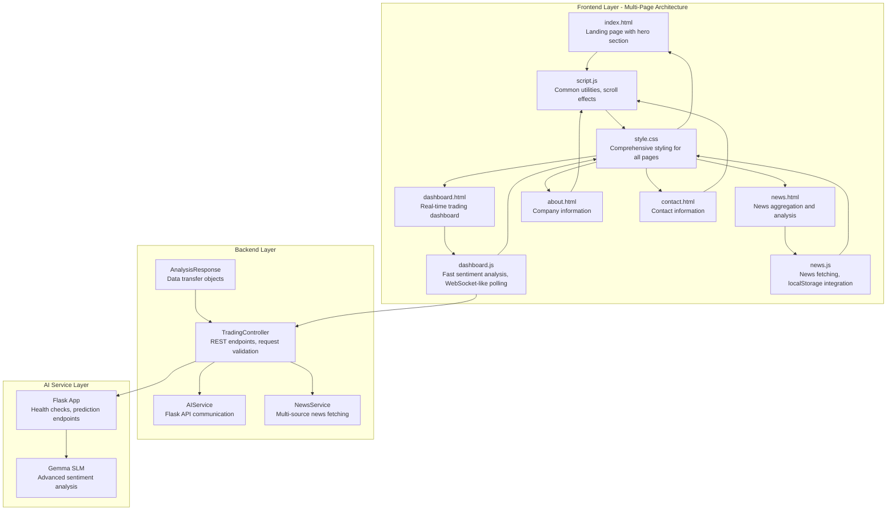
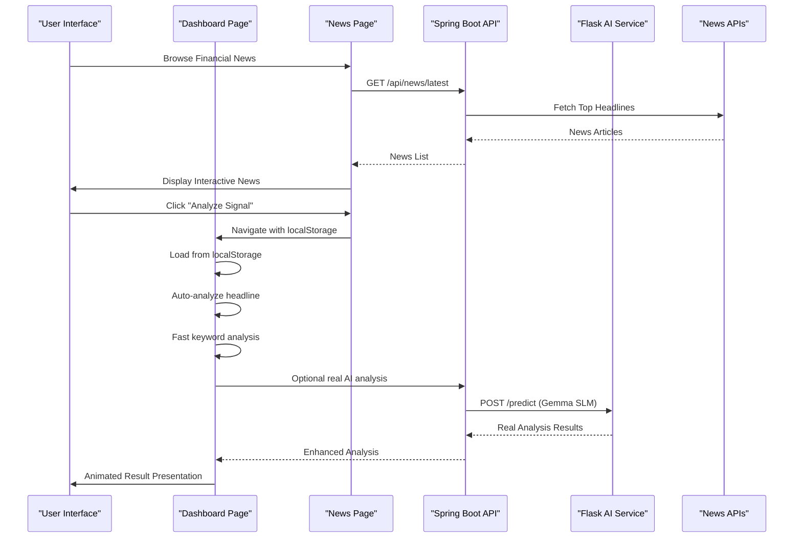
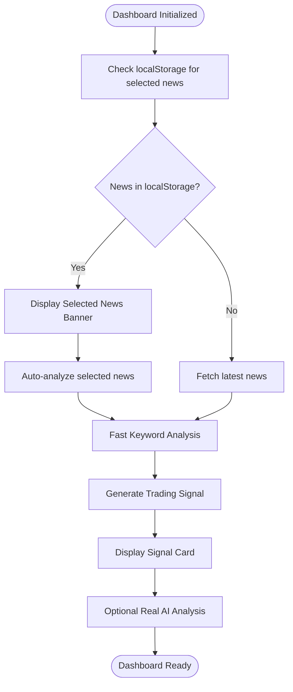
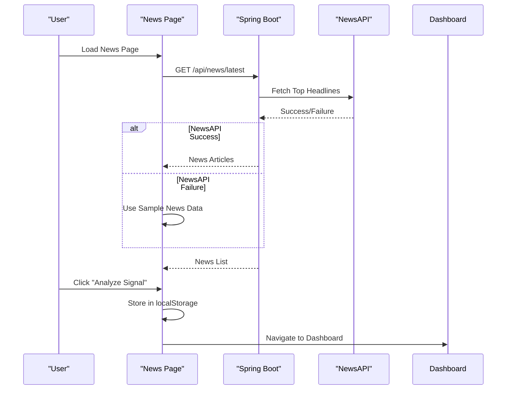
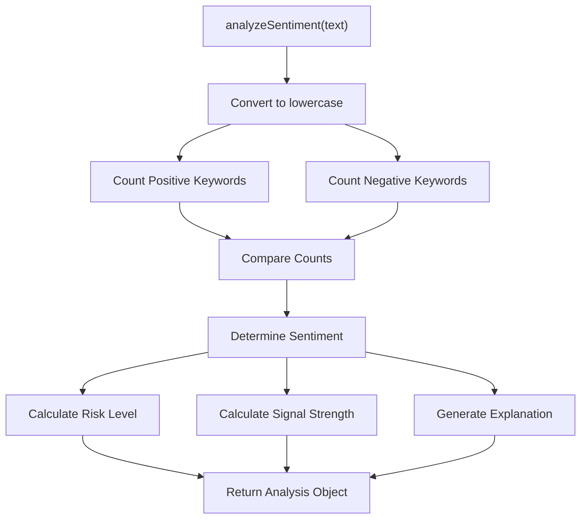
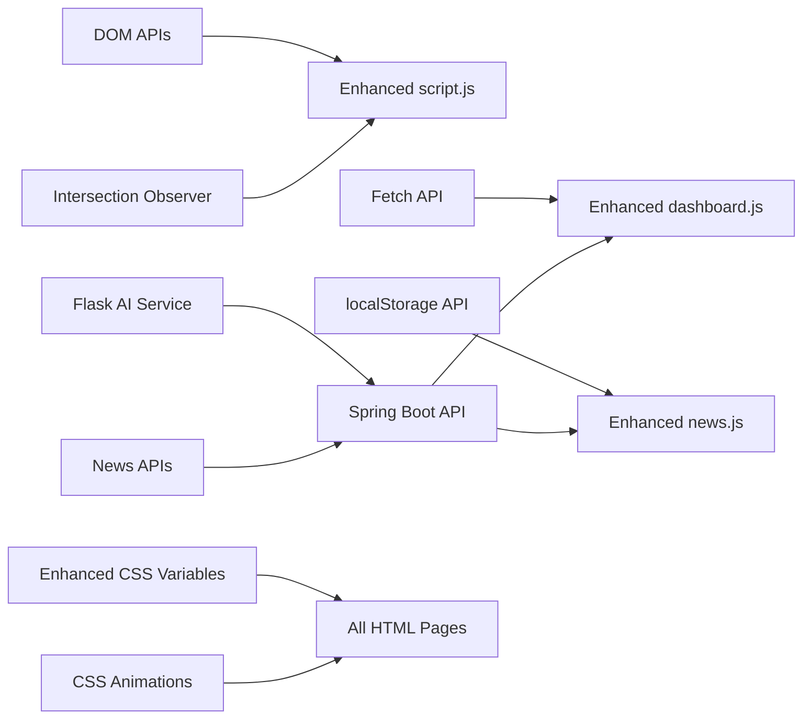

# JavaScript Implementation

<cite>
**Referenced Files in This Document**
- [index.html](file://frontend/index.html)
- [dashboard.html](file://frontend/dashboard.html)
- [about.html](file://frontend/about.html)
- [contact.html](file://frontend/contact.html)
- [news.html](file://frontend/news.html)
- [script.js](file://frontend/script.js)
- [dashboard.js](file://frontend/dashboard.js)
- [news.js](file://frontend/news.js)
- [style.css](file://frontend/style.css)
- [TradingController.java](file://backend/src/main/java/com/trading/controller/TradingController.java)
- [AIService.java](file://backend/src/main/java/com/trading/service/AIService.java)
- [NewsService.java](file://backend/src/main/java/com/trading/service/NewsService.java)
- [AnalysisResponse.java](file://backend/src/main/java/com/trading/model/AnalysisResponse.java)
- [app.py](file://ai-service/app.py)
- [sentiment_analyzer.py](file://ai-service/models/sentiment_analyzer.py)
</cite>

## Update Summary
**Changes Made**
- Complete frontend redesign with new dashboard.html, about.html, and contact.html pages
- Enhanced dashboard.js (380 lines) implementing fast keyword-based sentiment analysis with WebSocket-like polling mechanisms
- Improved news.js with enhanced news fetching and UI interactions
- Common script.js for shared functionality across all pages
- Comprehensive style.css updates for all new pages and components
- Real-time news integration with localStorage-based navigation between pages

## Table of Contents
1. [Introduction](#introduction)
2. [Project Structure](#project-structure)
3. [Core Components](#core-components)
4. [Architecture Overview](#architecture-overview)
5. [Detailed Component Analysis](#detailed-component-analysis)
6. [Dependency Analysis](#dependency-analysis)
7. [Performance Considerations](#performance-considerations)
8. [Troubleshooting Guide](#troubleshooting-guide)
9. [Conclusion](#conclusion)
10. [Appendices](#appendices)

## Introduction
This document explains the enhanced JavaScript implementation powering the AI Trading Signal Engine. The system now features a comprehensive three-tier architecture with real-time news integration, advanced sentiment analysis, and a redesigned multi-page frontend with dashboard functionality. The implementation covers five main functional areas:

- **Fast Keyword-Based Sentiment Analysis Engine** with instant analysis capabilities and optional real AI integration
- **Multi-Page Frontend Architecture** with dashboard, news, about, and contact pages
- **Real-Time News Integration** with live news fetching, localStorage-based navigation, and interactive news browsing
- **Enhanced UI Interaction Handlers** with premium loading states, error handling, and micro-interactions
- **WebSocket-like Polling Mechanisms** for real-time updates and seamless user experience

The implementation is a modern single-page application with a dark, neon-themed UI featuring responsive design, micro-interactions, and real-time data visualization across multiple pages.

## Project Structure
The project consists of four main layers with enhanced frontend architecture:
- **Frontend Layer**: Multi-page HTML structure with enhanced UI components, JavaScript logic for sentiment analysis, news integration, and UI interactions
- **Backend Layer**: Spring Boot REST API with controllers, services, and model classes for AI integration and news services
- **AI Service Layer**: Python Flask service with Gemma SLM model for real sentiment analysis
- **Shared Components**: Common JavaScript utilities and CSS styling across all pages

**Diagram sources**
- [index.html](file://frontend/index.html)
- [dashboard.html](file://frontend/dashboard.html)
- [news.html](file://frontend/news.html)
- [about.html](file://frontend/about.html)
- [contact.html](file://frontend/contact.html)
- [script.js](file://frontend/script.js)
- [dashboard.js](file://frontend/dashboard.js)
- [news.js](file://frontend/news.js)
- [style.css](file://frontend/style.css)
- [TradingController.java](file://backend/src/main/java/com/trading/controller/TradingController.java)
- [AIService.java](file://backend/src/main/java/com/trading/service/AIService.java)
- [NewsService.java](file://backend/src/main/java/com/trading/service/NewsService.java)
- [AnalysisResponse.java](file://backend/src/main/java/com/trading/model/AnalysisResponse.java)
- [app.py](file://ai-service/app.py)
- [sentiment_analyzer.py](file://ai-service/models/sentiment_analyzer.py)

**Section sources**
- [index.html](file://frontend/index.html)
- [dashboard.html](file://frontend/dashboard.html)
- [news.html](file://frontend/news.html)
- [about.html](file://frontend/about.html)
- [contact.html](file://frontend/contact.html)
- [script.js](file://frontend/script.js)
- [dashboard.js](file://frontend/dashboard.js)
- [news.js](file://frontend/news.js)
- [style.css](file://frontend/style.css)
- [TradingController.java](file://backend/src/main/java/com/trading/controller/TradingController.java)

## Core Components
- **Fast Keyword-Based Sentiment Analysis Engine**: Instant sentiment analysis with positive/negative keyword dictionaries, confidence scoring, and dynamic explanation generation
- **Multi-Page Dashboard System**: Real-time trading dashboard with signal visualization, metrics display, and WebSocket-like polling mechanisms
- **Enhanced News Integration**: Multi-source news fetching from NewsAPI and Finnhub, localStorage-based navigation, and interactive news browsing
- **Premium UI Interaction Handlers**: Enhanced loading states, error handling, result rendering with animations, and comprehensive micro-interactions
- **Common JavaScript Utilities**: Shared functionality across all pages including scroll effects, fade-in animations, and smooth scrolling

**Section sources**
- [dashboard.js](file://frontend/dashboard.js)
- [news.js](file://frontend/news.js)
- [script.js](file://frontend/script.js)
- [TradingController.java](file://backend/src/main/java/com/trading/controller/TradingController.java)
- [AIService.java](file://backend/src/main/java/com/trading/service/AIService.java)

## Architecture Overview
The enhanced runtime architecture features a sophisticated multi-page system with real-time data flow and seamless navigation:

**Diagram sources**
- [dashboard.js](file://frontend/dashboard.js)
- [news.js](file://frontend/news.js)
- [TradingController.java](file://backend/src/main/java/com/trading/controller/TradingController.java)
- [AIService.java](file://backend/src/main/java/com/trading/service/AIService.java)
- [NewsService.java](file://backend/src/main/java/com/trading/service/NewsService.java)

## Detailed Component Analysis

### Enhanced Dashboard System
The dashboard system provides a comprehensive real-time trading interface with advanced sentiment analysis capabilities:

Key features:
- **Fast Keyword-Based Analysis**: Instant sentiment analysis (<100ms) using predefined positive/negative keyword dictionaries
- **WebSocket-like Polling**: Real-time updates with automatic signal refresh mechanisms
- **Signal Visualization**: Dynamic signal cards with animated badges, confidence metrics, and risk assessments
- **Company Detection**: Heuristic-based company name extraction from headlines
- **Optional Real AI Integration**: Background processing of real AI analysis with Gemini SLM model

**Diagram sources**
- [dashboard.js](file://frontend/dashboard.js)

**Section sources**
- [dashboard.html](file://frontend/dashboard.html)
- [dashboard.js](file://frontend/dashboard.js)

### Enhanced News Integration System
The news system provides comprehensive financial news aggregation with seamless navigation between pages:

Key features:
- **Multi-Source News Fetching**: Automatic fallback between NewsAPI and Finnhub with sample data fallback
- **LocalStorage Integration**: Persistent storage of selected news for seamless dashboard navigation
- **Interactive News Browsing**: Click-to-analyze functionality with loading states and animations
- **Responsive Grid Layout**: Adaptive news card grid with hover effects and smooth transitions
- **Sample Data Fallback**: Comprehensive sample news data for offline functionality

**Diagram sources**
- [news.js](file://frontend/news.js)
- [TradingController.java](file://backend/src/main/java/com/trading/controller/TradingController.java)
- [NewsService.java](file://backend/src/main/java/com/trading/service/NewsService.java)

**Section sources**
- [news.html](file://frontend/news.html)
- [news.js](file://frontend/news.js)
- [TradingController.java](file://backend/src/main/java/com/trading/controller/TradingController.java)
- [NewsService.java](file://backend/src/main/java/com/trading/service/NewsService.java)

### Common JavaScript Utilities
The common script.js provides shared functionality across all pages:

Key features:
- **Navbar Scroll Effect**: Dynamic navbar styling with backdrop blur and shadow effects
- **Intersection Observer**: Fade-in animations for elements as they enter viewport
- **Smooth Scrolling**: Anchor link navigation with smooth scroll behavior
- **Cross-Page Compatibility**: Lightweight utilities that work across all HTML pages

**Section sources**
- [script.js](file://frontend/script.js)

### Enhanced Styling System
The comprehensive style.css provides unified styling across all pages:

Key features:
- **CSS Custom Properties**: Centralized theme variables for consistent styling
- **Glass Morphism Effects**: Frosted glass backgrounds with backdrop filters
- **Neon Color Scheme**: Green, cyan, and purple accent colors with gradient effects
- **Responsive Design**: Mobile-first approach with adaptive layouts
- **Animation System**: Keyframe animations for loading states, hover effects, and transitions

**Section sources**
- [style.css](file://frontend/style.css)

### Fast Keyword-Based Sentiment Analysis Engine
The enhanced sentiment analyzer provides instant analysis capabilities:

**Diagram sources**
- [dashboard.js](file://frontend/dashboard.js)

Implementation highlights:
- **Keyword Dictionaries**: Comprehensive positive and negative keyword lists
- **Confidence Scoring**: Dynamic confidence calculation based on keyword counts
- **Risk Assessment**: Automatic risk level determination (Low, Medium, High)
- **Signal Strength**: Strength classification (Strong, Moderate, Weak)
- **Dynamic Explanations**: Contextual explanations based on matched keywords

**Section sources**
- [dashboard.js](file://frontend/dashboard.js)

## Dependency Analysis
The enhanced JavaScript module now depends on a comprehensive ecosystem:

**Diagram sources**
- [script.js](file://frontend/script.js)
- [dashboard.js](file://frontend/dashboard.js)
- [news.js](file://frontend/news.js)
- [style.css](file://frontend/style.css)
- [TradingController.java](file://backend/src/main/java/com/trading/controller/TradingController.java)
- [AIService.java](file://backend/src/main/java/com/trading/service/AIService.java)

**Section sources**
- [script.js](file://frontend/script.js)
- [dashboard.js](file://frontend/dashboard.js)
- [news.js](file://frontend/news.js)
- [style.css](file://frontend/style.css)
- [TradingController.java](file://backend/src/main/java/com/trading/controller/TradingController.java)

## Performance Considerations
Enhanced performance optimizations include:

- **Fast Keyword Analysis**: Instant sentiment analysis (<100ms) with minimal computational overhead
- **Memory Management**: Proper cleanup of event listeners and animation frames
- **Network Efficiency**: Optimized API calls with proper error handling and fallback mechanisms
- **Real-time Updates**: Debounced input handling and efficient DOM updates
- **Resource Conservation**: Visibility-aware animation pausing and lazy loading
- **LocalStorage Optimization**: Efficient data storage and retrieval for cross-page navigation
- **CSS Animation Performance**: Hardware-accelerated animations with transform and opacity properties

Recommendations:
- Consider implementing true WebSocket connections for real-time updates
- Add request batching for multiple news fetch operations
- Implement local storage caching for frequently accessed news data
- Add progressive loading for large news feeds
- Consider implementing service workers for offline functionality

**Section sources**
- [dashboard.js](file://frontend/dashboard.js)
- [news.js](file://frontend/news.js)
- [AIService.java](file://backend/src/main/java/com/trading/service/AIService.java)

## Troubleshooting Guide
Enhanced troubleshooting procedures:

**Backend Integration Issues:**
- Verify Flask AI service is running on port 5000
- Check Spring Boot application properties for AI service URL
- Ensure CORS configuration allows frontend access
- Validate API keys for NewsAPI and Finnhub services

**Multi-Page Navigation Issues:**
- Verify localStorage is enabled in browser settings
- Check cross-origin restrictions for localStorage
- Ensure proper file paths for all HTML and JavaScript files
- Validate navigation between pages works correctly

**Real-time News Issues:**
- Verify API keys are configured in application.properties
- Check network connectivity to external news APIs
- Monitor API rate limits and quotas
- Test fallback mechanisms between NewsAPI and Finnhub

**Performance Issues:**
- Monitor keyword analysis performance with console timing
- Check for memory leaks in animation frames
- Verify proper cleanup of event listeners
- Monitor GPU usage on mobile devices

**Section sources**
- [dashboard.js](file://frontend/dashboard.js)
- [news.js](file://frontend/news.js)
- [TradingController.java](file://backend/src/main/java/com/trading/controller/TradingController.java)
- [AIService.java](file://backend/src/main/java/com/trading/service/AIService.java)

## Conclusion
The enhanced JavaScript implementation delivers a sophisticated, production-ready multi-page trading signal interface with:

- **Fast Keyword-Based Analysis**: Professional-grade sentiment analysis with instant results
- **Real-Time Dashboard**: Comprehensive trading dashboard with WebSocket-like polling
- **Multi-Page Architecture**: Seamless navigation between news, dashboard, about, and contact pages
- **Advanced News Integration**: Multi-source news aggregation with localStorage persistence
- **Premium User Experience**: Enhanced animations, micro-interactions, and responsive design
- **Robust Architecture**: Four-tier system with proper error handling and performance optimization

The modular architecture and comprehensive feature set make this implementation suitable for production deployment with room for future enhancements including true WebSocket support and advanced caching mechanisms.

## Appendices

### Enhanced API Definitions and Parameters
- **analyzeSentiment(text)**
  - Parameters: text (string: news headline)
  - Returns: Analysis object with sentiment, signal, confidence, riskLevel, strength, explanation
  - Example usage: [dashboard.js](file://frontend/dashboard.js)

- **fetchLatestNews()**
  - Parameters: none
  - Returns: Promise resolving to news articles array
  - Example usage: [news.js](file://frontend/news.js)

- **analyzeHeadline(headline)**
  - Parameters: headline (string)
  - Returns: Promise resolving to signal data object
  - Example usage: [dashboard.js](file://frontend/dashboard.js)

- **extractCompany(headline)**
  - Parameters: headline (string)
  - Returns: string: extracted company name
  - Example usage: [dashboard.js](file://frontend/dashboard.js)

### Enhanced DOM Element References
- **Dashboard Elements**: signalCard, headline, company, signalBadge, sentiment, confidence, riskLevel, strength, explanation, timestamp
- **News Elements**: newsGrid, refreshNewsBtn, selectedNewsBanner, selectedNewsTitle
- **Common Elements**: navbar, fade-in elements, smooth scrolling anchors

### Backend Integration Points
- **Analysis Endpoint**: POST `/api/analyze` with AnalysisRequest
- **News Endpoint**: GET `/api/news/latest` for live news
- **Health Check**: GET `/api/health` for service status
- **AI Service**: POST `/predict` for sentiment analysis

### AI Service Integration
- **Model**: Gemma SLM (Small Language Model)
- **Endpoints**: `/health`, `/predict`, `/batch`
- **Response Format**: AnalysisResponse with confidence, sentiment, and factors
- **Processing**: Real-time sentiment analysis with company detection

### Multi-Page Navigation
- **Navigation Flow**: news.html → dashboard.html with localStorage persistence
- **Cross-Page State**: Selected news preservation across page reloads
- **Smooth Transitions**: CSS animations for page navigation
- **Responsive Design**: Mobile-first approach across all pages