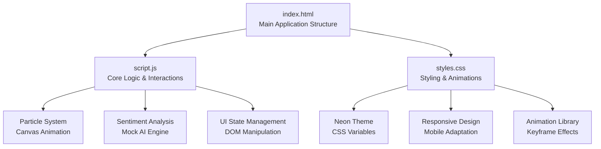
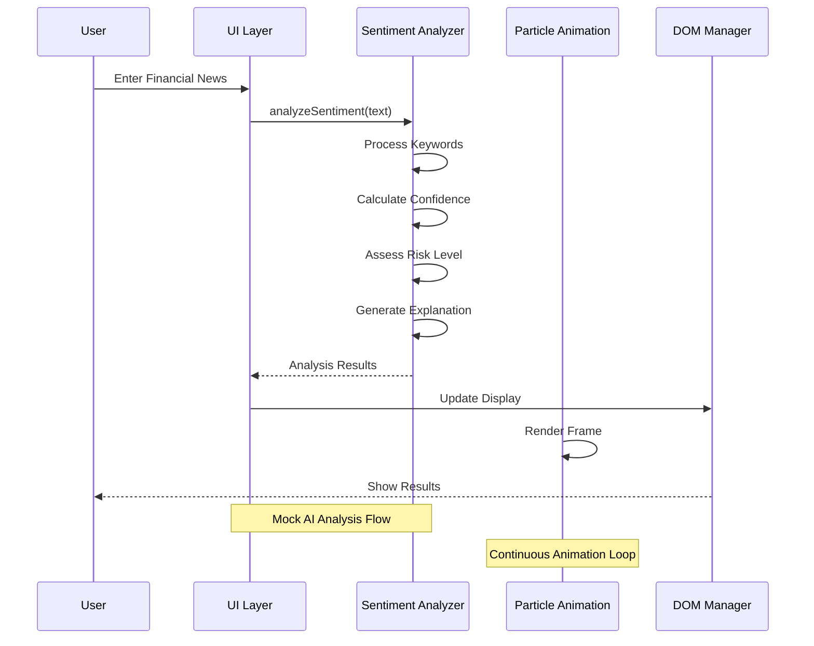
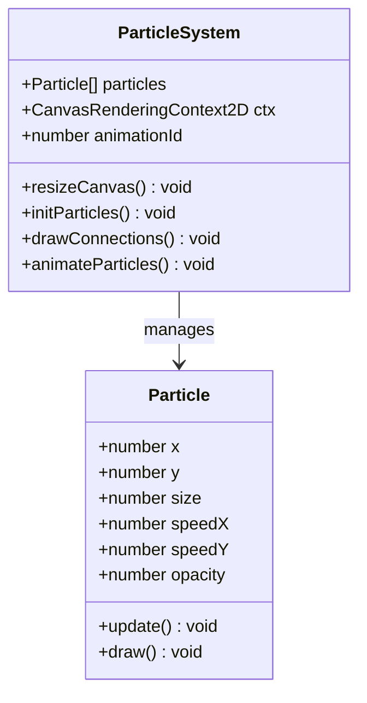
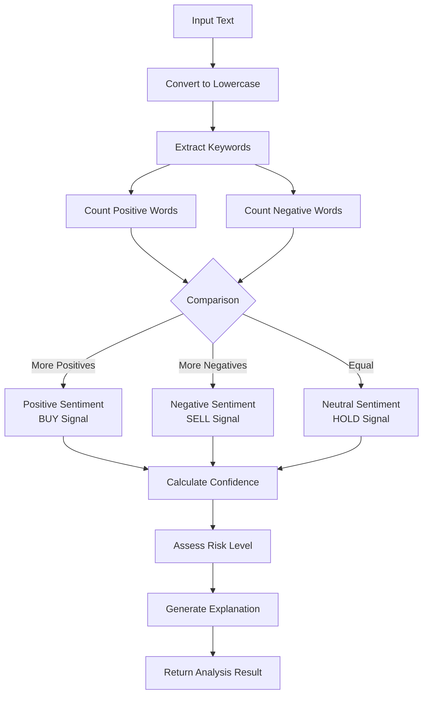
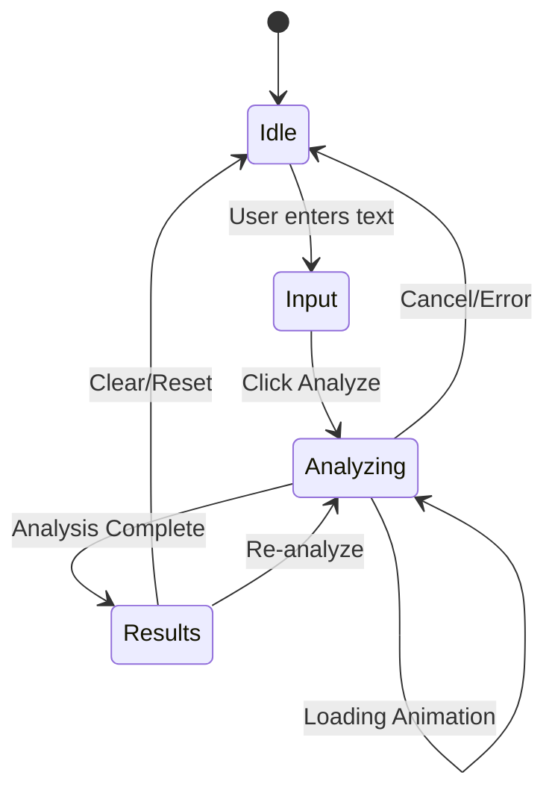
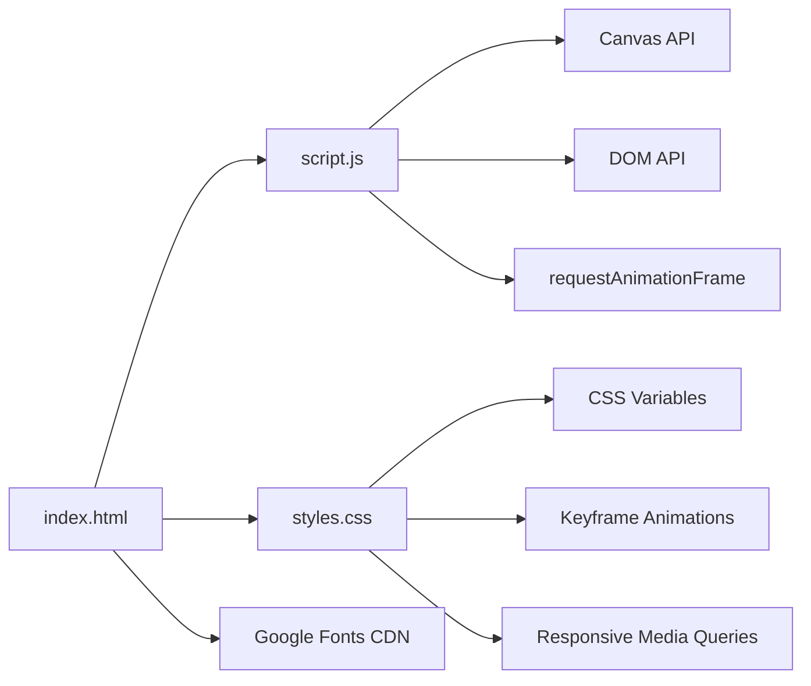

# Project Overview

<cite>
**Referenced Files in This Document**
- [index.html](file://index.html)
- [script.js](file://script.js)
- [styles.css](file://styles.css)
</cite>

## Table of Contents
1. [Introduction](#introduction)
2. [Project Structure](#project-structure)
3. [Core Components](#core-components)
4. [Architecture Overview](#architecture-overview)
5. [Detailed Component Analysis](#detailed-component-analysis)
6. [Dependency Analysis](#dependency-analysis)
7. [Performance Considerations](#performance-considerations)
8. [Troubleshooting Guide](#troubleshooting-guide)
9. [Conclusion](#conclusion)

## Introduction
The AI Trading Signal Engine is a real-time financial sentiment analysis tool designed to process financial news headlines and generate automated trading signals (BUY, SELL, HOLD). It combines a neon-themed UI with a particle animation system and responsive layout to deliver an immersive, high-performance experience for financial analysts and traders who need quick insights from textual market signals.

The project demonstrates a complete frontend solution built with HTML5, CSS3, and vanilla JavaScript, showcasing modern web technologies to create a visually engaging and highly functional interface. The system simulates AI-powered analysis by processing user-provided news headlines through a sentiment detection engine, confidence scoring mechanism, and risk assessment framework.

## Project Structure
The project follows a minimal, modular architecture with three primary files:

**Diagram sources**
- [index.html:1-175](file://index.html#L1-L175)
- [script.js:1-404](file://script.js#L1-L404)
- [styles.css:1-816](file://styles.css#L1-L816)

The structure emphasizes separation of concerns with HTML handling markup, CSS managing presentation and animations, and JavaScript controlling interactivity and state management.

**Section sources**
- [index.html:1-175](file://index.html#L1-L175)
- [script.js:1-404](file://script.js#L1-L404)
- [styles.css:1-816](file://styles.css#L1-L816)

## Core Components
The AI Trading Signal Engine consists of several interconnected components that work together to provide a seamless user experience:

### 1. Particle Animation System
A sophisticated canvas-based particle system that creates a dynamic, futuristic background effect. The system features:
- Dynamic particle generation with randomized properties
- Real-time connection rendering between nearby particles
- Edge wrapping for continuous motion
- Performance optimization through requestAnimationFrame
- Responsive canvas sizing that adapts to viewport changes

### 2. Sentiment Detection Engine
A mock AI-powered analysis system that processes financial news through:
- Keyword-based sentiment scoring using predefined positive/negative word lists
- Confidence calculation based on keyword density and randomization
- Risk level assessment derived from confidence thresholds
- Dynamic explanation generation providing contextual analysis

### 3. Neon-Themed UI Framework
A comprehensive styling system featuring:
- Dark theme with vibrant neon accents
- Glass-morphism design elements
- Gradient-based visual effects
- Responsive typography using Orbitron, Inter, and Poppins fonts
- Comprehensive animation library with keyframe effects

### 4. Interactive Input System
A user-friendly interface with:
- Real-time character counting for input validation
- Keyboard shortcuts (Ctrl/Cmd + Enter) for efficient analysis
- Loading states with animated progress indicators
- Smooth transitions between UI states

**Section sources**
- [script.js:23-120](file://script.js#L23-L120)
- [script.js:145-227](file://script.js#L145-L227)
- [styles.css:4-60](file://styles.css#L4-L60)
- [script.js:127-139](file://script.js#L127-L139)

## Architecture Overview
The application follows a unidirectional data flow architecture with clear separation between presentation, logic, and state management:

**Diagram sources**
- [script.js:259-275](file://script.js#L259-L275)
- [script.js:145-227](file://script.js#L145-L227)
- [script.js:99-109](file://script.js#L99-L109)

The architecture ensures that user interactions trigger immediate feedback while maintaining smooth background animations and responsive performance.

**Section sources**
- [script.js:259-327](file://script.js#L259-L327)
- [script.js:99-120](file://script.js#L99-L120)

## Detailed Component Analysis

### Particle Animation System
The particle system represents the visual foundation of the neon-themed interface:

**Diagram sources**
- [script.js:38-75](file://script.js#L38-L75)
- [script.js:99-120](file://script.js#L99-L120)

The system dynamically generates particles based on viewport size, creating an optimal balance between visual appeal and performance. Particles wrap around screen edges and form connections when within proximity, creating a network-like visual effect.

### Sentiment Analysis Engine
The mock AI analysis engine processes financial news through a keyword-based scoring system:

**Diagram sources**
- [script.js:145-227](file://script.js#L145-L227)
- [script.js:229-253](file://script.js#L229-L253)

The engine uses predefined financial terminology lists to identify bullish and bearish indicators, calculating confidence scores based on keyword density and randomization factors.

### UI State Management
The application manages multiple UI states through a structured approach:

**Diagram sources**
- [script.js:259-327](file://script.js#L259-L327)
- [script.js:278-285](file://script.js#L278-L285)

The state machine ensures predictable user interactions while maintaining visual continuity through smooth transitions and loading states.

**Section sources**
- [script.js:38-120](file://script.js#L38-L120)
- [script.js:145-253](file://script.js#L145-L253)
- [script.js:259-327](file://script.js#L259-L327)

## Dependency Analysis
The project maintains minimal external dependencies, relying solely on browser-native APIs and standard web technologies:

**Diagram sources**
- [index.html:8-13](file://index.html#L8-L13)
- [script.js:25-26](file://script.js#L25-L26)
- [styles.css:89-109](file://styles.css#L89-L109)

This dependency-free approach ensures maximum compatibility, reduced bundle sizes, and simplified deployment requirements.

**Section sources**
- [index.html:8-13](file://index.html#L8-L13)
- [script.js:25-26](file://script.js#L25-L26)
- [styles.css:89-109](file://styles.css#L89-L109)

## Performance Considerations
The application implements several optimization strategies to maintain smooth performance:

### Canvas Optimization
- Dynamic particle count calculation based on viewport area
- Efficient edge wrapping without boundary checks
- Optimized connection drawing with distance thresholding
- RequestAnimationFrame-based animation loop

### Memory Management
- Particle recycling through array reuse
- Event listener cleanup on visibility change
- Conditional rendering based on element visibility
- Debounced resize handling

### Rendering Efficiency
- CSS transforms for animations (hardware acceleration)
- Minimal DOM manipulation through batch updates
- Efficient gradient calculations
- Optimized color space conversions

**Section sources**
- [script.js:68-75](file://script.js#L68-L75)
- [script.js:389-395](file://script.js#L389-L395)
- [styles.css:673-734](file://styles.css#L673-L734)

## Troubleshooting Guide
Common issues and their solutions:

### Particle Animation Problems
- **Issue**: Particles disappear on small screens
  - **Solution**: Verify canvas resize handler is active and responsive
  - **Check**: Window resize event listeners and particle count calculation

### Sentiment Analysis Issues
- **Issue**: No results returned for valid input
  - **Solution**: Ensure input contains recognizable financial keywords
  - **Check**: Keyword lists and text preprocessing steps

### UI Responsiveness Problems
- **Issue**: Slow button interactions
  - **Solution**: Verify CSS transitions aren't blocking JavaScript execution
  - **Check**: Animation duration settings and event handler timing

### Mobile Compatibility
- **Issue**: Touch interactions not working
  - **Solution**: Test with actual mobile devices and adjust touch targets
  - **Check**: Pointer events vs touch events handling

**Section sources**
- [script.js:117-120](file://script.js#L117-L120)
- [script.js:375-382](file://script.js#L375-L382)
- [styles.css:739-795](file://styles.css#L739-L795)

## Conclusion
The AI Trading Signal Engine successfully demonstrates a complete frontend solution for real-time financial sentiment analysis. By combining modern web technologies with innovative design principles, the project delivers an engaging, high-performance interface that showcases the potential of AI-powered trading tools.

The neon-themed UI with particle animations creates an immersive experience that appeals to the target audience of financial analysts and traders seeking quick insights from market sentiment. The modular architecture ensures maintainability while the mock AI engine provides a realistic demonstration of automated trading signal generation.

Key strengths include the responsive design that works across all device sizes, the performance-optimized particle system, and the intuitive user interface that minimizes cognitive load during critical decision-making processes. The project serves as an excellent foundation for building more advanced sentiment analysis tools with integrated real AI models.