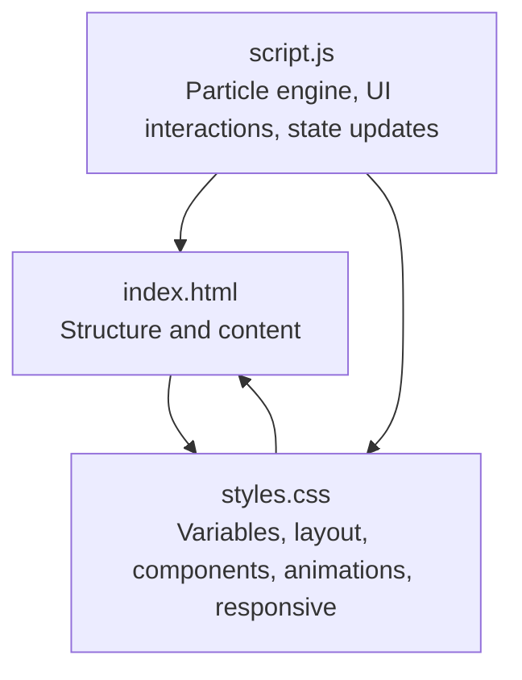
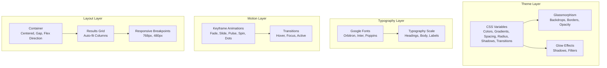
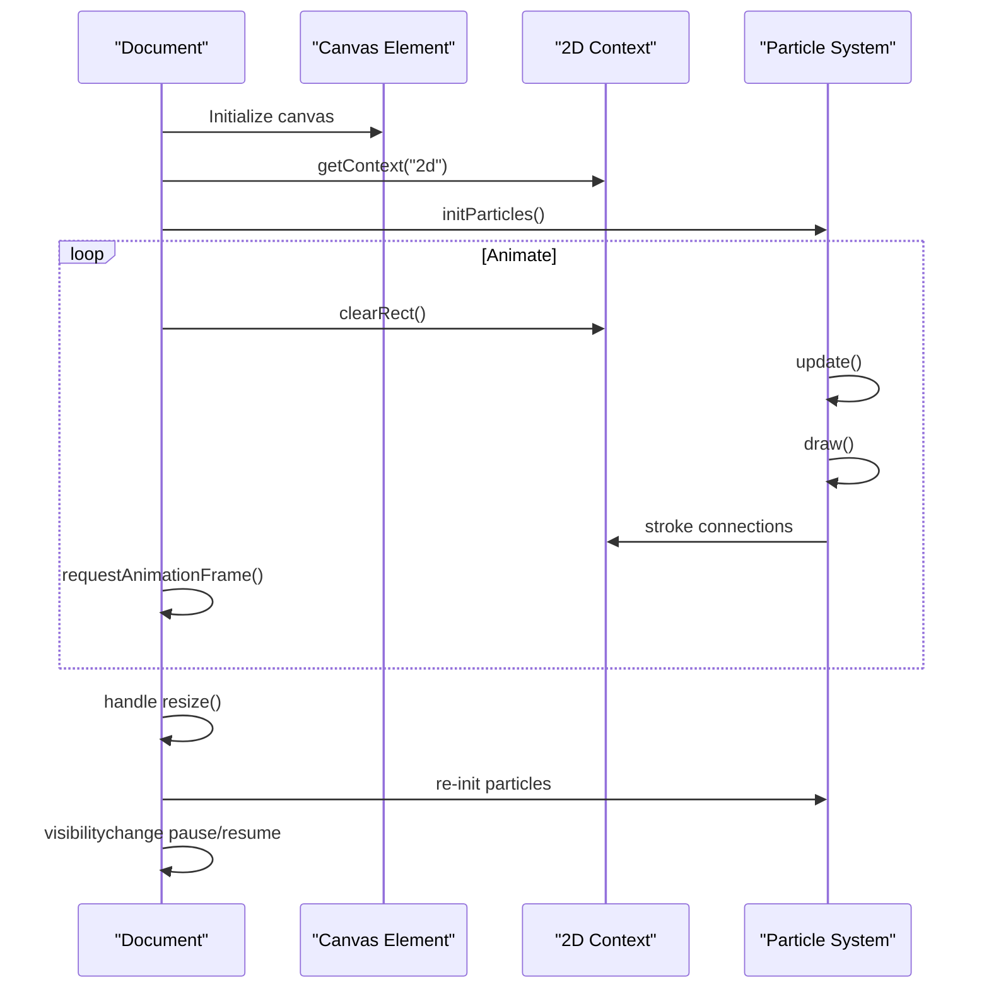
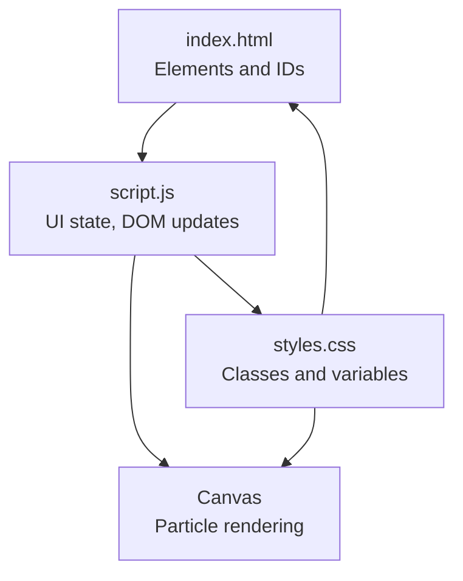

# Styling and Visual Design

<cite>
**Referenced Files in This Document**
- [styles.css](file://styles.css)
- [index.html](file://index.html)
- [script.js](file://script.js)
</cite>

## Table of Contents
1. [Introduction](#introduction)
2. [Project Structure](#project-structure)
3. [Core Components](#core-components)
4. [Architecture Overview](#architecture-overview)
5. [Detailed Component Analysis](#detailed-component-analysis)
6. [Dependency Analysis](#dependency-analysis)
7. [Performance Considerations](#performance-considerations)
8. [Troubleshooting Guide](#troubleshooting-guide)
9. [Conclusion](#conclusion)
10. [Appendices](#appendices)

## Introduction
This document describes the styling and visual design system of the AI Trading Signal Engine. It covers the CSS architecture, custom properties for theming, responsive design patterns, animation systems, neon theme implementation, typography, grid system for result cards, color schemes, spacing systems, and component styling patterns. It also addresses performance optimization, browser compatibility, accessibility, and customization guidelines.

## Project Structure
The project follows a minimal, component-driven CSS architecture with a single stylesheet and two HTML/JS entry points. The design system centers on a dark neon theme with glassmorphism, gradients, and subtle animations.

**Diagram sources**
- [index.html:1-175](file://index.html#L1-L175)
- [styles.css:1-816](file://styles.css#L1-L816)
- [script.js:1-404](file://script.js#L1-L404)

**Section sources**
- [index.html:1-175](file://index.html#L1-L175)
- [styles.css:1-816](file://styles.css#L1-L816)
- [script.js:1-404](file://script.js#L1-L404)

## Core Components
- CSS Variables and Root Config: Centralized theming via custom properties for colors, gradients, spacing, radius, shadows, and transitions.
- Base Reset and Typography: Normalize margins/paddings, set body font stack, and define smooth scrolling.
- Animated Background: Canvas-based particle system with connections and responsive sizing.
- Layout Container: Centered container with animated entrance and flexible column layout.
- Header: Glass-like header with logo, subtitle, and live status indicator.
- Input Section: Glass-styled textarea with character count, glow focus effect, and dynamic color feedback.
- Analyze Button: Gradient-filled button with ripple press effect, hover lift, and glow on interaction.
- Loading State: Multi-ring loader with pulsing core and animated dots.
- Result Card: Signal badge with color-coded glow, results grid, confidence bar, explanation box, and disclaimer.
- Footer Stats: Glass stats panel with divider separators and responsive wrapping.
- Utility Classes: Hidden visibility toggle.
- Animations: Fade, slide, pulse, spin, and dot animations.
- Responsive Breakpoints: Mobile-first design with media queries at 768px and 480px.

**Section sources**
- [styles.css:4-60](file://styles.css#L4-L60)
- [styles.css:65-84](file://styles.css#L65-L84)
- [styles.css:89-109](file://styles.css#L89-L109)
- [styles.css:114-125](file://styles.css#L114-L125)
- [styles.css:130-204](file://styles.css#L130-L204)
- [styles.css:222-294](file://styles.css#L222-L294)
- [styles.css:299-360](file://styles.css#L299-L360)
- [styles.css:376-456](file://styles.css#L376-L456)
- [styles.css:461-571](file://styles.css#L461-L571)
- [styles.css:624-661](file://styles.css#L624-L661)
- [styles.css:666-668](file://styles.css#L666-L668)
- [styles.css:673-734](file://styles.css#L673-L734)
- [styles.css:739-795](file://styles.css#L739-L795)

## Architecture Overview
The visual system is built around a cohesive design language:
- Theming: CSS custom properties define a dark neon palette with glassmorphism and glow effects.
- Typography: Google Fonts Orbitron (display), Inter (body), and Poppins (fallback) are used for a modern tech aesthetic.
- Motion: Micro-interactions and animations enhance usability and perceived performance.
- Layout: Flexbox and CSS Grid create a responsive, mobile-first structure.
- Performance: Canvas-based particle animation with visibility-aware lifecycle and optimized scrollbar styling.

**Diagram sources**
- [styles.css:4-60](file://styles.css#L4-L60)
- [styles.css:77-84](file://styles.css#L77-L84)
- [styles.css:673-734](file://styles.css#L673-L734)
- [styles.css:114-125](file://styles.css#L114-L125)
- [styles.css:521-526](file://styles.css#L521-L526)
- [styles.css:739-795](file://styles.css#L739-L795)

## Detailed Component Analysis

### CSS Variables and Root Config
- Purpose: Centralize design tokens for consistent theming across components.
- Scope: Colors (primary, secondary, card, glass), neon accents, gradients, spacing, radius, shadows, and transitions.
- Usage: Consumed via var(--token-name) across selectors for colors, backgrounds, borders, and shadows.

**Section sources**
- [styles.css:4-60](file://styles.css#L4-L60)

### Base Reset and Typography
- Reset: Normalize margins/padding and set box-sizing globally.
- Body: Set font family stack with Inter and Poppins fallbacks, dark background, and smooth scroll behavior.
- Headings: Use Orbitron for emphasis and gradient text effects.

**Section sources**
- [styles.css:65-84](file://styles.css#L65-L84)
- [styles.css:162-172](file://styles.css#L162-L172)

### Animated Background
- Canvas: Fixed-position canvas fills the viewport and renders animated particles.
- Particles: Dynamically generated with random sizes, speeds, and opacities; wrap at edges.
- Connections: Lines drawn between nearby particles with opacity based on distance.
- Lifecycle: Initializes on load, resizes with window, and pauses when tab is not visible.

**Diagram sources**
- [script.js:25-120](file://script.js#L25-L120)
- [script.js:388-395](file://script.js#L388-L395)

**Section sources**
- [styles.css:89-109](file://styles.css#L89-L109)
- [script.js:25-120](file://script.js#L25-L120)
- [script.js:388-395](file://script.js#L388-L395)

### Layout Container
- Purpose: Center content, apply max-width, and manage vertical rhythm with gaps.
- Behavior: Animated fade-in and slide-up entrances for child components.

**Section sources**
- [styles.css:114-125](file://styles.css#L114-L125)

### Header and Status
- Header: Glass-like backdrop, blur, border, rounded corners, shadow, sticky positioning, and slide-down animation.
- Logo: Icon with neon green drop-shadow and continuous pulse animation.
- Status Badge: Live indicator with neon green dot and pulse animation.

**Section sources**
- [styles.css:130-141](file://styles.css#L130-L141)
- [styles.css:156-160](file://styles.css#L156-L160)
- [styles.css:180-204](file://styles.css#L180-L204)

### Input Section
- Textarea: Dark glass background, low-contrast border, rounded corners, and Inter font.
- Focus Effects: Blue border glow with inset glow and transition timing.
- Character Counter: Positioned absolutely with dynamic color change based on input length.

**Section sources**
- [styles.css:248-294](file://styles.css#L248-L294)
- [styles.css:266-269](file://styles.css#L266-L269)

### Analyze Button
- Gradient Fill: Multi-stop gradient using primary and accent colors.
- Interaction States: Hover lift, glow on hover, pressed state with ripple effect.
- Ripple: Absolute pseudo-element scaled on click to simulate water ripples.

**Section sources**
- [styles.css:299-360](file://styles.css#L299-L360)
- [styles.css:336-354](file://styles.css#L336-L354)

### Loading State
- Loader Rings: Three concentric rings with distinct neon colors and staggered animation delays.
- Core: Pulsing central element with gradient background.
- Dots: Animated ellipsis effect using staggered keyframes.

**Section sources**
- [styles.css:376-456](file://styles.css#L376-L456)
- [styles.css:362-371](file://styles.css#L362-L371)

### Result Card
- Signal Badge: Color-coded glow and text color per signal type (buy/sell/hold).
- Results Grid: CSS Grid with auto-fit columns and consistent spacing.
- Confidence Bar: Animated width transition with gradient fill and glow.
- Explanation Box: Glass background with label and descriptive text.
- Disclaimer: Yellow-accented notice with icon and small text.

**Section sources**
- [styles.css:461-571](file://styles.css#L461-L571)
- [styles.css:521-526](file://styles.css#L521-L526)
- [styles.css:555-570](file://styles.css#L555-L570)

### Footer Stats
- Panel: Glass-like stats container with blur and border.
- Items: Centered stat values and labels with responsive wrapping.
- Dividers: Vertical separators with reduced visibility on smaller screens.

**Section sources**
- [styles.css:624-661](file://styles.css#L624-L661)
- [styles.css:657-661](file://styles.css#L657-L661)

### Animations
- Fade In: Subtle opacity transition for container and child elements.
- Slide Down/Up: Entrance animations for header and cards.
- Pulse: Continuous scale and opacity variation for icons and badges.
- Spin: Infinite rotation for loader rings.
- Dots: Staggered opacity for animated ellipsis.

**Section sources**
- [styles.css:673-734](file://styles.css#L673-L734)

### Responsive Design
- 768px Breakpoint: Adjusts container padding, header layout, main card padding, signal text size, grid to single column, footer gap, and hides dividers.
- 480px Breakpoint: Reduces logo icon and text sizes, button font and padding, and signal icon/text sizes.

**Section sources**
- [styles.css:739-795](file://styles.css#L739-L795)

### Scrollbar Styling
- WebKit scrollbar: Custom width, track background, thumb radius, and hover color using neon variables.

**Section sources**
- [styles.css:798-816](file://styles.css#L798-L816)

## Dependency Analysis
The visual system relies on coordinated interactions between HTML structure, CSS variables, animations, and JavaScript-driven state changes.

**Diagram sources**
- [index.html:1-175](file://index.html#L1-L175)
- [script.js:1-404](file://script.js#L1-L404)
- [styles.css:1-816](file://styles.css#L1-L816)

**Section sources**
- [index.html:1-175](file://index.html#L1-L175)
- [script.js:1-404](file://script.js#L1-L404)
- [styles.css:1-816](file://styles.css#L1-L816)

## Performance Considerations
- Canvas Optimization: Particles dynamically adjust count based on viewport area and pause when the tab is not visible to reduce CPU/GPU usage.
- CSS Hardware Acceleration: Use transforms and opacity for animations; avoid layout-affecting properties where possible.
- Efficient Transitions: Keep transition durations short and limit property counts in keyframes.
- Font Loading: Preconnect and pre-render Google Fonts to minimize render-blocking.
- Scrollbar Styling: Minimal custom scrollbar reduces layout thrashing.

**Section sources**
- [script.js:68-75](file://script.js#L68-L75)
- [script.js:388-395](file://script.js#L388-L395)
- [index.html:8-11](file://index.html#L8-L11)
- [styles.css:798-816](file://styles.css#L798-L816)

## Troubleshooting Guide
- Fonts Not Loading:
  - Ensure Google Fonts links are present and reachable.
  - Verify preconnect and crossorigin attributes are included.
- Canvas Not Rendering:
  - Confirm canvas element exists and is appended to the DOM.
  - Check for errors in the particle initialization and animation loop.
- Animations Jank:
  - Reduce particle count on small screens.
  - Limit simultaneous animations and use transform/opacity.
- Button Ripple Not Triggering:
  - Ensure the button is not disabled and the active state class is toggled.
- Responsive Issues:
  - Validate media queries and ensure viewport meta tag is present.

**Section sources**
- [index.html:8-11](file://index.html#L8-L11)
- [script.js:25-120](file://script.js#L25-L120)
- [styles.css:739-795](file://styles.css#L739-L795)

## Conclusion
The visual design system employs a cohesive dark neon theme with glassmorphism, gradients, and micro-interactions. It balances aesthetics with performance through a particle animation engine, CSS variables, and responsive breakpoints. The modular structure enables easy customization and extension while maintaining accessibility and cross-browser compatibility.

## Appendices

### Color Scheme Reference
- Primary Background: Dark blue/black tone.
- Secondary Background: Deeper blue tint.
- Card Background: Semi-transparent glass with backdrop blur.
- Glass Background: Low-opacity overlay for UI panels.
- Neon Accents: Green, red, yellow, blue, and purple with dim variants for glows.
- Text Colors: High contrast white, muted gray, and secondary light gray.
- Gradients: Multi-stop gradients for buttons and confidence bars.

**Section sources**
- [styles.css:4-60](file://styles.css#L4-L60)

### Typography Scale Reference
- Display: Orbitron for headings and signal text.
- Body: Inter for form controls and paragraphs.
- Fallback: System fonts for broader compatibility.

**Section sources**
- [styles.css:77-84](file://styles.css#L77-L84)
- [styles.css:162-172](file://styles.css#L162-L172)

### Spacing System Reference
- Tokens: Extra-small, small, medium, large, extra-large.
- Consistent use across paddings, margins, gaps, and radii.

**Section sources**
- [styles.css:34-46](file://styles.css#L34-L46)

### Component Styling Patterns
- Glass Panels: Backdrop blur, thin borders, rounded corners, and soft shadows.
- Glowing Borders: Use shadow-glow variables for buy/sell/hold states.
- Interactive Feedback: Hover lifts, glow on hover, and ripple press effects.
- Animated Entrances: Fade and slide animations for page and component transitions.

**Section sources**
- [styles.css:130-141](file://styles.css#L130-L141)
- [styles.css:299-360](file://styles.css#L299-L360)
- [styles.css:475-491](file://styles.css#L475-L491)
- [styles.css:673-702](file://styles.css#L673-L702)

### Customization Guidelines
- Theming:
  - Modify CSS variables in :root to change palettes, gradients, and shadows.
  - Replace gradient values to match brand identity.
- Typography:
  - Swap Google Fonts by updating the font stack and ensuring availability.
  - Adjust font weights and sizes to fit content hierarchy.
- Animations:
  - Tune keyframe durations and easing curves for desired feel.
  - Add or remove micro-interactions to balance performance and polish.
- Layout:
  - Adjust container max-width and grid column rules for different content densities.
  - Extend responsive breakpoints as needed for target devices.
- Accessibility:
  - Maintain sufficient color contrast against glass backgrounds.
  - Provide focus-visible styles and keyboard navigation support.
  - Avoid motion-sensitive animations for users who prefer reduced motion.

**Section sources**
- [styles.css:4-60](file://styles.css#L4-L60)
- [styles.css:77-84](file://styles.css#L77-L84)
- [styles.css:673-734](file://styles.css#L673-L734)
- [styles.css:521-526](file://styles.css#L521-L526)