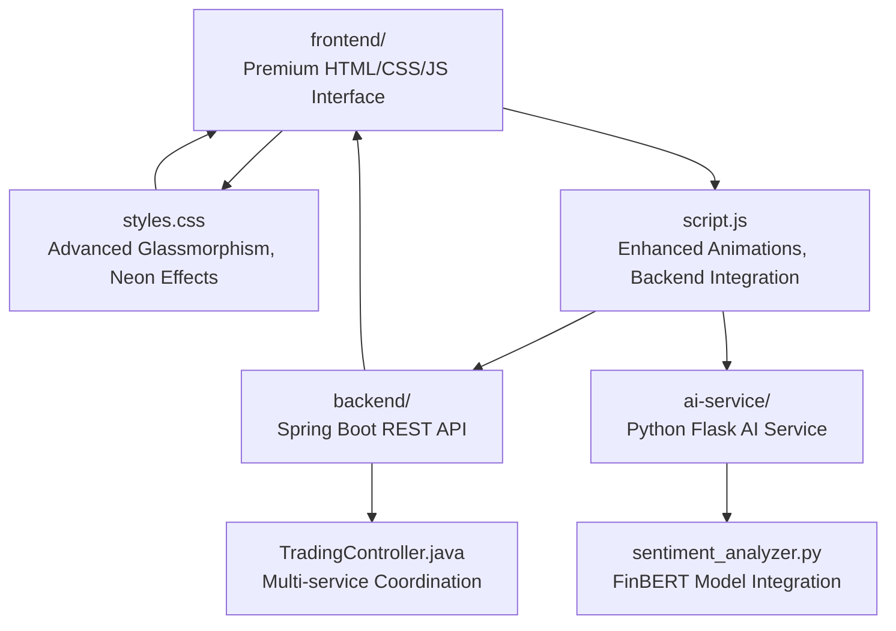
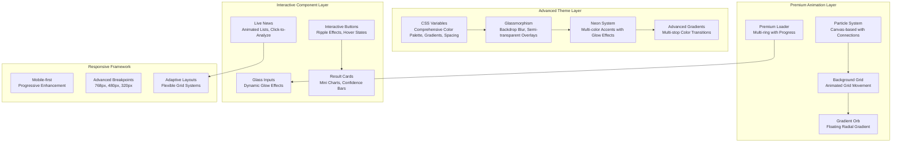
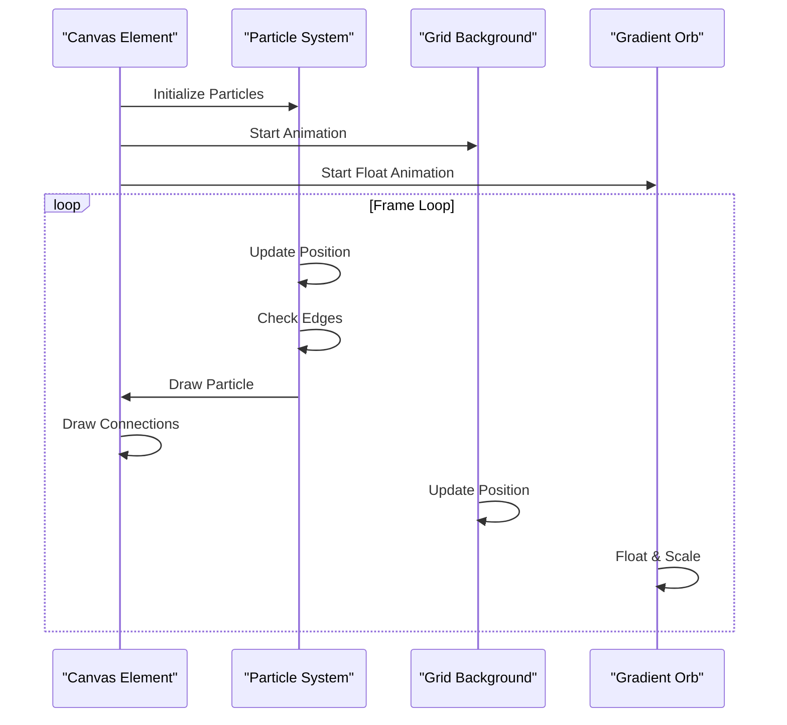
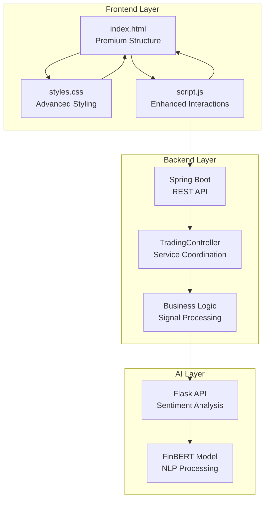

# Styling and Visual Design

<cite>
**Referenced Files in This Document**
- [styles.css](file://frontend/styles.css)
- [index.html](file://frontend/index.html)
- [script.js](file://frontend/script.js)
- [app.py](file://ai-service/app.py)
- [TradingController.java](file://backend/src/main/java/com/trading/controller/TradingController.java)
</cite>

## Update Summary
**Changes Made**
- Enhanced CSS architecture with advanced glassmorphism effects and neon color system
- Added premium loading overlay with gradient progress bars and animated dots
- Implemented sophisticated particle animation system with grid background effects
- Expanded responsive design with improved mobile-first breakpoints
- Integrated multi-service architecture with real-time backend integration
- Added advanced micro-interactions including button ripple effects and glow animations
- Enhanced result card with mini charts and interactive visualizations

## Table of Contents
1. [Introduction](#introduction)
2. [Project Structure](#project-structure)
3. [Core Components](#core-components)
4. [Architecture Overview](#architecture-overview)
5. [Detailed Component Analysis](#detailed-component-analysis)
6. [Multi-Service Integration](#multi-service-integration)
7. [Advanced CSS Features](#advanced-css-features)
8. [Performance Considerations](#performance-considerations)
9. [Troubleshooting Guide](#troubleshooting-guide)
10. [Conclusion](#conclusion)
11. [Appendices](#appendices)

## Introduction
This document describes the advanced styling and visual design system of the AI Trading Signal Engine. The system features sophisticated glassmorphism effects, neon color accents, and responsive layouts designed for a multi-service architecture. The design system centers on a dark neon theme with gradient effects, glow animations, and modern typography using Google Fonts (Orbitron, Inter, Poppins). It includes advanced particle animations, premium loading states, interactive element effects, and comprehensive responsive design patterns.

## Project Structure
The project follows a sophisticated, multi-service architecture with a premium frontend, Spring Boot backend, and Python AI service. The styling system is built around advanced CSS techniques including glassmorphism, neon accents, and responsive design patterns.

**Diagram sources**
- [index.html:1-235](file://frontend/index.html#L1-L235)
- [styles.css:1-1415](file://frontend/styles.css#L1-L1415)
- [script.js:1-1068](file://frontend/script.js#L1-L1068)
- [TradingController.java:1-168](file://backend/src/main/java/com/trading/controller/TradingController.java#L1-L168)
- [app.py:1-155](file://ai-service/app.py#L1-L155)

**Section sources**
- [index.html:1-235](file://frontend/index.html#L1-L235)
- [styles.css:1-1415](file://frontend/styles.css#L1-L1415)
- [script.js:1-1068](file://frontend/script.js#L1-L1068)
- [TradingController.java:1-168](file://backend/src/main/java/com/trading/controller/TradingController.java#L1-L168)
- [app.py:1-155](file://ai-service/app.py#L1-L155)

## Core Components
- **Advanced CSS Variables**: Comprehensive color palette with neon accents, gradients, spacing tokens, and shadow effects
- **Glassmorphism System**: Backdrop blur effects, semi-transparent overlays, and border enhancements
- **Neon Color System**: Multi-color neon accents with glow effects for buy/sell/hold states
- **Premium Loading Overlay**: Advanced loading animation with gradient rings, pulsing core, and progress bars
- **Particle Animation System**: Canvas-based particle system with connections, grid background, and floating orbs
- **Enhanced Input System**: Glass-styled inputs with glow effects, character counters, and dynamic feedback
- **Interactive Button System**: Gradient buttons with ripple effects, glow animations, and hover states
- **Result Card System**: Comprehensive analysis cards with mini charts, confidence indicators, and risk meters
- **Live News Integration**: Dynamic news fetching with animated lists and click-to-analyze functionality
- **Responsive Design**: Mobile-first approach with advanced breakpoints and adaptive layouts

**Section sources**
- [styles.css:4-73](file://frontend/styles.css#L4-L73)
- [styles.css:102-157](file://frontend/styles.css#L102-L157)
- [styles.css:162-287](file://frontend/styles.css#L162-L287)
- [styles.css:308-403](file://frontend/styles.css#L308-L403)
- [styles.css:506-580](file://frontend/styles.css#L506-L580)
- [styles.css:583-685](file://frontend/styles.css#L583-L685)
- [styles.css:697-880](file://frontend/styles.css#L697-L880)

## Architecture Overview
The visual system is built around a sophisticated design language featuring advanced glassmorphism, neon color accents, and responsive layouts adapted for multi-service architecture.

**Diagram sources**
- [styles.css:4-73](file://frontend/styles.css#L4-L73)
- [styles.css:102-157](file://frontend/styles.css#L102-L157)
- [styles.css:162-287](file://frontend/styles.css#L162-L287)
- [styles.css:308-403](file://frontend/styles.css#L308-L403)
- [styles.css:506-580](file://frontend/styles.css#L506-L580)
- [styles.css:583-685](file://frontend/styles.css#L583-L685)
- [styles.css:697-880](file://frontend/styles.css#L697-L880)

## Detailed Component Analysis

### Advanced CSS Variables and Root Configuration
The system uses a comprehensive CSS custom property system defining a complete design token library:

- **Dark Theme Palette**: Deep blues (#0a0e27, #111638) with semi-transparent overlays (rgba(17, 22, 56, 0.6))
- **Neon Color System**: Complete spectrum including green (#00ff88), red (#ff4757), yellow (#ffa502), blue (#00d4ff), and purple (#a855f7)
- **Advanced Gradients**: Multi-stop gradients for buttons, backgrounds, and interactive elements
- **Glass Effects**: Transparent overlays with backdrop-filter blur (20px) and border enhancements
- **Shadow System**: Sophisticated shadow tokens with glow effects for different neon colors
- **Animation Timing**: Custom cubic-bezier curves for smooth, premium-feeling animations

**Section sources**
- [styles.css:4-73](file://frontend/styles.css#L4-L73)

### Premium Animated Background System
Features a multi-layered animated background with advanced visual effects:

- **Canvas Particle System**: Dynamic particle generation with physics-based movement and edge wrapping
- **Grid Background**: Animated grid overlay with smooth translation animations
- **Gradient Orb**: Large floating radial gradient with blur effects and floating animation
- **Connection Lines**: Particle-to-particle connections with opacity-based distance calculations
- **Performance Optimization**: Automatic particle count adjustment based on viewport size

**Diagram sources**
- [script.js:41-136](file://frontend/script.js#L41-L136)
- [styles.css:112-157](file://frontend/styles.css#L112-L157)

**Section sources**
- [styles.css:102-157](file://frontend/styles.css#L102-L157)
- [script.js:41-136](file://frontend/script.js#L41-L136)

### Premium Loading Overlay System
A sophisticated loading experience featuring:

- **Glassmorphism Overlay**: Semi-transparent backdrop with blur effects and pointer event management
- **Multi-Ring Loader**: Three concentric rings with different neon colors and staggered animations
- **Pulsing Core**: Central gradient element with continuous pulse animation and glow effects
- **Animated Dots**: Three-dot ellipsis effect with staggered keyframe animations
- **Progress Bar**: Gradient progress indicator with smooth width transitions
- **Status Messaging**: Dynamic loading messages with gradient text effects

**Section sources**
- [styles.css:162-287](file://frontend/styles.css#L162-L287)
- [index.html:24-41](file://frontend/index.html#L24-L41)

### Enhanced Input and Form System
Advanced form elements with premium styling:

- **Glass Input Fields**: Dark semi-transparent backgrounds with low-contrast borders
- **Dynamic Glow Effects**: Real-time glow animations on focus with inset shadows
- **Character Count System**: Dynamic color-changing counters with threshold-based feedback
- **Live News Integration**: Dedicated news fetching button with animated loading states
- **News List Display**: Animated news items with hover effects and click-to-analyze functionality

**Section sources**
- [styles.css:506-580](file://frontend/styles.css#L506-L580)
- [styles.css:408-502](file://frontend/styles.css#L408-L502)
- [index.html:73-92](file://frontend/index.html#L73-L92)

### Interactive Button System with Advanced Effects
Premium button components featuring:

- **Multi-Gradient Backgrounds**: Complex gradient compositions with multiple color stops
- **Ripple Effect System**: Water ripple animations with dynamic sizing and positioning
- **Glow Animations**: Continuous glow effects with blur filters and opacity transitions
- **Micro-Interaction Enhancements**: Scale transforms, shadow depth changes, and icon animations
- **State Management**: Disabled states, hover effects, and active press animations

**Section sources**
- [styles.css:583-685](file://frontend/styles.css#L583-L685)
- [script.js:684-698](file://frontend/script.js#L684-L698)

### Comprehensive Result Card System
Advanced analysis display with multiple visualization components:

- **Signal Badge System**: Color-coded badges with glow effects and gradient backgrounds
- **Mini Chart Visualization**: Canvas-based chart rendering with quadratic curves and gradient fills
- **Results Grid**: Responsive grid layout with sentiment indicators, confidence bars, and risk meters
- **Explanation System**: AI-powered explanations with key factor highlighting
- **Action Buttons**: Secondary and primary action buttons with hover effects

**Section sources**
- [styles.css:697-880](file://frontend/styles.css#L697-L880)
- [script.js:142-263](file://frontend/script.js#L142-L263)
- [index.html:121-208](file://frontend/index.html#L121-L208)

### Advanced Responsive Design System
Sophisticated responsive architecture:

- **Mobile-First Approach**: Progressive enhancement from 320px to desktop widths
- **Advanced Breakpoints**: Strategic breakpoints at 768px, 480px, and 320px
- **Flexible Grid System**: CSS Grid with auto-fit columns and responsive spacing
- **Adaptive Typography**: Fluid font sizing with clamp functions and responsive units
- **Touch-Friendly Interactions**: Optimized touch targets and gesture-friendly layouts

**Section sources**
- [styles.css:739-795](file://frontend/styles.css#L739-L795)
- [styles.css:798-816](file://frontend/styles.css#L798-L816)

## Multi-Service Integration
The styling system seamlessly integrates with the multi-service architecture:

**Diagram sources**
- [index.html:1-235](file://frontend/index.html#L1-L235)
- [styles.css:1-1415](file://frontend/styles.css#L1-L1415)
- [script.js:1-1068](file://frontend/script.js#L1-L1068)
- [TradingController.java:1-168](file://backend/src/main/java/com/trading/controller/TradingController.java#L1-L168)
- [app.py:1-155](file://ai-service/app.py#L1-L155)

**Section sources**
- [script.js:15-16](file://frontend/script.js#L15-L16)
- [TradingController.java:37-80](file://backend/src/main/java/com/trading/controller/TradingController.java#L37-L80)
- [app.py:39-96](file://ai-service/app.py#L39-L96)

## Advanced CSS Features
The system implements cutting-edge CSS techniques:

### Glassmorphism Implementation
- **Backdrop Filter**: Advanced blur effects with `backdrop-filter: blur(20px)`
- **Semi-Transparent Overlays**: Strategic use of rgba values for depth perception
- **Border Enhancements**: Subtle borders with transparency for depth definition
- **Layered Effects**: Multiple shadow layers creating realistic depth

### Neon Color System
- **Multi-Color Accents**: Complete spectrum of neon colors with appropriate dim variants
- **Glow Effects**: Sophisticated shadow-based glow effects with varying intensities
- **Dynamic Color Application**: Color transitions based on signal strength and confidence levels
- **Accessibility Considerations**: Proper contrast ratios and readable text on neon backgrounds

### Advanced Animation System
- **Custom Timing Functions**: Cubic-bezier curves for premium feel
- **Hardware Acceleration**: Transform and opacity animations for smooth performance
- **Complex Keyframe Sequences**: Multi-step animations with precise timing control
- **Performance Optimization**: Animation frame management and visibility-aware lifecycle

**Section sources**
- [styles.css:308-403](file://frontend/styles.css#L308-L403)
- [styles.css:750-800](file://frontend/styles.css#L750-L800)
- [styles.css:641-650](file://frontend/styles.css#L641-L650)

## Performance Considerations
The system implements comprehensive performance optimizations:

### Canvas Optimization
- **Dynamic Particle Count**: Automatic adjustment based on viewport area (max 80 particles)
- **Visibility-Aware Lifecycle**: Pauses animation when tab is not visible
- **Efficient Drawing**: Optimized canvas drawing with minimal reflows
- **Memory Management**: Proper cleanup of animation frames and event listeners

### CSS Performance
- **Hardware Acceleration**: Transform and opacity for smooth animations
- **Reduced Paint Areas**: Strategic use of shadows and gradients
- **Optimized Transitions**: Carefully tuned duration and easing functions
- **Font Loading**: Preconnect and crossorigin attributes for fast font delivery

### Backend Integration Performance
- **API Caching**: Strategic caching of frequently accessed data
- **Error Handling**: Graceful degradation when services are unavailable
- **Timeout Management**: Appropriate timeout configurations for service calls
- **Resource Cleanup**: Proper cleanup of intervals and timeouts

**Section sources**
- [script.js:84-91](file://frontend/script.js#L84-L91)
- [script.js:1051-1058](file://frontend/script.js#L1051-L1058)
- [index.html:8-11](file://frontend/index.html#L8-L11)

## Troubleshooting Guide
Common issues and solutions for the advanced styling system:

### CSS and Styling Issues
- **Fonts Not Loading**: Verify Google Fonts preconnect and crossorigin attributes are present
- **Glass Effects Not Working**: Check browser support for `backdrop-filter` property
- **Animations Jank**: Reduce particle count on mobile devices, optimize keyframe complexity
- **Neon Colors Not Appearing**: Ensure CSS variables are properly defined and accessible

### JavaScript and Animation Issues
- **Canvas Not Rendering**: Confirm canvas element exists and dimensions are set
- **Particle System Errors**: Check for proper canvas context initialization
- **Button Ripple Not Triggering**: Verify event listener attachment and CSS class manipulation
- **Loading Overlay Issues**: Ensure proper class toggling and z-index stacking

### Multi-Service Integration Issues
- **Backend API Not Responding**: Check Spring Boot service health endpoints
- **AI Service Unavailable**: Verify Flask service is running on port 5000
- **CORS Issues**: Confirm CORS configuration allows frontend requests
- **API Key Problems**: Validate NewsAPI and Finnhub credentials in backend configuration

**Section sources**
- [index.html:8-11](file://frontend/index.html#L8-L11)
- [script.js:757-798](file://frontend/script.js#L757-L798)
- [TradingController.java:67-73](file://backend/src/main/java/com/trading/controller/TradingController.java#L67-L73)

## Conclusion
The AI Trading Signal Engine's styling system represents a sophisticated implementation of modern web design principles. The advanced glassmorphism effects, neon color system, and responsive layouts create a premium user experience while maintaining excellent performance. The multi-service architecture integration ensures seamless communication between frontend, backend, and AI services, delivering a comprehensive trading analysis platform with professional-grade visual design.

## Appendices

### Advanced Color Scheme Reference
- **Primary Background**: Deep space blue (#0a0e27) with gradient variations
- **Secondary Background**: Deeper blue (#111638) for elevated elements
- **Glass Background**: Semi-transparent overlays (rgba(17, 22, 56, 0.6)) with blur effects
- **Neon Accents**: Complete spectrum with glow variants (green, red, yellow, blue, purple)
- **Text Colors**: High contrast white, muted grays, and neon-accented text
- **Gradient System**: Multi-stop gradients for buttons, backgrounds, and interactive elements

**Section sources**
- [styles.css:4-73](file://frontend/styles.css#L4-L73)

### Advanced Typography Scale Reference
- **Display Fonts**: Orbitron for headings and signal text with gradient effects
- **Body Fonts**: Inter for form controls and general content
- **Fallback Fonts**: Poppins and system fonts for broad compatibility
- **Font Weights**: Comprehensive weight scaling from 300 to 900
- **Responsive Typography**: Fluid sizing with clamp functions for optimal readability

**Section sources**
- [styles.css:89-97](file://frontend/styles.css#L89-L97)
- [styles.css:340-350](file://frontend/styles.css#L340-L350)

### Advanced Spacing System Reference
- **Extra Small**: 0.5rem for tight spacing and small elements
- **Small**: 1rem for standard gaps and padding
- **Medium**: 1.5rem for comfortable spacing
- **Large**: 2rem for section separation
- **Extra Large**: 3rem for major layout divisions
- **Double Extra Large**: 4rem for prominent spacing

**Section sources**
- [styles.css:42-49](file://frontend/styles.css#L42-L49)

### Premium Component Styling Patterns
- **Glass Panels**: Backdrop blur with 20px blur, 1px borders, and 24px radius
- **Neon Borders**: Glow effects with shadow-glow variables for different signal states
- **Interactive Feedback**: Hover lifts, continuous glow animations, and ripple press effects
- **Advanced Animations**: Custom cubic-bezier timing functions for premium feel
- **Responsive Grids**: Flexible CSS Grid with auto-fit columns and strategic gaps

**Section sources**
- [styles.css:308-403](file://frontend/styles.css#L308-L403)
- [styles.css:583-685](file://frontend/styles.css#L583-L685)
- [styles.css:697-880](file://frontend/styles.css#L697-L880)

### Multi-Service Integration Guidelines
- **Backend Configuration**: Spring Boot REST API with CORS enabled and health checks
- **AI Service Setup**: Python Flask service with FinBERT model loading and batch processing
- **Frontend Integration**: API endpoints for analysis, news fetching, and health monitoring
- **Error Handling**: Graceful degradation with informative error messages
- **Performance Monitoring**: Health check endpoints for service availability

**Section sources**
- [TradingController.java:18-31](file://backend/src/main/java/com/trading/controller/TradingController.java#L18-L31)
- [app.py:16-26](file://ai-service/app.py#L16-L26)
- [script.js:15-16](file://frontend/script.js#L15-L16)