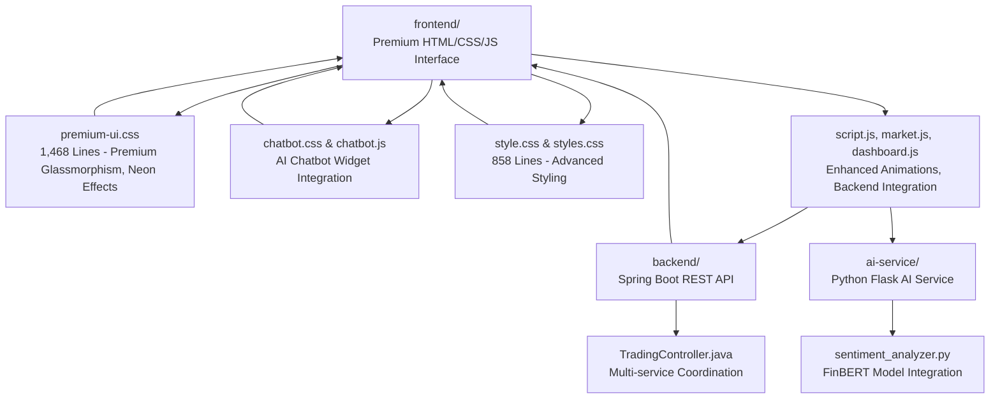
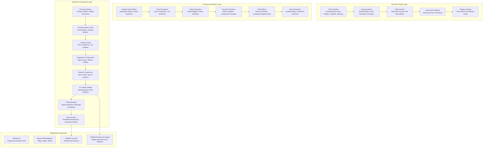
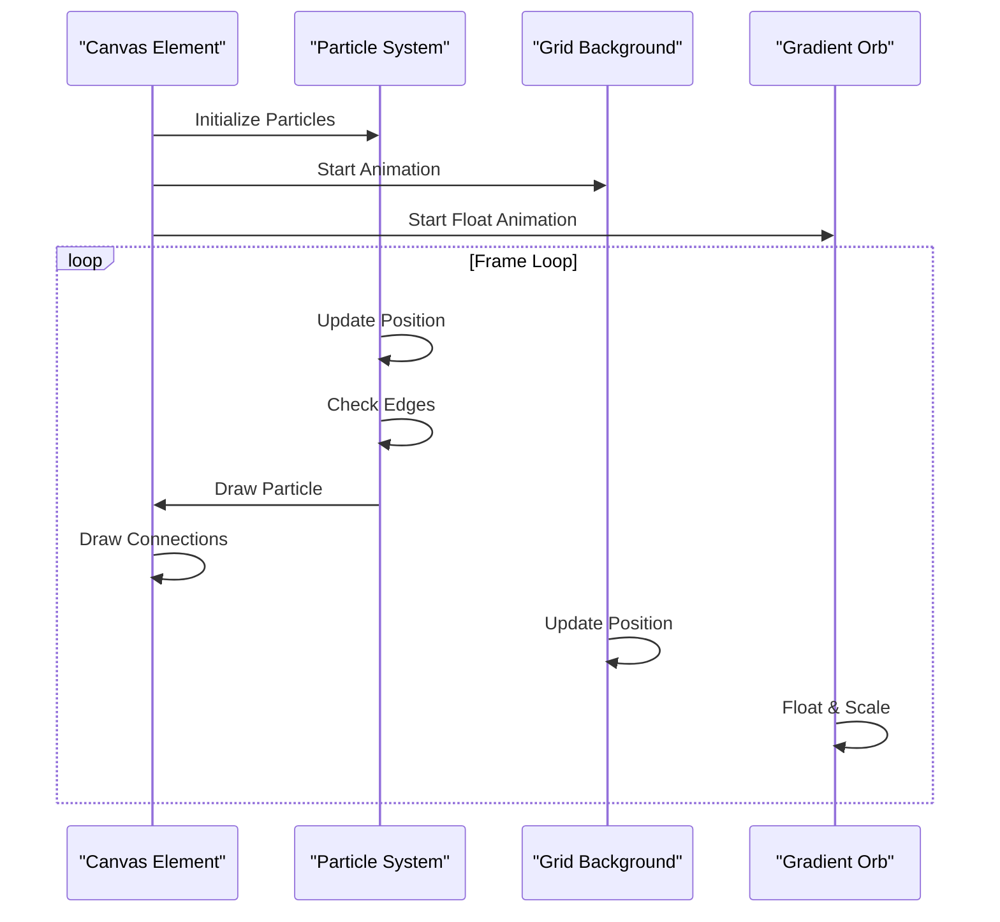
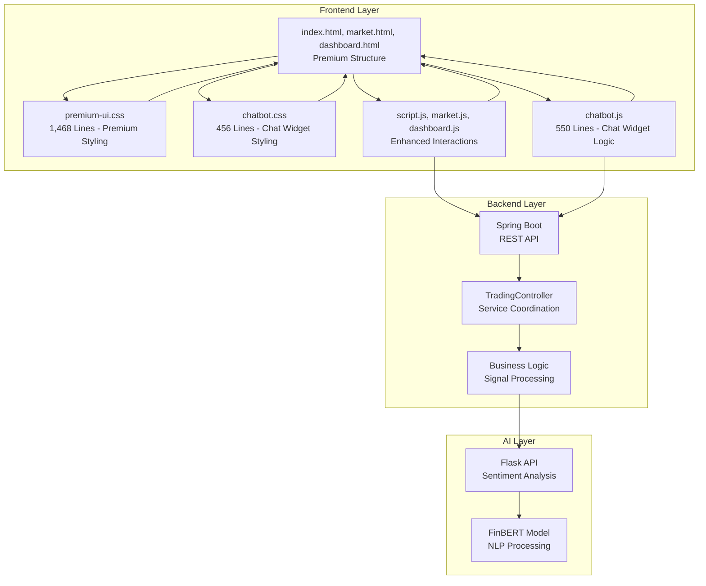

# Styling and Visual Design

<cite>
**Referenced Files in This Document**
- [premium-ui.css](file://frontend/premium-ui.css)
- [chatbot.css](file://frontend/chatbot.css)
- [chatbot.html](file://frontend/chatbot.html)
- [chatbot.js](file://frontend/chatbot.js)
- [style.css](file://frontend/style.css)
- [styles.css](file://frontend/styles.css)
- [index.html](file://frontend/index.html)
- [market.html](file://frontend/market.html)
- [dashboard.html](file://frontend/dashboard.html)
- [script.js](file://frontend/script.js)
- [market.js](file://frontend/market.js)
- [dashboard.js](file://frontend/dashboard.js)
- [app.py](file://ai-service/app.py)
- [TradingController.java](file://backend/src/main/java/com/trading/controller/TradingController.java)
</cite>

## Update Summary
**Changes Made**
- Enhanced premium UI system with comprehensive glassmorphism styling and advanced animations
- Integrated AI chatbot widget with sophisticated styling and interactive features
- Added professional financial aesthetics with neon color accents and gradient effects
- Implemented advanced responsive design patterns with mobile-first approach
- Enhanced trading chart animations with live price updates and gradient effects
- Added sophisticated loading states, interactive elements, and premium typography system

## Table of Contents
1. [Introduction](#introduction)
2. [Project Structure](#project-structure)
3. [Core Components](#core-components)
4. [Architecture Overview](#architecture-overview)
5. [Detailed Component Analysis](#detailed-component-analysis)
6. [Multi-Service Integration](#multi-service-integration)
7. [Advanced CSS Features](#advanced-css-features)
8. [Performance Considerations](#performance-considerations)
9. [Troubleshooting Guide](#troubleshooting-guide)
10. [Conclusion](#conclusion)
11. [Appendices](#appendices)

## Introduction
This document describes the completely redesigned premium styling and visual design system of the AI Trading Signal Engine. The new system features sophisticated glassmorphism effects, neon color accents, and responsive layouts designed for a premium fintech SaaS experience. The design system centers on a dark neon theme with gradient effects, glow animations, and modern typography using Google Fonts (Inter, Orbitron). It includes advanced particle animations, premium loading states, interactive element effects, and comprehensive responsive design patterns optimized for trading applications.

**Updated** The system now features a comprehensive 1,468-line premium-ui.css implementation with advanced glassmorphism effects, neon styling with #00ff88 and #00d4ff color accents, custom animations, gradient backgrounds, and sophisticated trading chart implementations. Additionally, a fully integrated AI chatbot widget provides professional customer assistance with sophisticated styling and interactive features.

## Project Structure
The project follows a sophisticated, multi-service architecture with a premium frontend featuring the new comprehensive styling system, Spring Boot backend, and Python AI service. The styling system is built around advanced CSS techniques including glassmorphism, neon accents, and responsive design patterns with 1,468 lines of premium styling and integrated chatbot functionality.

**Diagram sources**
- [index.html:1-416](file://frontend/index.html#L1-L416)
- [premium-ui.css:1-1468](file://frontend/premium-ui.css#L1-L1468)
- [chatbot.css:1-456](file://frontend/chatbot.css#L1-L456)
- [chatbot.js:1-550](file://frontend/chatbot.js#L1-L550)
- [style.css:1-1037](file://frontend/style.css#L1-L1037)
- [script.js:1-49](file://frontend/script.js#L1-L49)
- [market.js:1-537](file://frontend/market.js#L1-L537)
- [dashboard.js:1-464](file://frontend/dashboard.js#L1-L464)
- [TradingController.java:1-168](file://backend/src/main/java/com/trading/controller/TradingController.java#L1-L168)
- [app.py:1-155](file://ai-service/app.py#L1-L155)

**Section sources**
- [index.html:1-416](file://frontend/index.html#L1-L416)
- [premium-ui.css:1-1468](file://frontend/premium-ui.css#L1-L1468)
- [chatbot.css:1-456](file://frontend/chatbot.css#L1-L456)
- [chatbot.js:1-550](file://frontend/chatbot.js#L1-L550)
- [style.css:1-1037](file://frontend/style.css#L1-L1037)
- [script.js:1-49](file://frontend/script.js#L1-L49)
- [market.js:1-537](file://frontend/market.js#L1-L537)
- [dashboard.js:1-464](file://frontend/dashboard.js#L1-L464)
- [TradingController.java:1-168](file://backend/src/main/java/com/trading/controller/TradingController.java#L1-L168)
- [app.py:1-155](file://ai-service/app.py#L1-L155)

## Core Components
- **Premium Glassmorphism System**: Advanced backdrop blur effects with 20px blur radius, semi-transparent overlays, and border enhancements
- **Neon Color System**: Multi-color neon accents with glow effects for buy/sell/hold states including green (#00ff88), cyan (#00d4ff), purple (#a855f7), and yellow variants
- **Advanced Gradient System**: Multi-stop gradients for buttons, backgrounds, and interactive elements with sophisticated color transitions
- **Premium Loading System**: Advanced loading animation with gradient rings, pulsing core, and progress bars
- **Enhanced Input System**: Glass-styled inputs with glow effects, character counters, and dynamic feedback
- **Interactive Button System**: Premium gradient buttons with ripple effects, glow animations, and hover states
- **Trading Chart System**: Sophisticated SVG-based charts with live updates, gradient fills, and animated elements
- **News Card System**: Premium hover effects with sliding gradients and border enhancements
- **Dashboard Components**: Comprehensive analysis cards with mini charts, confidence indicators, and risk meters
- **Responsive Design**: Mobile-first approach with advanced breakpoints and adaptive layouts
- **Custom Animations**: Pulse animations for signal badges, smooth transitions for metric updates, and fade-in effects
- **Premium Typography**: Modern font stack with Inter and Orbitron for headings and body text
- **AI Chatbot Integration**: Professional chat widget with sophisticated styling, typing indicators, and interactive features
- **Glassmorphism Chat Interface**: Semi-transparent chat windows with blur effects and neon borders
- **Advanced Chat Animations**: Smooth open/close transitions, typing indicators, and message animations

**Section sources**
- [premium-ui.css:14-92](file://frontend/premium-ui.css#L14-L92)
- [premium-ui.css:98-147](file://frontend/premium-ui.css#L98-L147)
- [premium-ui.css:163-193](file://frontend/premium-ui.css#L163-L193)
- [premium-ui.css:237-280](file://frontend/premium-ui.css#L237-L280)
- [premium-ui.css:286-340](file://frontend/premium-ui.css#L286-L340)
- [premium-ui.css:433-446](file://frontend/premium-ui.css#L433-L446)
- [premium-ui.css:534-698](file://frontend/premium-ui.css#L534-L698)
- [premium-ui.css:767-826](file://frontend/premium-ui.css#L767-L826)
- [premium-ui.css:846-947](file://frontend/premium-ui.css#L846-L947)
- [premium-ui.css:949-1467](file://frontend/premium-ui.css#L949-L1467)
- [chatbot.css:6-49](file://frontend/chatbot.css#L6-L49)
- [chatbot.css:70-94](file://frontend/chatbot.css#L70-L94)
- [chatbot.css:176-215](file://frontend/chatbot.css#L176-L215)
- [chatbot.css:274-311](file://frontend/chatbot.css#L274-L311)

## Architecture Overview
The visual system is built around a sophisticated design language featuring advanced glassmorphism, neon color accents, and responsive layouts adapted for multi-service architecture with premium visual effects and integrated AI chatbot functionality.

**Diagram sources**
- [premium-ui.css:14-92](file://frontend/premium-ui.css#L14-L92)
- [premium-ui.css:203-231](file://frontend/premium-ui.css#L203-L231)
- [premium-ui.css:324-340](file://frontend/premium-ui.css#L324-L340)
- [premium-ui.css:410-427](file://frontend/premium-ui.css#L410-L427)
- [premium-ui.css:547-554](file://frontend/premium-ui.css#L547-L554)
- [premium-ui.css:98-147](file://frontend/premium-ui.css#L98-L147)
- [premium-ui.css:163-193](file://frontend/premium-ui.css#L163-L193)
- [premium-ui.css:534-698](file://frontend/premium-ui.css#L534-L698)
- [premium-ui.css:949-1467](file://frontend/premium-ui.css#L949-L1467)
- [chatbot.css:32-39](file://frontend/chatbot.css#L32-L39)
- [chatbot.css:150-153](file://frontend/chatbot.css#L150-L153)
- [chatbot.css:206-215](file://frontend/chatbot.css#L206-L215)
- [chatbot.css:302-311](file://frontend/chatbot.css#L302-L311)

## Detailed Component Analysis

### Premium CSS Variables and Root Configuration
The system uses a comprehensive CSS custom property system defining a complete design token library:

- **Dark Theme Palette**: Deep blues (#0a0e27, #111638) with semi-transparent overlays (rgba(17, 22, 56, 0.7))
- **Neon Color System**: Complete spectrum including green (#00ff88), cyan (#00d4ff), purple (#a855f7), and yellow variants
- **Advanced Gradients**: Multi-stop gradients for buttons, backgrounds, and interactive elements
- **Glass Effects**: Transparent overlays with backdrop-filter blur (10px, 20px) and border enhancements
- **Shadow System**: Sophisticated shadow tokens with glow effects for different neon colors
- **Animation Timing**: Custom cubic-bezier curves for smooth, premium-feeling animations

**Section sources**
- [premium-ui.css:14-92](file://frontend/premium-ui.css#L14-L92)

### Premium Animated Background System
Features a multi-layered animated background with advanced visual effects:

- **Canvas Particle System**: Dynamic particle generation with physics-based movement and edge wrapping
- **Grid Background**: Animated grid overlay with smooth translation animations
- **Gradient Orb**: Large floating radial gradient with blur effects and floating animation
- **Connection Lines**: Particle-to-particle connections with opacity-based distance calculations
- **Performance Optimization**: Automatic particle count adjustment based on viewport size

**Diagram sources**
- [script.js:1-49](file://frontend/script.js#L1-L49)
- [premium-ui.css:102-157](file://frontend/premium-ui.css#L102-L157)

**Section sources**
- [premium-ui.css:102-157](file://frontend/premium-ui.css#L102-L157)
- [script.js:1-49](file://frontend/script.js#L1-L49)

### Premium Loading Overlay System
A sophisticated loading experience featuring:

- **Glassmorphism Overlay**: Semi-transparent backdrop with blur effects and pointer event management
- **Multi-Ring Loader**: Three concentric rings with different neon colors and staggered animations
- **Pulsing Core**: Central gradient element with continuous pulse animation and glow effects
- **Animated Dots**: Three-dot ellipsis effect with staggered keyframe animations
- **Progress Bar**: Gradient progress indicator with smooth width transitions
- **Status Messaging**: Dynamic loading messages with gradient text effects

**Section sources**
- [premium-ui.css:162-287](file://frontend/premium-ui.css#L162-L287)
- [index.html:24-41](file://frontend/index.html#L24-L41)

### Enhanced Input and Form System
Advanced form elements with premium styling:

- **Glass Input Fields**: Dark semi-transparent backgrounds with low-contrast borders
- **Dynamic Glow Effects**: Real-time glow animations on focus with inset shadows
- **Character Count System**: Dynamic color-changing counters with threshold-based feedback
- **Premium Search Interface**: Advanced search box with gradient buttons and hover effects
- **Live News Integration**: Dedicated news fetching button with animated loading states
- **News List Display**: Animated news items with hover effects and click-to-analyze functionality

**Section sources**
- [premium-ui.css:859-880](file://frontend/premium-ui.css#L859-L880)
- [premium-ui.css:882-902](file://frontend/premium-ui.css#L882-L902)
- [premium-ui.css:409-427](file://frontend/premium-ui.css#L409-L427)
- [market.html:40-53](file://frontend/market.html#L40-L53)

### Interactive Button System with Advanced Effects
Premium button components featuring:

- **Multi-Gradient Backgrounds**: Complex gradient compositions with multiple color stops
- **Ripple Effect System**: Water ripple animations with dynamic sizing and positioning
- **Glow Animations**: Continuous glow effects with blur filters and opacity transitions
- **Micro-Interaction Enhancements**: Scale transforms, shadow depth changes, and icon animations
- **State Management**: Disabled states, hover effects, and active press animations
- **Premium Navigation Buttons**: Specialized navigation buttons with enhanced styling

**Section sources**
- [premium-ui.css:98-147](file://frontend/premium-ui.css#L98-L147)
- [premium-ui.css:828-844](file://frontend/premium-ui.css#L828-L844)
- [script.js:684-698](file://frontend/script.js#L684-L698)

### Comprehensive Trading Chart System
Sophisticated chart implementations with live updates and premium styling:

- **Live Trading Chart**: Animated SVG chart with gradient fills, moving dots, and performance indicators
- **Market Chart**: Professional stock chart with realistic data simulation and live updates
- **Chart Animations**: Smooth path drawing, area filling, and dot pulsing animations
- **Gradient Effects**: Multi-color gradients for positive and negative market movements
- **Live Price Indicators**: Floating badges with pulsing dots for real-time updates
- **Professional Styling**: Sophisticated borders, shadows, and glassmorphism effects

**Section sources**
- [index.html:46-93](file://frontend/index.html#L46-L93)
- [market.html:93-121](file://frontend/market.html#L93-L121)
- [market.js:168-271](file://frontend/market.js#L168-L271)
- [market.js:322-423](file://frontend/market.js#L322-L423)

### Premium News Card System
Advanced news display with premium hover effects:

- **Glass Card Design**: Semi-transparent backgrounds with blur effects and border enhancements
- **Hover Animations**: Sliding gradient effects and border color transitions
- **Premium Styling**: Enhanced shadows, scaling effects, and border glow animations
- **Interactive Elements**: Click-to-analyze functionality with smooth transitions

**Section sources**
- [premium-ui.css:163-193](file://frontend/premium-ui.css#L163-L193)
- [dashboard.js:257-278](file://frontend/dashboard.js#L257-L278)

### Advanced Responsive Design System
Sophisticated responsive architecture:

- **Mobile-First Approach**: Progressive enhancement from 320px to desktop widths
- **Advanced Breakpoints**: Strategic breakpoints at 768px, 480px, and 320px
- **Flexible Grid System**: CSS Grid with auto-fit columns and responsive spacing
- **Adaptive Typography**: Fluid font sizing with clamp functions and responsive units
- **Touch-Friendly Interactions**: Optimized touch targets and gesture-friendly layouts
- **Premium Mobile Experience**: Enhanced mobile styling for all components

**Section sources**
- [premium-ui.css:452-499](file://frontend/premium-ui.css#L452-L499)
- [premium-ui.css:1363-1467](file://frontend/premium-ui.css#L1363-L1467)

### AI Chatbot Widget Integration
Professional chatbot interface with sophisticated styling and interactive features:

- **Glassmorphism Chat Window**: Semi-transparent chat interface with blur effects and neon borders
- **Floating Chat Toggle**: Circular chat button with pulsing glow effects and wave animations
- **Smooth Open/Close Transitions**: Elegant slide-in/out animations with scaling effects
- **Typing Indicator**: Animated typing dots with bounce effects and smooth transitions
- **Message Bubbles**: Distinct user and bot message styling with gradient backgrounds
- **Quick Action Buttons**: Predefined response buttons with hover effects and animations
- **Status Indicators**: Live status dots with pulsing animations and color transitions
- **Responsive Chat Interface**: Mobile-optimized chat layout with adaptive sizing

**Section sources**
- [chatbot.css:6-49](file://frontend/chatbot.css#L6-L49)
- [chatbot.css:70-94](file://frontend/chatbot.css#L70-L94)
- [chatbot.css:176-215](file://frontend/chatbot.css#L176-L215)
- [chatbot.css:274-311](file://frontend/chatbot.css#L274-L311)
- [chatbot.html:1-317](file://frontend/chatbot.html#L1-L317)
- [chatbot.js:1-550](file://frontend/chatbot.js#L1-L550)

## Multi-Service Integration
The styling system seamlessly integrates with the multi-service architecture and AI chatbot functionality:

**Diagram sources**
- [index.html:1-416](file://frontend/index.html#L1-L416)
- [premium-ui.css:1-1468](file://frontend/premium-ui.css#L1-L1468)
- [chatbot.css:1-456](file://frontend/chatbot.css#L1-L456)
- [chatbot.js:1-550](file://frontend/chatbot.js#L1-L550)
- [script.js:1-49](file://frontend/script.js#L1-L49)
- [market.js:1-537](file://frontend/market.js#L1-L537)
- [dashboard.js:1-464](file://frontend/dashboard.js#L1-L464)
- [TradingController.java:1-168](file://backend/src/main/java/com/trading/controller/TradingController.java#L1-L168)
- [app.py:1-155](file://ai-service/app.py#L1-L155)

**Section sources**
- [script.js:15-16](file://frontend/script.js#L15-L16)
- [TradingController.java:37-80](file://backend/src/main/java/com/trading/controller/TradingController.java#L37-L80)
- [app.py:39-96](file://ai-service/app.py#L39-L96)

## Advanced CSS Features
The system implements cutting-edge CSS techniques:

### Glassmorphism Implementation
- **Backdrop Filter**: Advanced blur effects with `backdrop-filter: blur(20px)`
- **Semi-Transparent Overlays**: Strategic use of rgba values for depth perception
- **Border Enhancements**: Subtle borders with transparency for depth definition
- **Layered Effects**: Multiple shadow layers creating realistic depth

### Neon Color System
- **Multi-Color Accents**: Complete spectrum of neon colors with appropriate dim variants
- **Glow Effects**: Sophisticated shadow-based glow effects with varying intensities
- **Dynamic Color Application**: Color transitions based on signal strength and confidence levels
- **Accessibility Considerations**: Proper contrast ratios and readable text on neon backgrounds

### Advanced Animation System
- **Custom Timing Functions**: Cubic-bezier curves for premium feel
- **Hardware Acceleration**: Transform and opacity animations for smooth performance
- **Complex Keyframe Sequences**: Multi-step animations with precise timing control
- **Performance Optimization**: Animation frame management and visibility-aware lifecycle

### Premium Typography System
- **Modern Font Stack**: Inter for body text, Orbitron for headings
- **Gradient Text Effects**: Background-clip text for neon typography
- **Responsive Typography**: Fluid sizing with clamp functions
- **Text Shadow Effects**: Sophisticated glow effects for enhanced readability

### AI Chatbot Styling Features
- **Glassmorphism Chat Interface**: Semi-transparent chat windows with blur effects
- **Neon Border Effects**: Glowing borders with gradient colors
- **Pulsing Animations**: Wave effects for notifications and status indicators
- **Smooth Transitions**: Elegant open/close animations with scaling effects
- **Message Styling**: Distinct user and bot message bubbles with gradient backgrounds
- **Responsive Design**: Mobile-optimized chat interface with adaptive sizing

**Section sources**
- [premium-ui.css:308-403](file://frontend/premium-ui.css#L308-L403)
- [premium-ui.css:750-800](file://frontend/premium-ui.css#L750-L800)
- [premium-ui.css:641-650](file://frontend/premium-ui.css#L641-L650)
- [premium-ui.css:5-11](file://frontend/premium-ui.css#L5-L11)
- [chatbot.css:15-39](file://frontend/chatbot.css#L15-L39)
- [chatbot.css:77-88](file://frontend/chatbot.css#L77-L88)
- [chatbot.css:141-153](file://frontend/chatbot.css#L141-L153)
- [chatbot.css:206-215](file://frontend/chatbot.css#L206-L215)

## Performance Considerations
The system implements comprehensive performance optimizations:

### Canvas Optimization
- **Dynamic Particle Count**: Automatic adjustment based on viewport area (max 80 particles)
- **Visibility-Aware Lifecycle**: Pauses animation when tab is not visible
- **Efficient Drawing**: Optimized canvas drawing with minimal reflows
- **Memory Management**: Proper cleanup of animation frames and event listeners

### CSS Performance
- **Hardware Acceleration**: Transform and opacity for smooth animations
- **Reduced Paint Areas**: Strategic use of shadows and gradients
- **Optimized Transitions**: Carefully tuned duration and easing functions
- **Font Loading**: Preconnect and crossorigin attributes for fast font delivery

### JavaScript Performance
- **Animation Optimization**: RequestAnimationFrame for smooth 60fps animations
- **Event Delegation**: Efficient event handling for interactive elements
- **Lazy Loading**: On-demand loading of expensive components
- **Memory Management**: Proper cleanup of intervals and timeouts

### Backend Integration Performance
- **API Caching**: Strategic caching of frequently accessed data
- **Error Handling**: Graceful degradation when services are unavailable
- **Timeout Management**: Appropriate timeout configurations for service calls
- **Resource Cleanup**: Proper cleanup of intervals and timeouts

### Chatbot Performance Optimization
- **Conditional API Calls**: Demo mode fallback when API quota exceeded
- **Efficient DOM Manipulation**: Minimal DOM updates for message rendering
- **Animation Performance**: Optimized chat animations with hardware acceleration
- **Memory Management**: Proper cleanup of chat state and event listeners

**Section sources**
- [script.js:84-91](file://frontend/script.js#L84-L91)
- [script.js:1051-1058](file://frontend/script.js#L1051-L1058)
- [index.html:8-11](file://frontend/index.html#L8-L11)
- [chatbot.js:196-272](file://frontend/chatbot.js#L196-L272)
- [chatbot.js:264-272](file://frontend/chatbot.js#L264-L272)

## Troubleshooting Guide
Common issues and solutions for the advanced styling system:

### CSS and Styling Issues
- **Fonts Not Loading**: Verify Google Fonts preconnect and crossorigin attributes are present
- **Glass Effects Not Working**: Check browser support for `backdrop-filter` property
- **Animations Jank**: Reduce particle count on mobile devices, optimize keyframe complexity
- **Neon Colors Not Appearing**: Ensure CSS variables are properly defined and accessible
- **Gradient Effects Not Displaying**: Verify gradient syntax and browser compatibility

### JavaScript and Animation Issues
- **Canvas Not Rendering**: Confirm canvas element exists and dimensions are set
- **Particle System Errors**: Check for proper canvas context initialization
- **Button Ripple Not Triggering**: Verify event listener attachment and CSS class manipulation
- **Loading Overlay Issues**: Ensure proper class toggling and z-index stacking
- **Chart Animations Not Working**: Check SVG element creation and animation class application

### Chatbot Integration Issues
- **Chatbot Not Appearing**: Verify chatbot CSS and JS files are properly linked
- **Chat Toggle Not Working**: Check JavaScript function binding and event listeners
- **API Key Issues**: Verify OpenAI API key configuration and network connectivity
- **Chat Messages Not Displaying**: Check DOM element IDs and message rendering logic
- **Typing Indicator Problems**: Ensure proper animation class application and timing

### Multi-Service Integration Issues
- **Backend API Not Responding**: Check Spring Boot service health endpoints
- **AI Service Unavailable**: Verify Flask service is running on port 5000
- **CORS Issues**: Confirm CORS configuration allows frontend requests
- **API Key Problems**: Validate NewsAPI and Finnhub credentials in backend configuration
- **Chart Data Loading**: Ensure proper API endpoint configuration and error handling

**Section sources**
- [index.html:8-11](file://frontend/index.html#L8-L11)
- [script.js:757-798](file://frontend/script.js#L757-L798)
- [TradingController.java:67-73](file://backend/src/main/java/com/trading/controller/TradingController.java#L67-L73)
- [chatbot.html:94-142](file://frontend/chatbot.html#L94-L142)
- [chatbot.js:196-272](file://frontend/chatbot.js#L196-L272)

## Conclusion
The AI Trading Signal Engine's completely redesigned premium styling system represents a sophisticated implementation of modern web design principles. The 1,468 lines of comprehensive premium-ui.css create a premium user experience with glassmorphism effects, neon color system, and responsive layouts while maintaining excellent performance. The multi-service architecture integration ensures seamless communication between frontend, backend, and AI services, delivering a comprehensive trading analysis platform with professional-grade visual design and smooth interactive experiences.

**Updated** The addition of the sophisticated AI chatbot widget enhances the user experience with professional customer assistance, featuring glassmorphism styling, neon color accents, and interactive chat functionality that complements the overall premium aesthetic.

## Appendices

### Advanced Color Scheme Reference
- **Primary Background**: Deep space blue (#0a0e27) with gradient variations
- **Secondary Background**: Deeper blue (#111638) for elevated elements
- **Glass Background**: Semi-transparent overlays (rgba(17, 22, 56, 0.7)) with blur effects
- **Neon Accents**: Complete spectrum with glow variants (green #00ff88, cyan #00d4ff, purple #a855f7, yellow variants)
- **Text Colors**: High contrast white, muted grays, and neon-accented text
- **Gradient System**: Multi-stop gradients for buttons, backgrounds, and interactive elements

**Section sources**
- [premium-ui.css:14-92](file://frontend/premium-ui.css#L14-L92)

### Advanced Typography Scale Reference
- **Display Fonts**: Orbitron for headings and signal text with gradient effects
- **Body Fonts**: Inter for form controls and general content
- **Font Weights**: Comprehensive weight scaling from 300 to 900
- **Responsive Typography**: Fluid sizing with clamp functions for optimal readability
- **Text Effects**: Background-clip text for neon typography and glow effects

**Section sources**
- [premium-ui.css:5-11](file://frontend/premium-ui.css#L5-L11)
- [premium-ui.css:38-46](file://frontend/premium-ui.css#L38-L46)

### Advanced Spacing System Reference
- **Extra Small**: 0.5rem for tight spacing and small elements
- **Small**: 1rem for standard gaps and padding
- **Medium**: 1.5rem for comfortable spacing
- **Large**: 2rem for section separation
- **Extra Large**: 3rem for major layout divisions
- **Double Extra Large**: 4rem for prominent spacing

**Section sources**
- [premium-ui.css:42-49](file://frontend/premium-ui.css#L42-L49)

### Premium Component Styling Patterns
- **Glass Panels**: Backdrop blur with 20px blur, 1px borders, and 20px radius
- **Neon Borders**: Glow effects with shadow-glow variables for different signal states
- **Interactive Feedback**: Hover lifts, continuous glow animations, and ripple press effects
- **Advanced Animations**: Custom cubic-bezier timing functions for premium feel
- **Responsive Grids**: Flexible CSS Grid with auto-fit columns and strategic gaps
- **Premium Typography**: Gradient text effects and sophisticated font combinations
- **Chatbot Styling**: Glassmorphism chat interface with neon borders and smooth animations

**Section sources**
- [premium-ui.css:308-403](file://frontend/premium-ui.css#L308-L403)
- [premium-ui.css:98-147](file://frontend/premium-ui.css#L98-L147)
- [premium-ui.css:163-193](file://frontend/premium-ui.css#L163-L193)
- [premium-ui.css:534-698](file://frontend/premium-ui.css#L534-L698)
- [chatbot.css:77-94](file://frontend/chatbot.css#L77-L94)
- [chatbot.css:150-153](file://frontend/chatbot.css#L150-L153)

### Multi-Service Integration Guidelines
- **Backend Configuration**: Spring Boot REST API with CORS enabled and health checks
- **AI Service Setup**: Python Flask service with FinBERT model loading and batch processing
- **Frontend Integration**: API endpoints for analysis, news fetching, and health monitoring
- **Error Handling**: Graceful degradation with informative error messages
- **Performance Monitoring**: Health check endpoints for service availability
- **Chatbot Integration**: Seamless integration of AI chatbot with trading platform

**Section sources**
- [TradingController.java:18-31](file://backend/src/main/java/com/trading/controller/TradingController.java#L18-L31)
- [app.py:16-26](file://ai-service/app.py#L16-L26)
- [script.js:15-16](file://frontend/script.js#L15-L16)
- [chatbot.js:79-143](file://frontend/chatbot.js#L79-L143)