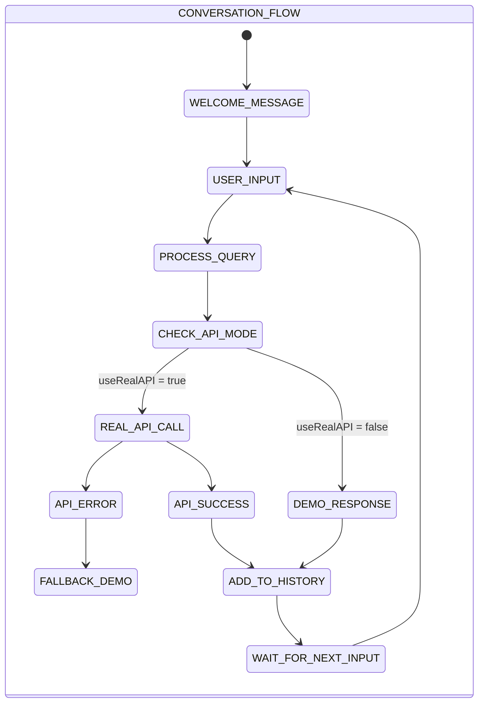
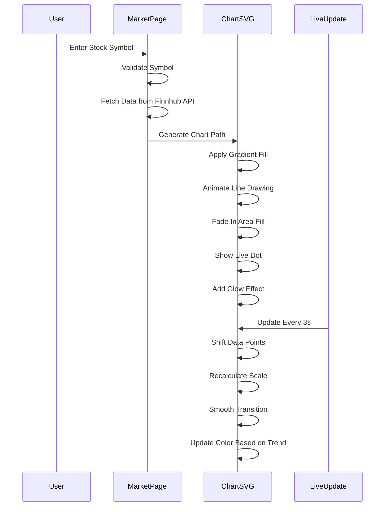
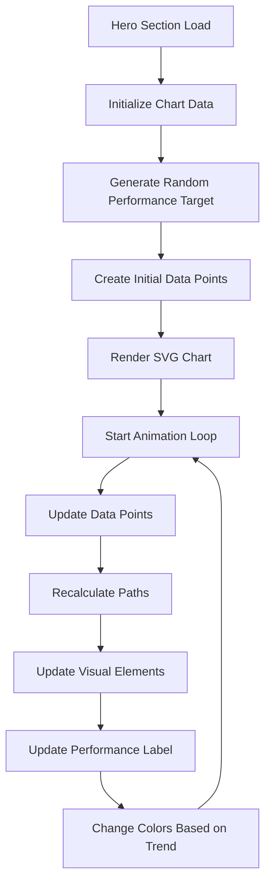
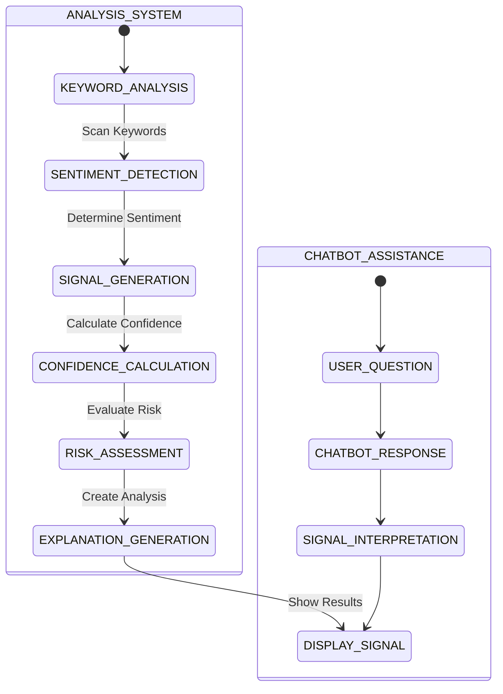
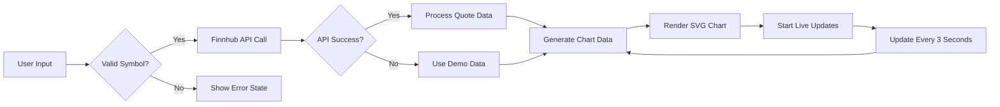
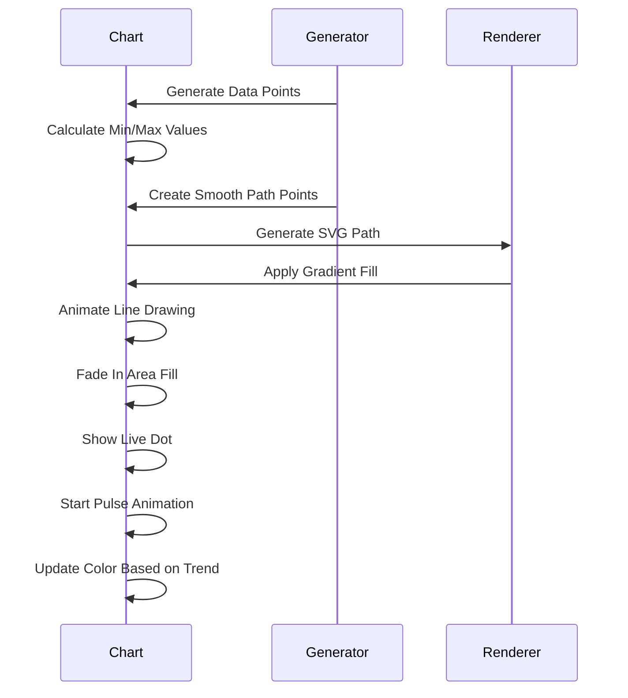

# User Interface Components

<cite>
**Referenced Files in This Document**
- [frontend/index.html](file://frontend/index.html)
- [frontend/market.html](file://frontend/market.html)
- [frontend/market.js](file://frontend/market.js)
- [frontend/news.html](file://frontend/news.html)
- [frontend/news.js](file://frontend/news.js)
- [frontend/dashboard.html](file://frontend/dashboard.html)
- [frontend/dashboard.js](file://frontend/dashboard.js)
- [frontend/style.css](file://frontend/style.css)
- [frontend/premium-ui.css](file://frontend/premium-ui.css)
- [frontend/about.html](file://frontend/about.html)
- [frontend/contact.html](file://frontend/contact.html)
- [frontend/chatbot.html](file://frontend/chatbot.html)
- [frontend/chatbot.js](file://frontend/chatbot.js)
- [frontend/chatbot.css](file://frontend/chatbot.css)
- [frontend/script.js](file://frontend/script.js)
</cite>

## Update Summary
**Changes Made**
- Enhanced AI Chatbot Widget with dual-mode operation (real API vs demo mode) and intelligent fallback system
- Integrated premium UI styling system with glass-morphism effects and neon glow animations
- Improved multi-page navigation with consistent chatbot integration across all six pages
- Added comprehensive chatbot features including welcome system, quick actions, and typing indicators
- Enhanced dashboard with integrated chatbot functionality and improved signal card presentation
- Updated market page with enhanced chart animations and real-time data visualization
- Implemented responsive design with specialized mobile optimizations for chatbot interface

## Table of Contents
1. [Introduction](#introduction)
2. [AI Chatbot Widget Integration](#ai-chatbot-widget-integration)
3. [Enhanced Market Data Visualization](#enhanced-market-data-visualization)
4. [Professional Hero Section](#professional-hero-section)
5. [Enhanced Dashboard Interface](#enhanced-dashboard-interface)
6. [News Integration System](#news-integration-system)
7. [Premium UI Components](#premium-ui-components)
8. [Neon Glow Effects](#neon-glow-effects)
9. [Live Stock Data Visualization](#live-stock-data-visualization)
10. [Responsive Design Implementation](#responsive-design-implementation)
11. [Local Storage Integration](#local-storage-integration)
12. [Component Interaction Patterns](#component-interaction-patterns)
13. [Performance Considerations](#performance-considerations)
14. [Accessibility Features](#accessibility-features)
15. [Integration Guidelines](#integration-guidelines)

## Introduction
This document describes the modern SaaS website architecture for the AI Trading Signal Engine, featuring a sophisticated TradingView-style market page with live stock data visualization, professional hero section with animated SVG trading charts, and enhanced dashboard interface with AI-powered trading signals. The system has evolved from a monolithic structure to a modular SaaS platform with separate HTML pages for different functional areas, providing users with a premium financial trading experience.

The new architecture emphasizes real-time data processing, modern UI design with glass-morphism effects, seamless navigation between market, news, dashboard, about, and contact sections, and comprehensive AI assistance through an integrated chatbot widget. The interface showcases animated signal cards with dynamic neon glow effects that respond to market sentiment analysis results, along with sophisticated stock chart visualizations powered by Finnhub API integration and an intelligent AI chatbot that operates in both real API and demo modes.

## AI Chatbot Widget Integration
The AI Chatbot Widget provides comprehensive customer assistance and platform guidance across all six pages of the application:

### Chatbot Architecture
- **Dual-Mode Operation**: Intelligent switching between real OpenAI API integration and demo mode with fallback responses
- **Persistent Integration**: Chatbot is embedded in all major pages (Home, Market, News, Dashboard, About, Contact)
- **Dynamic Configuration**: System prompt tailored specifically for trading and financial analysis
- **Conversation History**: Maintains up to 10 messages for context-aware responses
- **Real-Time Responses**: Asynchronous API calls with loading states and error handling

### Chatbot Features
- **Welcome System**: Automated greeting with feature overview and quick action suggestions
- **Quick Action Buttons**: Pre-defined questions for common trading scenarios
- **Typing Indicators**: Realistic typing animations during AI processing
- **Auto-Scrolling**: Automatic message scrolling to latest conversation
- **Keyboard Support**: Enter key functionality for message submission
- **Responsive Design**: Mobile-optimized chat interface with touch-friendly controls

### Conversation Intelligence
The chatbot implements sophisticated conversation management with intelligent fallback mechanisms:

**Diagram sources**
- [frontend/chatbot.js:196-272](file://frontend/chatbot.js#L196-L272)
- [frontend/chatbot.js:274-469](file://frontend/chatbot.js#L274-L469)

### Demo Mode Capabilities
When API quota is exceeded or disabled, the chatbot provides comprehensive demo responses covering:
- Trading signal explanations with confidence scores and risk levels
- News analysis process breakdown with step-by-step methodology
- Trading tips and strategies for different market conditions
- Platform feature overviews and usage instructions
- Technical information about AI models and backend infrastructure

**Section sources**
- [frontend/chatbot.html:1-317](file://frontend/chatbot.html#L1-L317)
- [frontend/chatbot.js:1-550](file://frontend/chatbot.js#L1-L550)
- [frontend/chatbot.css:1-456](file://frontend/chatbot.css#L1-L456)

## Enhanced Market Data Visualization
The market page provides a professional TradingView-inspired interface for real-time stock data visualization with enhanced chart capabilities:

### Market Data Architecture
- **Search Interface**: Advanced stock symbol search with popular tickers and real-time validation
- **Live Data Display**: Comprehensive stock information including price, change, and company details
- **Enhanced Charts**: Professional SVG-based charts with live price updates, gradient fills, and animated transitions
- **Popular Stocks Grid**: Quick-access grid for trending stocks with performance indicators
- **AI Analysis Integration**: Direct analysis button that triggers AI-powered signal generation
- **Quick Stats**: Key performance metrics and service highlights

### Chart Animation System
The market page features sophisticated chart animations with multiple layers and enhanced visual effects:

**Diagram sources**
- [frontend/market.js:169-271](file://frontend/market.js#L169-L271)
- [frontend/market.js:325-423](file://frontend/market.js#L325-L423)

### Enhanced Chart Features
The market page implements sophisticated real-time data visualization with enhanced capabilities:
- **Dynamic Color Changes**: Automatic color transitions based on price trends (green for gains, red for losses)
- **Live Dot Animation**: Pulsing dot that follows the latest price point with glow effects
- **Gradient Fills**: Dynamic gradient backgrounds that change with price movements
- **Smooth Transitions**: CSS transitions for seamless data updates and visual changes
- **Grid Background**: Subtle grid pattern for enhanced visual depth and readability
- **Performance Metrics**: Real-time percentage display with color-coded indicators

**Section sources**
- [frontend/market.html:31-179](file://frontend/market.html#L31-L179)
- [frontend/market.js:1-537](file://frontend/market.js#L1-L537)
- [frontend/premium-ui.css:1017-1166](file://frontend/premium-ui.css#L1017-L1166)

## Professional Hero Section
The hero section features a sophisticated animated trading chart that demonstrates the platform's capabilities:

### Animated Trading Chart
- **Dynamic SVG Chart**: Real-time performance visualization with gradient fills and glow effects
- **Continuous Animation**: Infinite loop of market movements with smooth transitions
- **Performance Metrics**: Live percentage display with color-coded indicators
- **Grid Background**: Subtle grid pattern for enhanced visual depth
- **Live Badge**: Animated "LIVE" indicator with pulsing effect

### Hero Section Architecture
The hero section implements a complex animation system:

**Diagram sources**
- [frontend/index.html:210-410](file://frontend/index.html#L210-L410)

**Section sources**
- [frontend/index.html:31-97](file://frontend/index.html#L31-L97)
- [frontend/index.html:210-410](file://frontend/index.html#L210-L410)
- [frontend/style.css:173-287](file://frontend/style.css#L173-L287)

## Enhanced Dashboard Interface
The dashboard provides the core real-time trading interface with sophisticated signal card presentation and integrated chatbot assistance:

### Signal Card Architecture
- **Header Section**: Displays headline and company information with animated loading states
- **Signal Badge**: Dynamic badge with neon glow effects (BUY: green, SELL: red, HOLD: yellow)
- **Metrics Grid**: Four-column layout showing sentiment, confidence, risk level, and signal strength
- **Explanation Box**: AI-generated analysis with key factors and catalyst identification
- **Action Controls**: Refresh signal, fetch latest news, and timestamp display
- **Chatbot Integration**: Seamless access to AI assistance for signal interpretation

### AI Analysis System
The dashboard implements a two-tier analysis system with enhanced chatbot integration:

**Diagram sources**
- [frontend/dashboard.js:146-229](file://frontend/dashboard.js#L146-L229)
- [frontend/dashboard.js:368-387](file://frontend/dashboard.js#L368-L387)

**Section sources**
- [frontend/dashboard.html:31-165](file://frontend/dashboard.html#L31-L165)
- [frontend/dashboard.js:1-464](file://frontend/dashboard.js#L1-L464)
- [frontend/premium-ui.css:237-281](file://frontend/premium-ui.css#L237-L281)

## News Integration System
The news system provides real-time financial news integration with seamless navigation to the dashboard and integrated chatbot assistance:

### News Card Architecture
- **Glass-morphism Design**: Modern card design with backdrop blur and border effects
- **Interactive Elements**: Hover animations with transform effects and glow enhancements
- **Analysis Integration**: Direct analysis button that stores news in localStorage and navigates to dashboard
- **Fallback Mechanism**: Sample news data when backend API is unavailable
- **Chatbot Assistance**: Quick access to AI help for news analysis and trading questions

### Local Storage Integration
The news system uses localStorage for cross-page data sharing:
- Stores selected news headline for dashboard analysis
- Maintains analysis timestamps for audit trails
- Enables seamless navigation between news and dashboard pages
- Supports chatbot integration across news page interactions

**Section sources**
- [frontend/news.html:1-412](file://frontend/news.html#L1-L412)
- [frontend/news.js:1-285](file://frontend/news.js#L1-L285)
- [frontend/dashboard.js:44-65](file://frontend/dashboard.js#L44-L65)

## Premium UI Components
The SaaS website implements a comprehensive set of premium UI components with enhanced chatbot integration:

### Glass-morphism Design System
- **Background Effects**: Frosted glass panels with backdrop blur
- **Border Effects**: Subtle borders with transparency for depth perception
- **Shadow System**: Multiple layered shadows for dimensional effects
- **Color Palette**: Dark theme with neon accent colors (green, cyan, purple)
- **Chatbot Integration**: Consistent styling across all chatbot components

### Interactive Elements
- **Hover Animations**: Smooth transitions with transform effects
- **Loading States**: Custom spinner animations and progress indicators
- **Button Variants**: Primary gradient buttons and secondary outline buttons
- **Card Interactions**: Hover effects with glow and elevation changes
- **Chatbot Animations**: Smooth open/close transitions and message animations

### Typography System
- **Font Family**: Inter font for clean, modern typography
- **Hierarchy**: Clear visual hierarchy with gradient text effects
- **Responsive Sizing**: Adaptive font sizes for different screen dimensions
- **Accent Effects**: Gradient text for headings and important elements

**Section sources**
- [frontend/style.css:6-37](file://frontend/style.css#L6-L37)
- [frontend/premium-ui.css:1-800](file://frontend/premium-ui.css#L1-L800)

## Neon Glow Effects
The SaaS website implements sophisticated neon glow effects throughout the interface with enhanced signal-based visualization:

### Signal-based Glow System
- **BUY Signals**: Green neon glow with pulse animation
- **SELL Signals**: Red neon glow with continuous pulsing
- **HOLD Signals**: Yellow neon glow with steady illumination
- **ANALYZING State**: Neutral glow with static lighting
- **Chatbot Status**: Online indicator with pulsing animation

### Implementation Details
The glow effects are implemented using CSS animations and box-shadow properties:
- Keyframe animations for continuous pulsing effects
- Variable-based color systems for consistent theming
- Performance-optimized animations using transform properties
- Responsive glow effects that adapt to screen size

### Visual Impact
The neon glow system creates a premium, high-tech feel:
- Enhanced visual appeal for trading interface
- Clear signal differentiation through color coding
- Dynamic feedback for user interactions
- Professional appearance suitable for financial applications

**Section sources**
- [frontend/premium-ui.css:237-281](file://frontend/premium-ui.css#L237-L281)
- [frontend/dashboard.js:418-430](file://frontend/dashboard.js#L418-L430)
- [frontend/style.css:31-33](file://frontend/style.css#L31-L33)

## Live Stock Data Visualization
The market page features sophisticated live stock data visualization with real-time updates and enhanced chart capabilities:

### Chart Rendering System
- **SVG Path Generation**: Smooth cubic bezier curves for professional chart appearance
- **Gradient Fills**: Dynamic gradient backgrounds that change with price trends
- **Live Dot Animation**: Pulsing dot that follows the latest price point with glow effects
- **Smooth Transitions**: CSS transitions for seamless data updates and visual changes

### Data Processing Pipeline
The market page implements a comprehensive data processing pipeline with enhanced error handling:

**Diagram sources**
- [frontend/market.js:39-107](file://frontend/market.js#L39-L107)
- [frontend/market.js:169-271](file://frontend/market.js#L169-L271)

### Enhanced Chart Animation Sequence
The chart rendering system follows a precise animation sequence with dynamic color transitions:

**Diagram sources**
- [frontend/market.js:169-271](file://frontend/market.js#L169-L271)
- [frontend/premium-ui.css:1060-1104](file://frontend/premium-ui.css#L1060-L1104)

**Section sources**
- [frontend/market.js:169-423](file://frontend/market.js#L169-L423)
- [frontend/premium-ui.css:1017-1166](file://frontend/premium-ui.css#L1017-L1166)

## Responsive Design Implementation
The SaaS website features comprehensive responsive design with enhanced chatbot responsiveness:

### Breakpoint Strategy
- **Mobile First**: Base styles optimized for mobile devices
- **Tablet Adaptation**: Adjustments at 768px breakpoint for tablet devices
- **Desktop Optimization**: Full feature display on larger screens
- **Flexible Grid System**: CSS Grid and Flexbox for adaptive layouts
- **Chatbot Responsiveness**: Specialized mobile optimizations for chatbot interface

### Component Responsiveness
- **Navigation**: Hidden menu on mobile with hamburger-style interaction
- **News Grid**: Single column on mobile, multi-column on desktop
- **Dashboard Cards**: Flexible grid that adapts to screen size
- **Market Charts**: Responsive chart sizing with reduced complexity on smaller screens
- **Typography**: Fluid font sizing with viewport-relative units
- **Chatbot Interface**: Mobile-optimized chat window with touch-friendly controls

### Performance Considerations
- **CSS Animations**: Hardware-accelerated transforms for smooth performance
- **Lazy Loading**: Images and content load progressively
- **Optimized Transitions**: Minimal CSS for maximum visual impact
- **Touch Targets**: Adequate sizing for mobile interaction
- **Chatbot Performance**: Optimized animations and transitions for mobile devices

**Section sources**
- [frontend/style.css:452-499](file://frontend/style.css#L452-L499)
- [frontend/premium-ui.css:1363-1467](file://frontend/premium-ui.css#L1363-L1467)
- [frontend/chatbot.css:399-456](file://frontend/chatbot.css#L399-L456)

## Local Storage Integration
The SaaS website implements strategic local storage usage for enhanced user experience with chatbot integration:

### Data Persistence Strategy
- **Cross-page Communication**: Selected news stored for dashboard analysis
- **Session Management**: Temporary data for user session continuity
- **Audit Trail**: Timestamps for analysis history tracking
- **Chatbot State**: Conversation history and user preferences
- **Fallback Mechanisms**: Graceful degradation when storage is unavailable

### Implementation Details
The local storage system handles:
- News headline preservation during navigation
- Analysis timestamps for historical tracking
- User preferences and session data
- Chatbot conversation history
- Error handling for storage limitations

### Security Considerations
- **Client-side Only**: No sensitive data stored in persistent storage
- **Temporary Data**: Most data is cleared after analysis completion
- **Data Limits**: Respect browser storage quotas and limitations
- **Privacy Compliance**: No personal data collection or retention

**Section sources**
- [frontend/news.js:113-127](file://frontend/news.js#L113-L127)
- [frontend/dashboard.js:29-65](file://frontend/dashboard.js#L29-L65)

## Component Interaction Patterns
The SaaS website implements sophisticated interaction patterns with enhanced chatbot integration:

### Real-time Data Flow
- **News Fetching**: Asynchronous API calls with loading states
- **Signal Generation**: Instant keyword-based analysis with real-time updates
- **UI Updates**: Smooth transitions between loading and result states
- **Error Handling**: Graceful degradation with fallback content
- **Chatbot Communication**: Seamless API integration with error handling

### User Experience Patterns
- **Progressive Disclosure**: Information revealed as needed
- **Immediate Feedback**: Visual responses to user actions
- **Consistent Patterns**: Familiar interaction paradigms across pages
- **Accessibility**: Keyboard navigation and screen reader support
- **Chatbot Integration**: Consistent assistance across all user interactions

### Performance Optimization
- **Debounced Actions**: Prevent rapid repeated submissions
- **Efficient Updates**: Minimal DOM manipulation for smooth animations
- **Resource Management**: Optimized loading of assets and scripts
- **Memory Management**: Cleanup of event listeners and timers
- **Chatbot Performance**: Optimized animations and API calls

**Section sources**
- [frontend/dashboard.js:281-341](file://frontend/dashboard.js#L281-L341)
- [frontend/market.js:467-479](file://frontend/market.js#L467-L479)
- [frontend/news.js:31-70](file://frontend/news.js#L31-L70)

## Performance Considerations
The SaaS website is optimized for performance across all components with enhanced chatbot efficiency:

### Loading Optimization
- **Critical Path**: Essential CSS and JavaScript loaded in priority order
- **Lazy Loading**: Non-critical resources loaded on demand
- **Asset Optimization**: Minified CSS and efficient image formats
- **Caching Strategy**: Strategic caching for improved repeat visits
- **Chatbot Optimization**: Efficient script loading and initialization

### Runtime Performance
- **Animation Efficiency**: Hardware-accelerated CSS animations
- **Event Handling**: Optimized event listeners with proper cleanup
- **Memory Management**: Prevention of memory leaks through proper cleanup
- **Network Optimization**: Efficient API calls with error handling
- **Chatbot Performance**: Optimized API calls and conversation management

### Scalability Considerations
- **Component Architecture**: Modular design for easy maintenance
- **Code Splitting**: Separate bundles for different page sections
- **Bundle Optimization**: Tree shaking and dead code elimination
- **CDN Integration**: External resources served from optimized CDNs
- **Chatbot Scalability**: Efficient conversation handling and API integration

**Section sources**
- [frontend/style.css:1026-1037](file://frontend/style.css#L1026-L1037)
- [frontend/market.js:283-303](file://frontend/market.js#L283-L303)

## Accessibility Features
The SaaS website implements comprehensive accessibility features with enhanced chatbot accessibility:

### Semantic HTML Structure
- **Proper Headings**: Logical heading hierarchy for screen readers
- **Descriptive Links**: Meaningful link text with context
- **Form Labels**: Associated labels for input elements
- **Alternative Text**: Descriptive alt attributes for images
- **Chatbot Accessibility**: Proper ARIA labels and roles for chat interface

### Keyboard Navigation
- **Tab Order**: Logical tab order through interactive elements
- **Focus Management**: Visible focus indicators for keyboard users
- **Shortcuts**: Keyboard shortcuts for common actions
- **Skip Links**: Ability to skip to main content
- **Chatbot Navigation**: Full keyboard support for chat interface

### Screen Reader Support
- **ARIA Labels**: Descriptive ARIA labels for complex components
- **Role Attributes**: Proper ARIA roles for interactive elements
- **Live Regions**: Dynamic content updates announced to assistive technologies
- **Structure Announcements**: Clear announcements of page sections and changes
- **Chatbot Announcements**: Live region support for chat message updates

### Visual Accessibility
- **Color Contrast**: Sufficient contrast ratios for text and interactive elements
- **Color Independence**: Information conveyed through multiple means
- **Resize Text**: Support for increased text size without loss of functionality
- **Motion Preferences**: Reduced motion options for sensitive users
- **Chatbot Motion**: Respects user motion preferences

**Section sources**
- [frontend/market.html:1-179](file://frontend/market.html#L1-L179)
- [frontend/news.html:1-412](file://frontend/news.html#L1-L412)
- [frontend/dashboard.html:1-165](file://frontend/dashboard.html#L1-L165)

## Integration Guidelines
The SaaS website provides guidelines for extending and integrating with the existing architecture with enhanced chatbot integration:

### Adding New Pages
- **Navigation Integration**: Add menu items to all navbar components
- **Styling Consistency**: Use the established CSS variable system
- **Responsive Behavior**: Implement mobile-first responsive design
- **Performance Standards**: Follow established performance optimization patterns
- **Chatbot Integration**: Include chatbot widget in new page templates

### Extending Market Functionality
- **API Integration**: Connect to additional financial data providers
- **Chart Enhancements**: Add new chart types and visualization components
- **Real-time Updates**: Implement WebSocket connections for live data
- **Data Visualization**: Extend chart capabilities with additional metrics
- **Chatbot Assistance**: Integrate chatbot for market data interpretation

### Component Development
- **CSS Architecture**: Follow the established naming convention (BEM methodology)
- **JavaScript Patterns**: Use modular patterns with proper encapsulation
- **Animation Standards**: Implement consistent animation timing and easing
- **Testing Strategy**: Implement unit tests for critical functionality
- **Chatbot Development**: Follow established chatbot patterns and integration

### Backend Integration
- **API Endpoints**: Follow RESTful conventions for new endpoints
- **Error Handling**: Implement comprehensive error handling and user feedback
- **Authentication**: Integrate with existing authentication systems
- **Data Validation**: Implement server-side validation for all inputs
- **Chatbot API**: Integrate with chatbot services and AI models

### Chatbot Integration Guidelines
- **Configuration Management**: Use centralized chatbot configuration
- **API Key Security**: Implement secure API key management
- **Error Handling**: Comprehensive error handling for API failures
- **Demo Mode**: Implement fallback to demo responses when API is unavailable
- **Conversation Management**: Maintain conversation context and history

**Section sources**
- [frontend/style.css:6-37](file://frontend/style.css#L6-L37)
- [frontend/dashboard.js:62-145](file://frontend/dashboard.js#L62-L145)
- [frontend/news.js:90-148](file://frontend/news.js#L90-L148)
- [frontend/chatbot.js:78-143](file://frontend/chatbot.js#L78-L143)