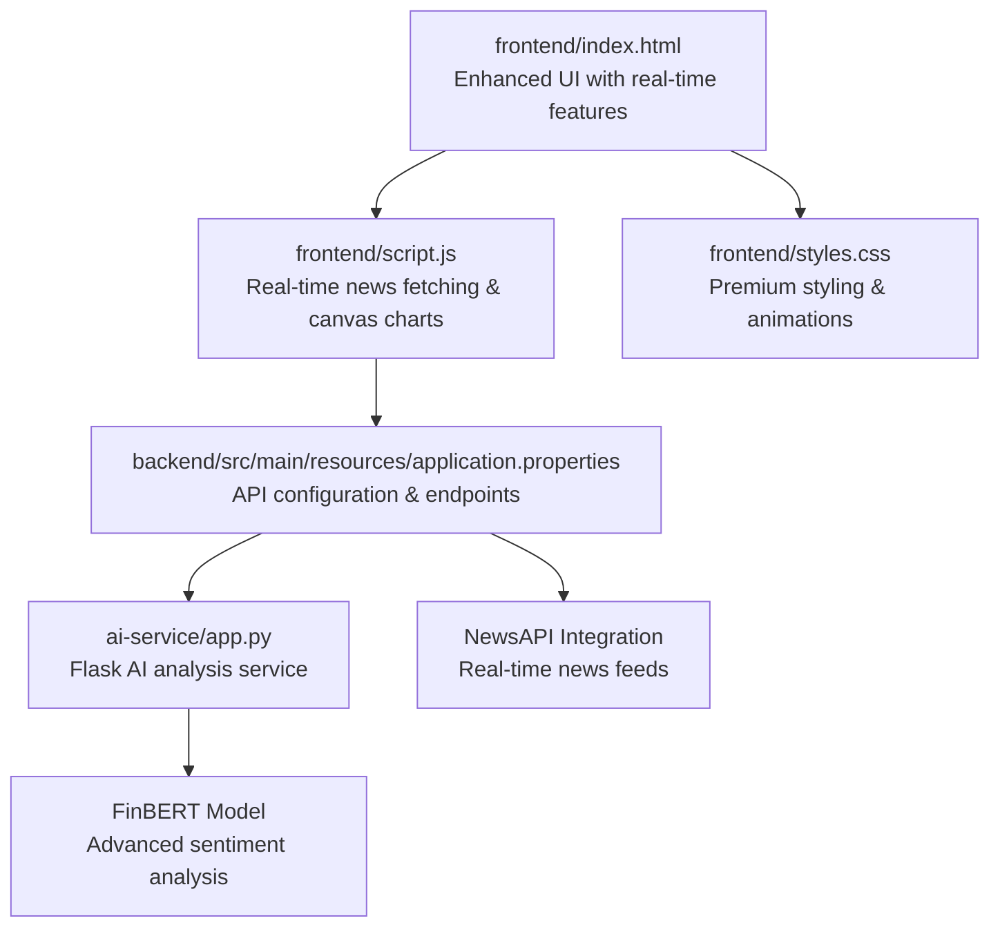
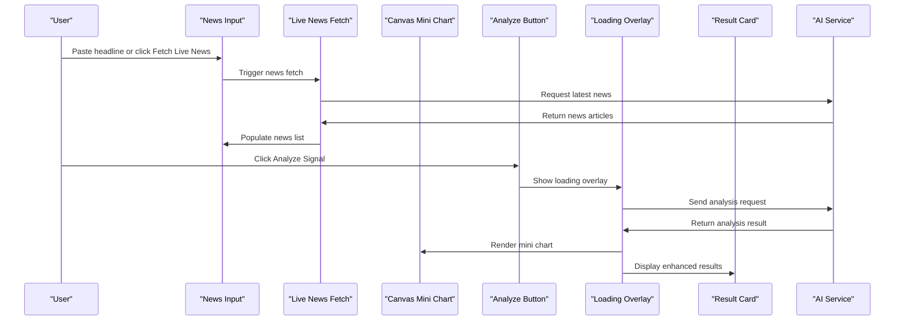
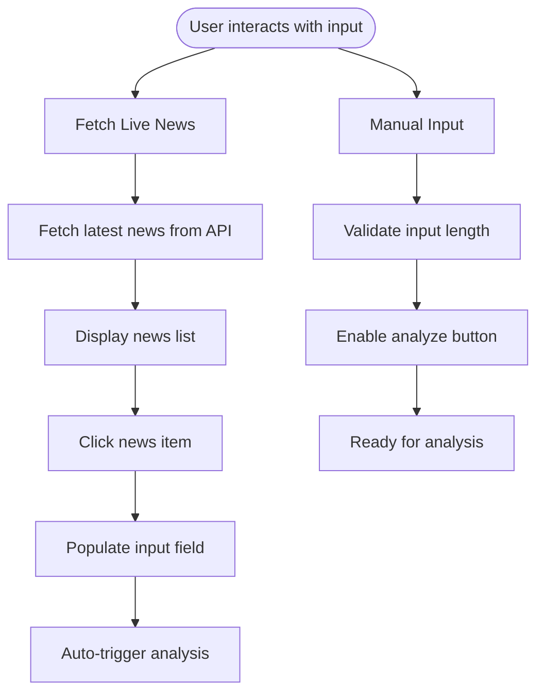
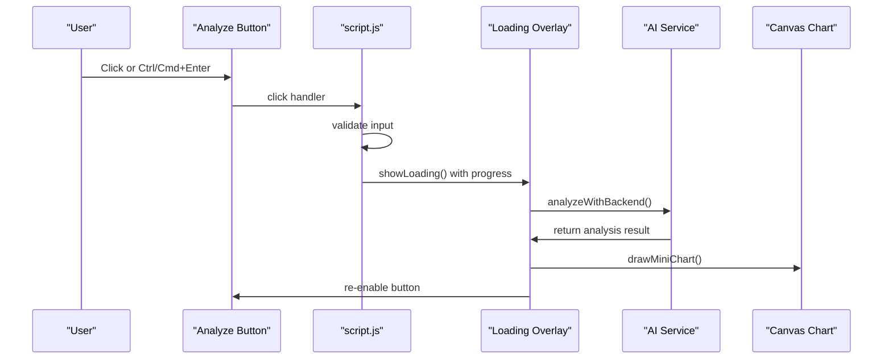
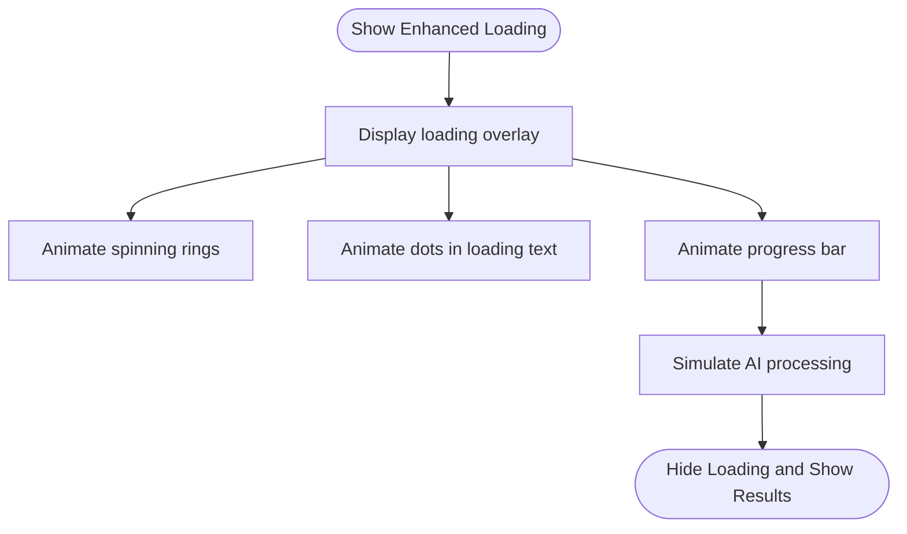
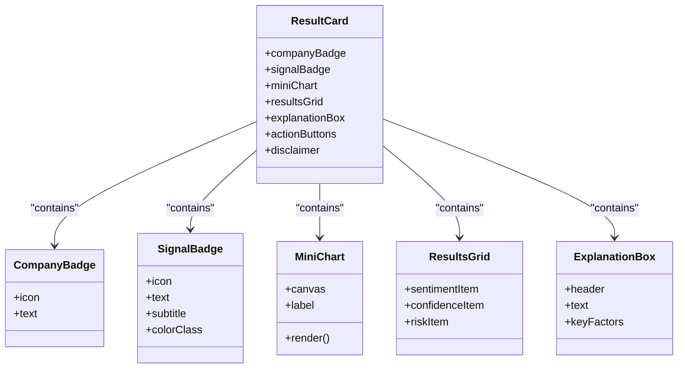
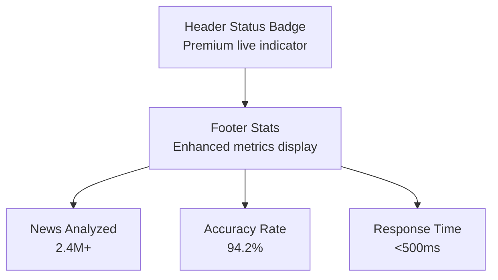
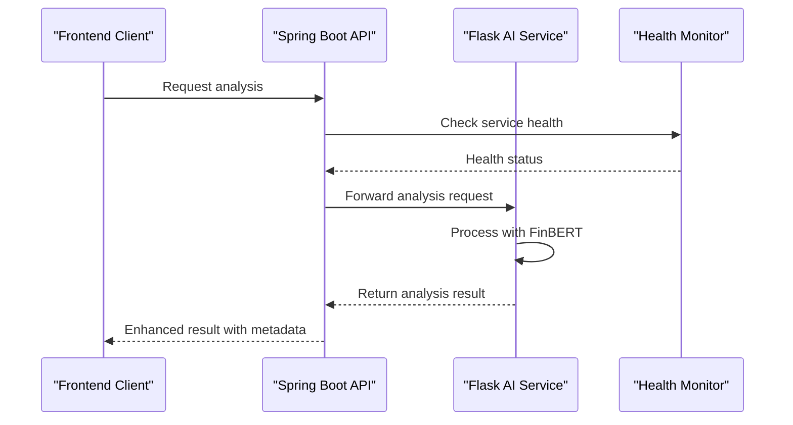
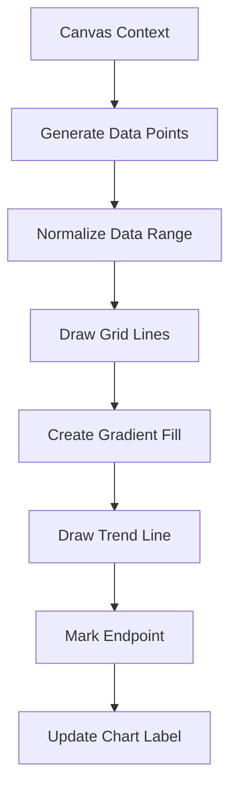
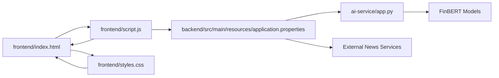

# User Interface Components

<cite>
**Referenced Files in This Document**
- [frontend/index.html](file://frontend/index.html)
- [frontend/script.js](file://frontend/script.js)
- [frontend/styles.css](file://frontend/styles.css)
- [ai-service/app.py](file://ai-service/app.py)
- [backend/src/main/resources/application.properties](file://backend/src/main/resources/application.properties)
</cite>

## Update Summary
**Changes Made**
- Added comprehensive documentation for real-time news fetching functionality
- Documented canvas-based mini chart visualization system
- Enhanced backend integration documentation with health monitoring
- Added company detection and key factor extraction features
- Updated loading state with progress bar implementation
- Expanded component analysis to include new interactive elements

## Table of Contents
1. [Introduction](#introduction)
2. [Project Structure](#project-structure)
3. [Core Components](#core-components)
4. [Architecture Overview](#architecture-overview)
5. [Detailed Component Analysis](#detailed-component-analysis)
6. [Enhanced Backend Integration](#enhanced-backend-integration)
7. [Canvas-Based Mini Chart System](#canvas-based-mini-chart-system)
8. [Dependency Analysis](#dependency-analysis)
9. [Performance Considerations](#performance-considerations)
10. [Troubleshooting Guide](#troubleshooting-guide)
11. [Conclusion](#conclusion)
12. [Appendices](#appendices)

## Introduction
This document describes the user interface components and interaction patterns of the AI Trading Signal Engine. The system has been enhanced with real-time news fetching capabilities, canvas-based signal visualization, and comprehensive backend integration. It covers the input system (news headline textarea with character counting and validation), the Analyze Signal button (including loading states, disabled/enabled behavior, and keyboard shortcuts), the result card presentation (signal badges, confidence visualization bars, risk level indicators, and dynamic explanation display), and the loading state animations, status indicators, and footer statistics. It also documents responsive behavior across screen sizes, accessibility considerations, and usage examples for extending or modifying UI elements.

## Project Structure
The application consists of three main components:
- **Frontend**: HTML, CSS, and JavaScript for the user interface with enhanced real-time capabilities
- **AI Service**: Flask-based sentiment analysis service with health monitoring
- **Backend**: Spring Boot application serving as API gateway and news aggregation

**Diagram sources**
- [frontend/index.html:1-235](file://frontend/index.html#L1-L235)
- [frontend/script.js:1-1068](file://frontend/script.js#L1-L1068)
- [frontend/styles.css:1-1415](file://frontend/styles.css#L1-L1415)
- [ai-service/app.py:1-155](file://ai-service/app.py#L1-L155)
- [backend/src/main/resources/application.properties:1-27](file://backend/src/main/resources/application.properties#L1-L27)

**Section sources**
- [frontend/index.html:1-235](file://frontend/index.html#L1-L235)
- [frontend/script.js:1-1068](file://frontend/script.js#L1-L1068)
- [frontend/styles.css:1-1415](file://frontend/styles.css#L1-L1415)
- [ai-service/app.py:1-155](file://ai-service/app.py#L1-L155)
- [backend/src/main/resources/application.properties:1-27](file://backend/src/main/resources/application.properties#L1-L27)

## Core Components
- **Enhanced Input System**: A textarea for pasting financial news headlines with real-time character counting, placeholder text, and integrated live news fetching capability.
- **Real-Time News Integration**: A dedicated "Fetch Live News" button that retrieves current financial news from external APIs and populates the input area.
- **Canvas-Based Mini Charts**: Sophisticated signal visualization using HTML5 Canvas for BUY/SELL/HOLD trend representations.
- **Enhanced Analyze Signal Button**: A premium gradient-styled button with ripple effects, micro-interactions, and keyboard shortcuts.
- **Advanced Loading State**: A comprehensive loading overlay with animated progress bar, multi-ring loader, and dynamic status indicators.
- **Premium Result Card**: Enhanced presentation with company detection badges, signal visualization, confidence bars, risk meters, and key factor analysis.
- **Health Monitoring Integration**: Real-time system health checks and performance metrics display.
- **Status Indicators**: Live status badge in the header and comprehensive footer statistics.
- **Footer Statistics**: Aggregated metrics including news analyzed, accuracy rate, and response time.

**Section sources**
- [frontend/index.html:66-93](file://frontend/index.html#L66-L93)
- [frontend/index.html:127-141](file://frontend/index.html#L127-L141)
- [frontend/index.html:111-209](file://frontend/index.html#L111-L209)
- [frontend/script.js:883-950](file://frontend/script.js#L883-L950)
- [frontend/script.js:142-263](file://frontend/script.js#L142-L263)
- [frontend/script.js:511-552](file://frontend/script.js#L511-L552)
- [frontend/script.js:24-37](file://frontend/script.js#L24-L37)

## Architecture Overview
The enhanced UI follows a sophisticated client-server architecture with real-time capabilities:
- **Frontend**: Reacts to user input, manages real-time news fetching, handles canvas-based visualizations, and coordinates with backend services.
- **Backend**: Acts as API gateway, manages news aggregation, and orchestrates communication with the AI service.
- **AI Service**: Provides advanced sentiment analysis using FinBERT models with health monitoring and batch processing capabilities.

**Diagram sources**
- [frontend/index.html:85-92](file://frontend/index.html#L85-L92)
- [frontend/script.js:883-950](file://frontend/script.js#L883-L950)
- [frontend/script.js:142-263](file://frontend/script.js#L142-L263)
- [frontend/script.js:511-552](file://frontend/script.js#L511-L552)
- [ai-service/app.py:29-36](file://ai-service/app.py#L29-L36)

## Detailed Component Analysis

### Enhanced Input System: Financial News Input with Live Integration
- **Purpose**: Accept financial news headlines with enhanced real-time capabilities and integrated news fetching.
- **Features**:
  - Standard news headline textarea with 500-character limit and real-time character counting.
  - Integrated "Fetch Live News" button for accessing current financial news.
  - Animated news list display with clickable articles that populate the input field.
  - Visual focus effects with neon blue glow and enhanced input styling.
- **Interaction Pattern**:
  - Users can either paste news manually or fetch live headlines.
  - Clicking news items automatically populates the input and triggers analysis.
  - Real-time validation enables the analyze button when content is present.

**Diagram sources**
- [frontend/index.html:85-92](file://frontend/index.html#L85-L92)
- [frontend/script.js:883-950](file://frontend/script.js#L883-L950)
- [frontend/script.js:369-381](file://frontend/script.js#L369-L381)

**Section sources**
- [frontend/index.html:66-93](file://frontend/index.html#L66-L93)
- [frontend/script.js:883-950](file://frontend/script.js#L883-L950)
- [frontend/script.js:369-381](file://frontend/script.js#L369-L381)
- [frontend/styles.css:408-502](file://frontend/styles.css#L408-L502)

### Enhanced Analyze Signal Button
- **Purpose**: Trigger comprehensive sentiment analysis with premium visual effects and micro-interactions.
- **States**:
  - Disabled by default until input is present.
  - Advanced hover effects with gradient glow, scaling animation, and icon rotation.
  - Active state with ripple effect animation and press-down transformation.
  - During analysis, the button is disabled with visual dimming and progress indication.
- **Behavior**:
  - Click handler validates input, shows enhanced loading overlay with progress bar, processes analysis, and displays comprehensive results.
  - Keyboard shortcut: Ctrl/Cmd + Enter triggers analysis when the button is enabled and input is present.
  - Micro-interactions include ripple effects, glow animations, and smooth transitions.
- **Accessibility**:
  - Uses semantic button element with clear label text.
  - Disabled state prevents accidental clicks.
  - Enhanced visual feedback for all interaction states.

**Diagram sources**
- [frontend/index.html:95-101](file://frontend/index.html#L95-L101)
- [frontend/script.js:511-552](file://frontend/script.js#L511-L552)
- [frontend/script.js:757-798](file://frontend/script.js#L757-L798)
- [frontend/script.js:142-263](file://frontend/script.js#L142-L263)

**Section sources**
- [frontend/index.html:95-101](file://frontend/index.html#L95-L101)
- [frontend/script.js:511-552](file://frontend/script.js#L511-L552)
- [frontend/script.js:684-698](file://frontend/script.js#L684-L698)
- [frontend/script.js:757-798](file://frontend/script.js#L757-L798)
- [frontend/styles.css:583-685](file://frontend/styles.css#L583-L685)

### Enhanced Loading State with Progress Bar
- **Purpose**: Provide comprehensive feedback during analysis with real-time progress indication.
- **Elements**:
  - Premium loading overlay with backdrop blur and glass-morphism effect.
  - Multi-ring loader with rotating rings in different neon colors (green, blue, purple).
  - Central core with pulsing animation and gradient glow.
  - Dynamic loading text with animated dots for typing effect.
  - Progress bar with gradient fill and real-time animation.
  - Subtext indicating processing details and model analysis.
- **Behavior**:
  - Enhanced overlay replaces traditional loading state with comprehensive visual feedback.
  - Progress bar animates from 0% to 90% during analysis, then to 100% completion.
  - Button is disabled and visually dimmed during this phase.
  - Smooth transitions between loading states and result display.

**Diagram sources**
- [frontend/index.html:23-41](file://frontend/index.html#L23-L41)
- [frontend/script.js:527-552](file://frontend/script.js#L527-L552)
- [frontend/script.js:952-982](file://frontend/script.js#L952-L982)

**Section sources**
- [frontend/index.html:23-41](file://frontend/index.html#L23-L41)
- [frontend/script.js:527-552](file://frontend/script.js#L527-L552)
- [frontend/script.js:952-982](file://frontend/script.js#L952-L982)
- [frontend/styles.css:162-287](file://frontend/styles.css#L162-L287)

### Enhanced Result Card Presentation
- **Purpose**: Present comprehensive analysis outcomes with premium visualizations and interactive elements.
- **Components**:
  - **Company Detection Badge**: Automatically detects and displays company names with neon blue styling.
  - **Signal Badge**: Enhanced with dynamic color transitions (green for BUY, red for SELL, yellow for HOLD) and gradient borders.
  - **Canvas Mini Chart**: Sophisticated signal visualization with trend lines, gradient fills, and endpoint markers.
  - **Results Grid**: Three-column layout with sentiment indicators, confidence bars, and risk meters.
  - **Dynamic Explanation**: AI-generated analysis with key factors and catalyst identification.
  - **Action Buttons**: Reset and Share functionality with micro-interactions.
  - **Disclaimer**: Educational disclaimer with enhanced visual styling.
- **Animations**:
  - Smooth slide-up entrance with bounce effect for the result card.
  - Confidence bar animates to final width with gradient color transitions.
  - Signal badge features rotating gradient backgrounds and glow effects.
  - Canvas chart renders with smooth animation and shadow effects.

**Diagram sources**
- [frontend/index.html:111-209](file://frontend/index.html#L111-L209)
- [frontend/script.js:555-636](file://frontend/script.js#L555-L636)
- [frontend/script.js:142-263](file://frontend/script.js#L142-L263)

**Section sources**
- [frontend/index.html:111-209](file://frontend/index.html#L111-L209)
- [frontend/script.js:555-636](file://frontend/script.js#L555-L636)
- [frontend/script.js:142-263](file://frontend/script.js#L142-L263)
- [frontend/styles.css:697-881](file://frontend/styles.css#L697-L881)

### Status Indicators and Footer Statistics
- **Header Status Badge**: Premium live status indicator with pulsing dot, neon green glow, and "LIVE" text.
- **Footer Statistics**: Enhanced three-metric display with news analyzed (2.4M+), accuracy rate (94.2%), and response time (<500ms).
- **Health Monitoring**: Real-time system health checks and performance metrics display.

**Diagram sources**
- [frontend/index.html:46-61](file://frontend/index.html#L46-L61)
- [frontend/index.html:212-228](file://frontend/index.html#L212-L228)

**Section sources**
- [frontend/index.html:46-61](file://frontend/index.html#L46-L61)
- [frontend/index.html:212-228](file://frontend/index.html#L212-L228)
- [frontend/styles.css:358-382](file://frontend/styles.css#L358-L382)
- [frontend/styles.css:883-950](file://frontend/styles.css#L883-L950)

## Enhanced Backend Integration
The system now features comprehensive backend integration with health monitoring and real-time capabilities:

### AI Service Architecture
- **Flask-based Service**: Built with Python Flask for sentiment analysis using FinBERT models.
- **Health Monitoring**: `/health` endpoint provides system status, model loading status, and service information.
- **Advanced Analysis**: Real-time sentiment analysis with confidence scoring, signal generation, and key factor extraction.
- **Batch Processing**: Support for analyzing multiple texts simultaneously with configurable limits.

### Backend API Gateway
- **Spring Boot Application**: Serves as API gateway managing communication between frontend and AI service.
- **Configuration Management**: External API keys for NewsAPI and Finnhub integration.
- **CORS Support**: Enables cross-origin requests for seamless frontend integration.
- **Actuator Endpoints**: Health checks and system monitoring capabilities.

**Diagram sources**
- [ai-service/app.py:29-36](file://ai-service/app.py#L29-L36)
- [ai-service/app.py:39-96](file://ai-service/app.py#L39-L96)
- [backend/src/main/resources/application.properties:13-14](file://backend/src/main/resources/application.properties#L13-L14)

**Section sources**
- [ai-service/app.py:1-155](file://ai-service/app.py#L1-L155)
- [backend/src/main/resources/application.properties:1-27](file://backend/src/main/resources/application.properties#L1-L27)

## Canvas-Based Mini Chart System
The system features sophisticated canvas-based visualization for signal trend representation:

### Chart Architecture
- **Canvas Rendering**: HTML5 Canvas API for high-performance chart rendering.
- **Signal-Based Generation**: Dynamic data generation based on BUY/SELL/HOLD signals.
- **Smooth Curves**: Quadratic bezier curves for organic-looking trend lines.
- **Gradient Effects**: Multi-stop gradients for visual depth and professional appearance.
- **Responsive Design**: Automatic sizing and scaling based on container dimensions.

### Chart Features
- **Dynamic Data Points**: 30-point datasets with realistic market-like fluctuations.
- **Signal-Specific Styling**: Green gradients for BUY, red for SELL, orange for HOLD.
- **Endpoint Markers**: White circles with inner highlights for trend termination points.
- **Grid System**: Subtle grid lines for enhanced readability.
- **Shadow Effects**: Glowing shadows matching signal colors for depth perception.

**Diagram sources**
- [frontend/script.js:142-263](file://frontend/script.js#L142-L263)

**Section sources**
- [frontend/script.js:142-263](file://frontend/script.js#L142-L263)
- [frontend/styles.css:136-157](file://frontend/styles.css#L136-L157)

## Dependency Analysis
The enhanced system maintains modular architecture with clear separation of concerns:
- **Frontend** depends on script.js for enhanced interactivity, canvas rendering, and backend communication.
- **script.js** depends on DOM elements defined in index.html, canvas API for chart rendering, and fetch API for backend integration.
- **styles.css** defines premium visual language with enhanced animations, responsive behavior, and canvas styling.
- **Backend** serves as API gateway coordinating between frontend and AI service.
- **AI Service** provides specialized sentiment analysis capabilities with health monitoring.

**Diagram sources**
- [frontend/index.html:1-235](file://frontend/index.html#L1-L235)
- [frontend/script.js:1-1068](file://frontend/script.js#L1-L1068)
- [frontend/styles.css:1-1415](file://frontend/styles.css#L1-L1415)
- [backend/src/main/resources/application.properties:1-27](file://backend/src/main/resources/application.properties#L1-L27)
- [ai-service/app.py:1-155](file://ai-service/app.py#L1-L155)

**Section sources**
- [frontend/index.html:1-235](file://frontend/index.html#L1-L235)
- [frontend/script.js:1-1068](file://frontend/script.js#L1-L1068)
- [frontend/styles.css:1-1415](file://frontend/styles.css#L1-L1415)
- [backend/src/main/resources/application.properties:1-27](file://backend/src/main/resources/application.properties#L1-L27)
- [ai-service/app.py:1-155](file://ai-service/app.py#L1-L155)

## Performance Considerations
- **Canvas Optimization**: Efficient canvas rendering with automatic sizing and memory management.
- **Particle Animation**: Pauses when tab is not visible to conserve resources.
- **Progressive Loading**: Enhanced loading states with smooth transitions and minimal DOM manipulation.
- **Backend Caching**: AI service model loading optimization and health monitoring.
- **Responsive Design**: Adaptive layouts that optimize performance across device categories.

**Section sources**
- [frontend/script.js:1051-1058](file://frontend/script.js#L1051-L1058)
- [frontend/script.js:535-541](file://frontend/script.js#L535-L541)
- [ai-service/app.py:21-26](file://ai-service/app.py#L21-L26)

## Troubleshooting Guide
- **Button remains disabled**:
  - Ensure the input field contains at least one character.
  - Verify the input event listener is attached and functioning.
  - Check for JavaScript errors in the browser console.
- **Loading state issues**:
  - Confirm the click handler invokes the enhanced loading overlay with progress bar.
  - Check that the result card is hidden during loading.
  - Verify backend connectivity for real-time analysis.
- **Results not displaying**:
  - Ensure the displayResults function updates all target elements.
  - Verify the button is re-enabled after processing completes.
  - Check canvas rendering permissions and browser compatibility.
- **Canvas chart not rendering**:
  - Verify canvas element exists and has proper dimensions.
  - Check for JavaScript errors in the console.
  - Ensure browser supports HTML5 Canvas API.
- **Live news fetching fails**:
  - Confirm API keys are properly configured in backend properties.
  - Check network connectivity and external service availability.
  - Verify CORS configuration allows frontend access.
- **Keyboard shortcut not working**:
  - Confirm Ctrl/Cmd + Enter is pressed while the button is enabled and input is present.
  - Check browser security settings that might block keyboard shortcuts.

**Section sources**
- [frontend/script.js:369-381](file://frontend/script.js#L369-L381)
- [frontend/script.js:511-552](file://frontend/script.js#L511-L552)
- [frontend/script.js:555-636](file://frontend/script.js#L555-L636)
- [frontend/script.js:142-263](file://frontend/script.js#L142-L263)
- [frontend/script.js:883-950](file://frontend/script.js#L883-L950)
- [frontend/script.js:1038-1045](file://frontend/script.js#L1038-L1045)

## Conclusion
The AI Trading Signal Engine now presents a sophisticated, real-time, and highly interactive interface. The enhanced system seamlessly integrates real-time news fetching, canvas-based signal visualization, and comprehensive backend analysis. The modular architecture allows for straightforward extension and modification of UI elements while maintaining premium visual quality and optimal performance. The addition of health monitoring, company detection, and key factor extraction significantly enhances the analytical capabilities and user experience.

## Appendices

### Responsive Behavior
- **Enhanced Breakpoints**:
  - Mobile-first design with adjustments at 768px and 480px.
  - Live news section adapts to smaller screens with stacked layout.
  - Canvas charts automatically resize based on container dimensions.
  - Footer metrics rearrange for optimal mobile viewing.
- **Canvas Responsiveness**:
  - Automatic resizing based on container width and height.
  - Optimized rendering performance across different screen densities.
  - Touch-friendly interactive elements for mobile devices.

**Section sources**
- [frontend/styles.css:739-795](file://frontend/styles.css#L739-L795)
- [frontend/script.js:142-146](file://frontend/script.js#L142-L146)

### Accessibility Notes
- **Enhanced Semantic HTML**: Buttons, forms, and interactive elements use proper semantic markup.
- **Focus Management**: Comprehensive focus states for keyboard navigation and screen readers.
- **Visual Accessibility**: High contrast color schemes, sufficient color differentiation, and alternative text for icons.
- **Keyboard Navigation**: Full support for keyboard shortcuts including Ctrl/Cmd + Enter.
- **Screen Reader Support**: Proper ARIA labels and semantic structure for assistive technologies.
- **Motion Preferences**: Reduced motion options available through CSS custom properties.

**Section sources**
- [frontend/index.html:66-101](file://frontend/index.html#L66-L101)
- [frontend/script.js:1038-1045](file://frontend/script.js#L1038-L1045)
- [frontend/styles.css:266-269](file://frontend/styles.css#L266-L269)

### Usage Examples and Integration Guidelines
- **Extending the Input System**:
  - Add validation rules by adjusting the input event handler and updating the character counter color.
  - Integrate with external news APIs by extending the fetchLatestNews function.
  - Implement custom news filtering by adding additional parameters to the news fetching endpoint.
- **Modifying the Analyze Signal Button**:
  - Customize hover/active effects by editing the button styles and animation properties.
  - Add tooltips or ARIA attributes for improved accessibility.
  - Implement custom ripple effects by modifying the ripple animation CSS.
- **Enhancing the Result Card**:
  - Add new metrics by introducing new DOM elements and updating the displayResults function.
  - Implement advanced charting libraries by replacing canvas-based mini charts with SVG or WebGL solutions.
  - Add export functionality by extending the share button to support multiple formats.
- **Canvas Chart Customization**:
  - Modify chart styling by adjusting color gradients and shadow effects.
  - Implement custom data visualization by extending the drawMiniChart function.
  - Add interactive features like zoom, pan, or tooltip displays.
- **Backend Integration Enhancement**:
  - Add new AI models by extending the Flask service with additional analysis endpoints.
  - Implement caching mechanisms by adding Redis or database integration.
  - Extend health monitoring by adding custom metrics and alerting systems.
- **Live News Integration**:
  - Add news source filtering by implementing source selection dropdown.
  - Implement news categorization by adding topic-based filtering.
  - Add news timeline functionality by implementing pagination and sorting.

**Section sources**
- [frontend/script.js:883-950](file://frontend/script.js#L883-L950)
- [frontend/script.js:142-263](file://frontend/script.js#L142-L263)
- [frontend/script.js:555-636](file://frontend/script.js#L555-L636)
- [ai-service/app.py:39-96](file://ai-service/app.py#L39-L96)
- [backend/src/main/resources/application.properties:7-14](file://backend/src/main/resources/application.properties#L7-L14)