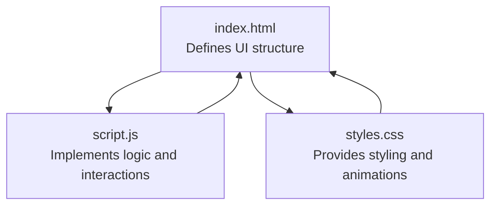
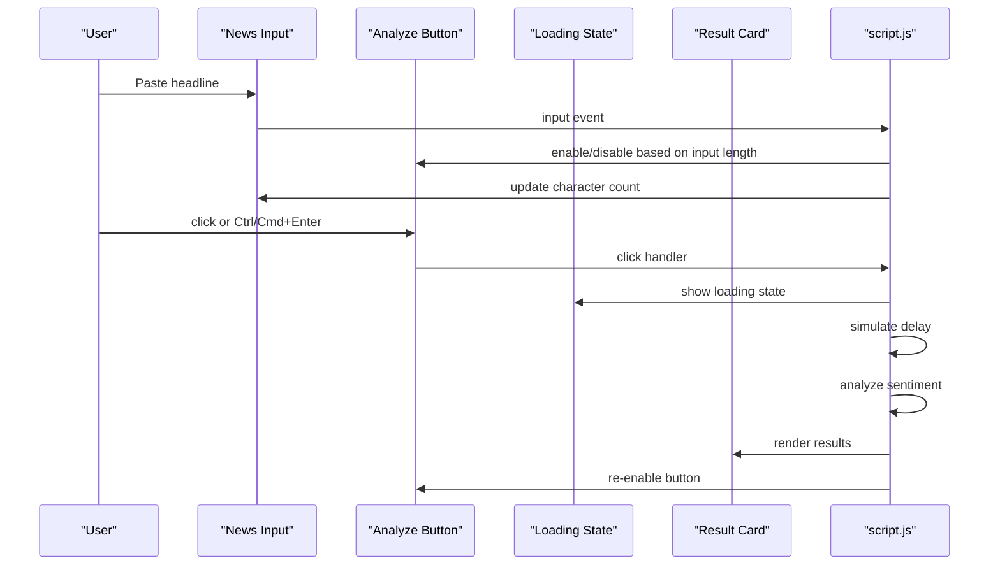
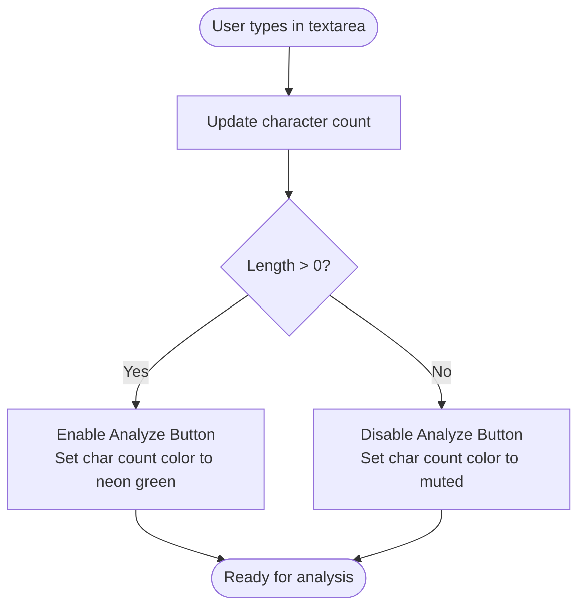
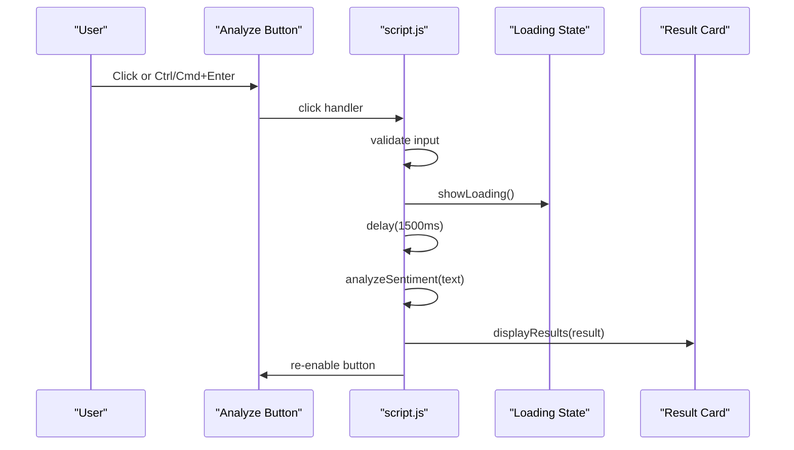
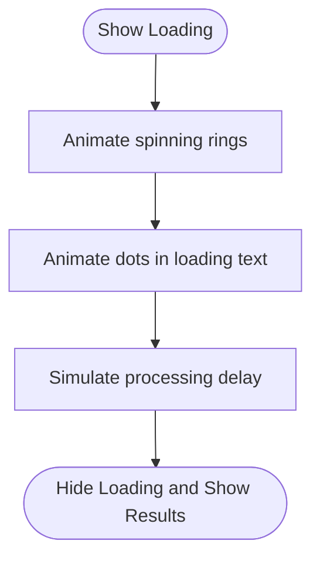
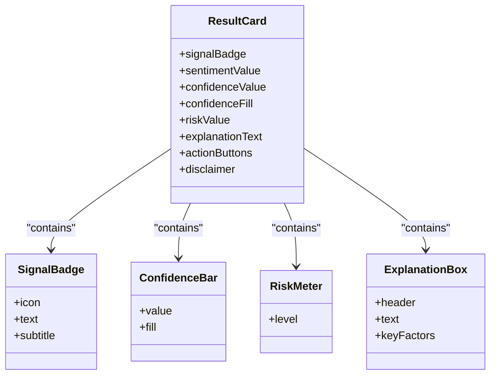
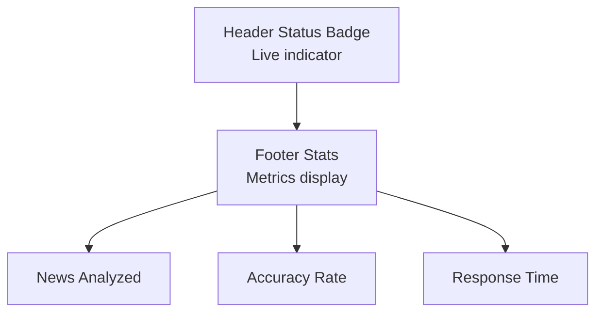
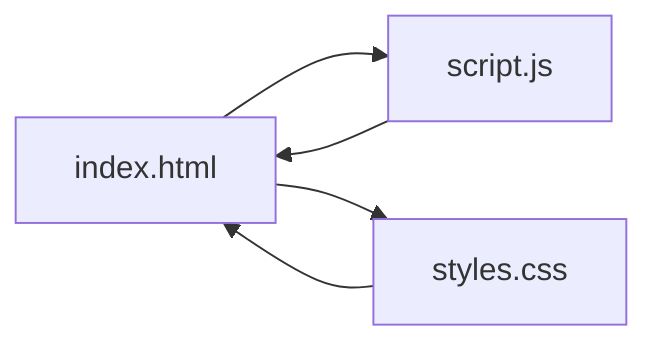

# User Interface Components

<cite>
**Referenced Files in This Document**
- [index.html](file://index.html)
- [script.js](file://script.js)
- [styles.css](file://styles.css)
</cite>

## Table of Contents
1. [Introduction](#introduction)
2. [Project Structure](#project-structure)
3. [Core Components](#core-components)
4. [Architecture Overview](#architecture-overview)
5. [Detailed Component Analysis](#detailed-component-analysis)
6. [Dependency Analysis](#dependency-analysis)
7. [Performance Considerations](#performance-considerations)
8. [Troubleshooting Guide](#troubleshooting-guide)
9. [Conclusion](#conclusion)
10. [Appendices](#appendices)

## Introduction
This document describes the user interface components and interaction patterns of the AI Trading Signal Engine. It covers the input system (news headline textarea with character counting and validation), the Analyze Signal button (including loading states, disabled/enabled behavior, and keyboard shortcuts), the result card presentation (signal badges, confidence visualization bars, risk level indicators, and dynamic explanation display), and the loading state animations, status indicators, and footer statistics. It also documents responsive behavior across screen sizes, accessibility considerations, and usage examples for extending or modifying UI elements.

## Project Structure
The application consists of three files:
- index.html: Defines the UI markup for the header, input section, analyze button, loading state, result card, and footer statistics.
- script.js: Implements the input handling, sentiment analysis engine, UI interaction handlers, keyboard shortcuts, and animations.
- styles.css: Provides the dark theme, layout, animations, and responsive breakpoints.

**Diagram sources**
- [index.html:1-204](file://index.html#L1-L204)
- [script.js:1-404](file://script.js#L1-L404)
- [styles.css:1-816](file://styles.css#L1-L816)

**Section sources**
- [index.html:1-204](file://index.html#L1-L204)
- [script.js:1-404](file://script.js#L1-L404)
- [styles.css:1-816](file://styles.css#L1-L816)

## Core Components
- Input System: A textarea for pasting financial news headlines with a character counter and placeholder text. It enables the Analyze Signal button when input is present and updates the counter in real time.
- Analyze Signal Button: A prominent gradient-styled button that triggers analysis, disables itself during processing, and supports keyboard shortcuts.
- Loading State: A centered animated loader with pulsing rings and dynamic dots to indicate ongoing processing.
- Result Card: Displays the trading signal, sentiment, confidence, risk level, and a dynamic explanation with key factors.
- Status Indicators: Live status badge in the header and footer statistics.
- Footer Statistics: Displays aggregated metrics such as news analyzed, accuracy rate, and response time.

**Section sources**
- [index.html:45-87](file://index.html#L45-L87)
- [index.html:89-177](file://index.html#L89-L177)
- [index.html:181-197](file://index.html#L181-L197)
- [script.js:126-139](file://script.js#L126-L139)
- [script.js:259-275](file://script.js#L259-L275)
- [script.js:277-285](file://script.js#L277-L285)
- [script.js:287-327](file://script.js#L287-L327)

## Architecture Overview
The UI follows a straightforward client-side architecture:
- index.html defines the DOM nodes for input, button, loading state, result card, and footer stats.
- script.js manages event listeners, state transitions, and UI updates.
- styles.css applies themes, animations, and responsive layouts.

**Diagram sources**
- [index.html:53-60](file://index.html#L53-L60)
- [index.html:66-70](file://index.html#L66-L70)
- [index.html:73-87](file://index.html#L73-L87)
- [index.html:90-177](file://index.html#L90-L177)
- [script.js:126-139](file://script.js#L126-L139)
- [script.js:259-275](file://script.js#L259-L275)
- [script.js:277-285](file://script.js#L277-L285)
- [script.js:287-327](file://script.js#L287-L327)

## Detailed Component Analysis

### Input System: News Headline Textarea
- Purpose: Accept financial news headlines with a maximum length of 500 characters.
- Features:
  - Placeholder text prompts the user to paste a headline.
  - Real-time character counting displayed near the input.
  - Enabling/disabling of the Analyze Signal button based on input presence.
  - Visual focus glow effect and placeholder styling.
- Interaction Pattern:
  - On input, the character count updates immediately.
  - When input length > 0, the button becomes enabled; otherwise disabled.
  - Character count color changes to a neon green when input is present.

**Diagram sources**
- [index.html:53-62](file://index.html#L53-L62)
- [script.js:126-139](file://script.js#L126-L139)

**Section sources**
- [index.html:53-62](file://index.html#L53-L62)
- [script.js:126-139](file://script.js#L126-L139)
- [styles.css:248-294](file://styles.css#L248-L294)

### Analyze Signal Button
- Purpose: Trigger the sentiment analysis process.
- States:
  - Disabled by default until input is present.
  - Hover and active effects with a subtle glow and press-down animation.
  - During analysis, the button is disabled and visually dimmed.
- Behavior:
  - Click handler validates input, shows loading state, simulates processing delay, runs analysis, and displays results.
  - Keyboard shortcut: Ctrl/Cmd + Enter triggers analysis when the button is enabled and input is present.
- Accessibility:
  - Uses semantic button element with clear label text.
  - Disabled state prevents accidental clicks.

**Diagram sources**
- [index.html:66-70](file://index.html#L66-L70)
- [script.js:259-275](file://script.js#L259-L275)
- [script.js:277-285](file://script.js#L277-L285)
- [script.js:287-327](file://script.js#L287-L327)
- [script.js:375-382](file://script.js#L375-L382)

**Section sources**
- [index.html:66-70](file://index.html#L66-L70)
- [script.js:259-275](file://script.js#L259-L275)
- [script.js:277-285](file://script.js#L277-L285)
- [script.js:375-382](file://script.js#L375-L382)
- [styles.css:299-360](file://styles.css#L299-L360)

### Loading State
- Purpose: Provide feedback while analysis is in progress.
- Elements:
  - Multi-ring loader with rotating rings and a central core.
  - Dynamic loading text with animated dots.
  - Subtext indicating processing details.
- Behavior:
  - Shown when analysis starts and hidden upon completion.
  - Button is disabled and visually dimmed during this phase.

**Diagram sources**
- [index.html:73-87](file://index.html#L73-L87)
- [script.js:277-285](file://script.js#L277-L285)
- [script.js:267-268](file://script.js#L267-L268)

**Section sources**
- [index.html:73-87](file://index.html#L73-L87)
- [script.js:277-285](file://script.js#L277-L285)
- [styles.css:376-456](file://styles.css#L376-L456)

### Result Card Presentation
- Purpose: Present the analysis outcome in a structured, visually distinct card.
- Components:
  - Signal Badge: Displays the trading signal (BUY/SELL/HOLD) with a colored border and glow, and an emoji icon.
  - Sentiment Indicator: Shows the sentiment label with color-coded text.
  - Confidence Visualization: Numeric percentage and a horizontal bar with gradient fill.
  - Risk Level Indicator: Displays risk level with color-coded text.
  - Dynamic Explanation: AI-generated explanation and key factors.
  - Action Buttons: Reset and Share buttons.
  - Disclaimer: Educational disclaimer text.
- Animations:
  - Smooth slide-up entrance for the result card.
  - Confidence bar animates to its final width after a short delay.

**Diagram sources**
- [index.html:90-177](file://index.html#L90-L177)
- [script.js:287-327](file://script.js#L287-L327)

**Section sources**
- [index.html:90-177](file://index.html#L90-L177)
- [script.js:287-327](file://script.js#L287-L327)
- [styles.css:461-619](file://styles.css#L461-L619)

### Status Indicators and Footer Statistics
- Header Status Badge: Live status indicator with a pulsing dot and “LIVE” text.
- Footer Statistics: Three metric items (news analyzed, accuracy rate, response time) arranged responsively with dividers.

**Diagram sources**
- [index.html:35-39](file://index.html#L35-L39)
- [index.html:182-197](file://index.html#L182-L197)

**Section sources**
- [index.html:35-39](file://index.html#L35-L39)
- [index.html:182-197](file://index.html#L182-L197)
- [styles.css:180-204](file://styles.css#L180-L204)
- [styles.css:624-661](file://styles.css#L624-L661)

## Dependency Analysis
- index.html depends on script.js for interactivity and on styles.css for styling.
- script.js depends on DOM elements defined in index.html and uses CSS classes for animations and state toggling.
- styles.css defines the visual language and responsive behavior used by both HTML and JavaScript.

**Diagram sources**
- [index.html:1-204](file://index.html#L1-L204)
- [script.js:1-404](file://script.js#L1-L404)
- [styles.css:1-816](file://styles.css#L1-L816)

**Section sources**
- [index.html:1-204](file://index.html#L1-L204)
- [script.js:1-404](file://script.js#L1-L404)
- [styles.css:1-816](file://styles.css#L1-L816)

## Performance Considerations
- Particle animation system pauses when the tab is not visible to conserve resources.
- Confidence bar animation uses a short delay before transitioning to avoid abrupt changes.
- Loading state uses lightweight CSS animations and minimal DOM manipulation.

**Section sources**
- [script.js:388-395](file://script.js#L388-L395)
- [script.js:306-309](file://script.js#L306-L309)
- [styles.css:382-431](file://styles.css#L382-L431)

## Troubleshooting Guide
- Button remains disabled:
  - Ensure the input field contains at least one character.
  - Verify the input event listener is attached and functioning.
- Loading state does not appear:
  - Confirm the click handler invokes the loading state and delay.
  - Check that the result card is hidden during loading.
- Results not displaying:
  - Ensure the displayResults function updates all target elements.
  - Verify the button is re-enabled after processing completes.
- Keyboard shortcut not working:
  - Confirm Ctrl/Cmd + Enter is pressed while the button is enabled and input is present.

**Section sources**
- [script.js:126-139](file://script.js#L126-L139)
- [script.js:259-275](file://script.js#L259-L275)
- [script.js:277-285](file://script.js#L277-L285)
- [script.js:287-327](file://script.js#L287-L327)
- [script.js:375-382](file://script.js#L375-L382)

## Conclusion
The AI Trading Signal Engine presents a cohesive, animated, and responsive interface. The input system, button, loading state, and result card work together to deliver a clear user experience. The modular structure allows for straightforward extension and modification of UI elements while maintaining consistent styling and behavior.

## Appendices

### Responsive Behavior
- Breakpoints:
  - Mobile-first design with adjustments at 768px and 480px.
  - Layout adapts to smaller screens with stacked header content, single-column results grid, and reduced typography sizes.
- Footer metrics:
  - Dividers removed on small screens for compactness.

**Section sources**
- [styles.css:739-795](file://styles.css#L739-L795)

### Accessibility Notes
- Semantic HTML: Buttons and form controls use native elements.
- Focus states: Input field has a visible focus glow.
- Keyboard navigation: Ctrl/Cmd + Enter triggers analysis.
- Color contrast: Neon accents against a dark theme improve readability.

**Section sources**
- [index.html:53-60](file://index.html#L53-L60)
- [index.html:66-70](file://index.html#L66-L70)
- [script.js:375-382](file://script.js#L375-L382)
- [styles.css:266-269](file://styles.css#L266-L269)

### Usage Examples and Integration Guidelines
- Extending the input system:
  - Add validation rules by adjusting the input event handler and updating the character counter color.
  - Integrate with external APIs by replacing the mock analysis function with a real endpoint call.
- Modifying the Analyze Signal button:
  - Customize hover/active effects by editing the button styles.
  - Add tooltips or ARIA attributes for improved accessibility.
- Enhancing the result card:
  - Add new metrics by introducing new DOM elements and updating the displayResults function.
  - Implement mini chart rendering by integrating a charting library and updating the mini chart container.
- Loading state customization:
  - Replace the spinner with a different animation or progress indicator.
  - Add progress percentages or ETA text for transparency.
- Footer statistics:
  - Add new metrics by appending stat items and updating the layout accordingly.

**Section sources**
- [script.js:145-227](file://script.js#L145-L227)
- [script.js:287-327](file://script.js#L287-L327)
- [index.html:182-197](file://index.html#L182-L197)
- [styles.css:461-619](file://styles.css#L461-L619)