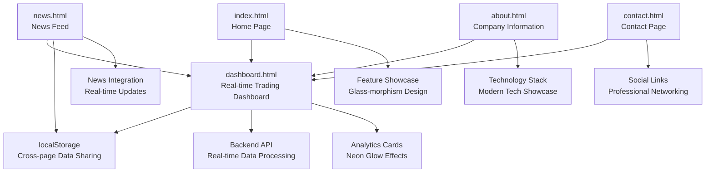
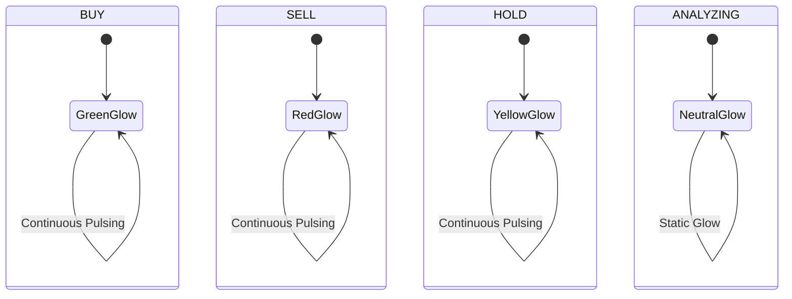

# User Interface Components

<cite>
**Referenced Files in This Document**
- [frontend/dashboard.html](file://frontend/dashboard.html)
- [frontend/dashboard.js](file://frontend/dashboard.js)
- [frontend/news.html](file://frontend/news.html)
- [frontend/news.js](file://frontend/news.js)
- [frontend/about.html](file://frontend/about.html)
- [frontend/contact.html](file://frontend/contact.html)
- [frontend/style.css](file://frontend/style.css)
- [frontend/index.html](file://frontend/index.html)
</cite>

## Update Summary
**Changes Made**
- Completely redesigned the user interface to reflect the new SaaS website architecture
- Replaced the monolithic structure with separate HTML pages for dashboard, news, about, and contact
- Implemented modern real-time trading interface with animated signal cards
- Added sophisticated neon glow effects for BUY/SELL/HOLD indicators
- Enhanced responsive design with glass-morphism and modern styling
- Integrated local storage for seamless navigation between pages
- Added comprehensive navigation system with active state management

## Table of Contents
1. [Introduction](#introduction)
2. [SaaS Website Architecture](#saas-website-architecture)
3. [Dashboard Interface](#dashboard-interface)
4. [News Integration System](#news-integration-system)
5. [Navigation and Routing](#navigation-and-routing)
6. [Modern UI Components](#modern-ui-components)
7. [Neon Glow Effects](#neon-glow-effects)
8. [Responsive Design Implementation](#responsive-design-implementation)
9. [Local Storage Integration](#local-storage-integration)
10. [Component Interaction Patterns](#component-interaction-patterns)
11. [Performance Considerations](#performance-considerations)
12. [Accessibility Features](#accessibility-features)
13. [Integration Guidelines](#integration-guidelines)

## Introduction
This document describes the modern SaaS website architecture for the AI Trading Signal Engine, featuring a sophisticated real-time trading interface with animated signal cards displaying BUY/SELL/HOLD indicators with neon glow effects. The system has evolved from a monolithic structure to a modular SaaS platform with separate HTML pages for different functional areas, providing users with a premium financial trading experience.

The new architecture emphasizes real-time data processing, modern UI design with glass-morphism effects, and seamless navigation between dashboard, news, about, and contact sections. The interface showcases animated signal cards with dynamic neon glow effects that respond to market sentiment analysis results.

## SaaS Website Architecture
The new SaaS architecture consists of four main pages with interconnected functionality:

**Diagram sources**
- [frontend/index.html:1-157](file://frontend/index.html#L1-L157)
- [frontend/dashboard.html:1-155](file://frontend/dashboard.html#L1-L155)
- [frontend/news.html:1-379](file://frontend/news.html#L1-L379)
- [frontend/about.html:1-125](file://frontend/about.html#L1-L125)
- [frontend/contact.html:1-113](file://frontend/contact.html#L1-L113)

**Section sources**
- [frontend/index.html:1-157](file://frontend/index.html#L1-L157)
- [frontend/dashboard.html:1-155](file://frontend/dashboard.html#L1-L155)
- [frontend/news.html:1-379](file://frontend/news.html#L1-L379)
- [frontend/about.html:1-125](file://frontend/about.html#L1-L125)
- [frontend/contact.html:1-113](file://frontend/contact.html#L1-L113)

## Dashboard Interface
The dashboard provides the core real-time trading interface with sophisticated signal card presentation:

### Signal Card Architecture
- **Header Section**: Displays headline and company information with animated loading states
- **Signal Badge**: Dynamic badge with neon glow effects (BUY: green, SELL: red, HOLD: yellow)
- **Metrics Grid**: Four-column layout showing sentiment, confidence, risk level, and signal strength
- **Explanation Box**: AI-generated analysis with key factors and catalyst identification
- **Action Controls**: Refresh signal, fetch latest news, and timestamp display

### Neon Glow Effects Implementation
The dashboard implements sophisticated neon glow effects that respond to signal type:

**Diagram sources**
- [frontend/dashboard.js:334-346](file://frontend/dashboard.js#L334-L346)
- [frontend/style.css:480-496](file://frontend/style.css#L480-L496)

**Section sources**
- [frontend/dashboard.html:45-88](file://frontend/dashboard.html#L45-L88)
- [frontend/dashboard.js:305-346](file://frontend/dashboard.js#L305-L346)
- [frontend/style.css:450-496](file://frontend/style.css#L450-L496)

## News Integration System
The news system provides real-time financial news integration with seamless navigation to the dashboard:

### News Card Architecture
- **Glass-morphism Design**: Modern card design with backdrop blur and border effects
- **Interactive Elements**: Hover animations with transform effects and glow enhancements
- **Analysis Integration**: Direct analysis button that stores news in localStorage and navigates to dashboard
- **Fallback Mechanism**: Sample news data when backend API is unavailable

### Local Storage Integration
The news system uses localStorage for cross-page data sharing:
- Stores selected news headline for dashboard analysis
- Maintains analysis timestamps for audit trails
- Enables seamless navigation between news and dashboard pages

**Section sources**
- [frontend/news.html:149-232](file://frontend/news.html#L149-L232)
- [frontend/news.js:69-88](file://frontend/news.js#L69-L88)
- [frontend/news.html:359-363](file://frontend/news.html#L359-L363)

## Navigation and Routing
The SaaS website features a modern navigation system with active state management:

### Navigation Components
- **Fixed Navbar**: Sticky navigation with glass-morphism effect and backdrop blur
- **Active State Management**: Visual indicators for current page with gradient underlines
- **Responsive Design**: Mobile-friendly navigation with hidden menu on smaller screens
- **Cross-page Integration**: Seamless navigation between all SaaS pages

### Page Routing Strategy
The navigation system implements a simple routing strategy:
- Direct links between pages using standard anchor tags
- Active class management for visual feedback
- Consistent styling across all navigation items
- Gradient accent colors for visual appeal

**Section sources**
- [frontend/dashboard.html:10-23](file://frontend/dashboard.html#L10-L23)
- [frontend/news.html:330-346](file://frontend/news.html#L330-L346)
- [frontend/about.html:10-22](file://frontend/about.html#L10-L22)
- [frontend/contact.html:10-22](file://frontend/contact.html#L10-L22)

## Modern UI Components
The SaaS website implements a comprehensive set of modern UI components:

### Glass-morphism Design System
- **Background Effects**: Frosted glass panels with backdrop blur
- **Border Effects**: Subtle borders with transparency for depth perception
- **Shadow System**: Multiple layered shadows for dimensional effects
- **Color Palette**: Dark theme with neon accent colors (green, cyan, purple)

### Interactive Elements
- **Hover Animations**: Smooth transitions with transform effects
- **Loading States**: Custom spinner animations and progress indicators
- **Button Variants**: Primary gradient buttons and secondary outline buttons
- **Card Interactions**: Hover effects with glow and elevation changes

### Typography System
- **Font Family**: Inter font for clean, modern typography
- **Hierarchy**: Clear visual hierarchy with gradient text effects
- **Responsive Sizing**: Adaptive font sizes for different screen dimensions
- **Accent Effects**: Gradient text for headings and important elements

**Section sources**
- [frontend/style.css:6-37](file://frontend/style.css#L6-L37)
- [frontend/style.css:431-464](file://frontend/style.css#L431-L464)
- [frontend/style.css:136-171](file://frontend/style.css#L136-L171)

## Neon Glow Effects
The SaaS website implements sophisticated neon glow effects throughout the interface:

### Signal-based Glow System
- **BUY Signals**: Green neon glow with pulse animation
- **SELL Signals**: Red neon glow with continuous pulsing
- **HOLD Signals**: Yellow neon glow with steady illumination
- **ANALYZING State**: Neutral glow with static lighting

### Implementation Details
The glow effects are implemented using CSS animations and box-shadow properties:
- Keyframe animations for continuous pulsing effects
- Variable-based color systems for consistent theming
- Performance-optimized animations using transform properties
- Responsive glow effects that adapt to screen size

### Visual Impact
The neon glow system creates a premium, high-tech feel:
- Enhanced visual appeal for trading interface
- Clear signal differentiation through color coding
- Dynamic feedback for user interactions
- Professional appearance suitable for financial applications

**Section sources**
- [frontend/dashboard.html:142-152](file://frontend/dashboard.html#L142-L152)
- [frontend/dashboard.js:317-318](file://frontend/dashboard.js#L317-L318)
- [frontend/dashboard.js:334-345](file://frontend/dashboard.js#L334-L345)
- [frontend/style.css:31-33](file://frontend/style.css#L31-L33)

## Responsive Design Implementation
The SaaS website features comprehensive responsive design:

### Breakpoint Strategy
- **Mobile First**: Base styles optimized for mobile devices
- **Tablet Adaptation**: Adjustments at 768px breakpoint for tablet devices
- **Desktop Optimization**: Full feature display on larger screens
- **Flexible Grid System**: CSS Grid and Flexbox for adaptive layouts

### Component Responsiveness
- **Navigation**: Hidden menu on mobile with hamburger-style interaction
- **News Grid**: Single column on mobile, multi-column on desktop
- **Dashboard Cards**: Flexible grid that adapts to screen size
- **Typography**: Fluid font sizing with viewport-relative units

### Performance Considerations
- **CSS Animations**: Hardware-accelerated transforms for smooth performance
- **Lazy Loading**: Images and content load progressively
- **Optimized Transitions**: Minimal CSS for maximum visual impact
- **Touch Targets**: Adequate sizing for mobile interaction

**Section sources**
- [frontend/style.css:1002-1024](file://frontend/style.css#L1002-L1024)
- [frontend/news.html:308-326](file://frontend/news.html#L308-L326)
- [frontend/dashboard.html:1002-1024](file://frontend/dashboard.html#L1002-L1024)

## Local Storage Integration
The SaaS website implements strategic local storage usage for enhanced user experience:

### Data Persistence Strategy
- **Cross-page Communication**: Selected news stored for dashboard analysis
- **Session Management**: Temporary data for user session continuity
- **Audit Trail**: Timestamps for analysis history tracking
- **Fallback Mechanisms**: Graceful degradation when storage is unavailable

### Implementation Details
The local storage system handles:
- News headline preservation during navigation
- Analysis timestamps for historical tracking
- User preferences and session data
- Error handling for storage limitations

### Security Considerations
- **Client-side Only**: No sensitive data stored in persistent storage
- **Temporary Data**: Most data is cleared after analysis completion
- **Data Limits**: Respect browser storage quotas and limitations
- **Privacy Compliance**: No personal data collection or retention

**Section sources**
- [frontend/news.js:73-76](file://frontend/news.js#L73-L76)
- [frontend/dashboard.js:29-46](file://frontend/dashboard.js#L29-L46)

## Component Interaction Patterns
The SaaS website implements sophisticated interaction patterns:

### Real-time Data Flow
- **News Fetching**: Asynchronous API calls with loading states
- **Signal Generation**: Instant keyword-based analysis with real-time updates
- **UI Updates**: Smooth transitions between loading and result states
- **Error Handling**: Graceful degradation with fallback content

### User Experience Patterns
- **Progressive Disclosure**: Information revealed as needed
- **Immediate Feedback**: Visual responses to user actions
- **Consistent Patterns**: Familiar interaction paradigms across pages
- **Accessibility**: Keyboard navigation and screen reader support

### Performance Optimization
- **Debounced Actions**: Prevent rapid repeated submissions
- **Efficient Updates**: Minimal DOM manipulation for smooth animations
- **Resource Management**: Optimized loading of assets and scripts
- **Memory Management**: Cleanup of event listeners and timers

**Section sources**
- [frontend/dashboard.js:147-171](file://frontend/dashboard.js#L147-L171)
- [frontend/dashboard.js:196-257](file://frontend/dashboard.js#L196-L257)
- [frontend/news.js:14-40](file://frontend/news.js#L14-L40)

## Performance Considerations
The SaaS website is optimized for performance across all components:

### Loading Optimization
- **Critical Path**: Essential CSS and JavaScript loaded in priority order
- **Lazy Loading**: Non-critical resources loaded on demand
- **Asset Optimization**: Minified CSS and efficient image formats
- **Caching Strategy**: Strategic caching for improved repeat visits

### Runtime Performance
- **Animation Efficiency**: Hardware-accelerated CSS animations
- **Event Handling**: Optimized event listeners with proper cleanup
- **Memory Management**: Prevention of memory leaks through proper cleanup
- **Network Optimization**: Efficient API calls with error handling

### Scalability Considerations
- **Component Architecture**: Modular design for easy maintenance
- **Code Splitting**: Separate bundles for different page sections
- **Bundle Optimization**: Tree shaking and dead code elimination
- **CDN Integration**: External resources served from optimized CDNs

**Section sources**
- [frontend/style.css:1026-1037](file://frontend/style.css#L1026-L1037)
- [frontend/dashboard.js:283-303](file://frontend/dashboard.js#L283-L303)

## Accessibility Features
The SaaS website implements comprehensive accessibility features:

### Semantic HTML Structure
- **Proper Headings**: Logical heading hierarchy for screen readers
- **Descriptive Links**: Meaningful link text with context
- **Form Labels**: Associated labels for input elements
- **Alternative Text**: Descriptive alt attributes for images

### Keyboard Navigation
- **Tab Order**: Logical tab order through interactive elements
- **Focus Management**: Visible focus indicators for keyboard users
- **Shortcuts**: Keyboard shortcuts for common actions
- **Skip Links**: Ability to skip to main content

### Screen Reader Support
- **ARIA Labels**: Descriptive ARIA labels for complex components
- **Role Attributes**: Proper ARIA roles for interactive elements
- **Live Regions**: Dynamic content updates announced to assistive technologies
- **Structure Announcements**: Clear announcements of page sections and changes

### Visual Accessibility
- **Color Contrast**: Sufficient contrast ratios for text and interactive elements
- **Color Independence**: Information conveyed through multiple means
- **Resize Text**: Support for increased text size without loss of functionality
- **Motion Preferences**: Reduced motion options for sensitive users

**Section sources**
- [frontend/dashboard.html:1-155](file://frontend/dashboard.html#L1-L155)
- [frontend/news.html:1-379](file://frontend/news.html#L1-L379)
- [frontend/about.html:1-125](file://frontend/about.html#L1-L125)
- [frontend/contact.html:1-113](file://frontend/contact.html#L1-L113)

## Integration Guidelines
The SaaS website provides guidelines for extending and integrating with the existing architecture:

### Adding New Pages
- **Navigation Integration**: Add menu items to all navbar components
- **Styling Consistency**: Use the established CSS variable system
- **Responsive Behavior**: Implement mobile-first responsive design
- **Performance Standards**: Follow established performance optimization patterns

### Extending Dashboard Functionality
- **Signal Analysis**: Implement additional analysis algorithms
- **Data Visualization**: Add new chart types and visualization components
- **Real-time Updates**: Implement WebSocket connections for live data
- **API Integration**: Connect to additional external services

### Component Development
- **CSS Architecture**: Follow the established naming convention (BEM methodology)
- **JavaScript Patterns**: Use modular patterns with proper encapsulation
- **Animation Standards**: Implement consistent animation timing and easing
- **Testing Strategy**: Implement unit tests for critical functionality

### Backend Integration
- **API Endpoints**: Follow RESTful conventions for new endpoints
- **Error Handling**: Implement comprehensive error handling and user feedback
- **Authentication**: Integrate with existing authentication systems
- **Data Validation**: Implement server-side validation for all inputs

**Section sources**
- [frontend/style.css:6-37](file://frontend/style.css#L6-L37)
- [frontend/dashboard.js:62-145](file://frontend/dashboard.js#L62-L145)
- [frontend/news.js:90-148](file://frontend/news.js#L90-L148)